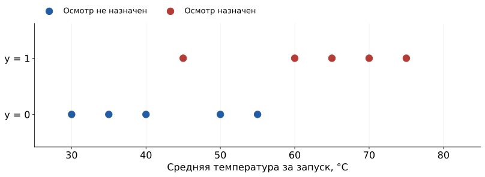

## Одна знакомая задача

После работы привода нужно решить, предложить ли дополнительный осмотр.

**Данные:** измерения температуры за запуск.

**Ответ:** предложение осмотра — 1, обычный регламент — 0.

[Все численные примеры занятия придуманы.]{.figcap}

## Учимся по известным примерам

[Опр.]{.definition} **Машинное обучение** — подбор правила по примерам для применения к новым данным.

| Запуск | Средняя температура, °C | Осмотр назначен |
|---|---:|:---:|
| F01 | 30 | 0 |
| F02 | 35 | 0 |
| F03 | 40 | 0 |
| F04 | 45 | 1 |

Известные ответы помогают выбрать правило.

## Из измерений получаем признак

[Опр.]{.definition} **Признак** — описание объекта, которое получает модель.

Три измерения F04: **43, 45, 47 °C**.

$$x=\frac{43+45+47}{3}=45\ ^\circ\mathrm C.$$

В этом опыте признак — средняя температура за запуск.

## Признаки и ответы — разные столбцы

[Опр.]{.definition} **Целевая переменная** $y$ — ответ, который требуется предсказать.

| Запуск | Вход $x$, °C | Известный ответ $y$ |
|---|---:|:---:|
| F01 | 30 | 0 |
| F04 | 45 | 1 |
| F07 | 60 | 1 |

[Опр.]{.definition} **Выборка** — набор таких примеров.

## Категория или число

[Опр.]{.definition} **Классификация** — предсказание категории.

Предложить осмотр: **0 или 1**. Сообщение: **обычное или спам**.

[Опр.]{.definition} **Регрессия** — предсказание численной величины.

Температура завтра: **58.4 °C**. Время доставки: **27 минут**.

## Та же таблица на графике

{height=365 fig-alt="Десять температур; цвет и высота точки показывают назначение осмотра"}

Одна точка — один запуск. По горизонтали температура, по вертикали метка.

## Модель с одним порогом

[Опр.]{.definition} **Модель** — правило, которое превращает признаки в прогноз.

При температуре **не ниже порога** предлагаем осмотр.

[Опр.]{.definition} **Порог** $t$ — температура, с которой сравниваем признак.

$$\widehat y=\begin{cases}1,&x\ge t,\\0,&x<t.\end{cases}$$

При $t=50$ °C и $x=58$ °C прогноз равен **1**.

## Три ошибки порога 50 °C

| Температура | Известный ответ | Прогноз при $t=50$ |
|---:|:---:|:---:|
| 45 °C | 1 | 0 |
| 50 °C | 0 | 1 |
| 55 °C | 0 | 1 |

На остальных семи обучающих примерах ответы совпали.

## Один штраф за одно несовпадение

[Опр.]{.definition} **Функция потерь** присваивает прогнозу численный штраф.

В этом опыте: совпадение — **0**, ошибка — **1**.

$$L=\frac{0+0+0+1+1+1+0+0+0+0}{10}=0.3.$$

Для порога 50 °C ошибочны 30% обучающих ответов.

## Сравним четыре кандидата

{height=365 fig-alt="Пороги 40, 50, 60, 70 дают 3, 3, 1, 3 ошибки на тех же десяти строках"}

Данные одинаковые. Меняется только температурный порог.

## Обучение выбрало 60 °C

{height=365 fig-alt="Выбранный порог 60 градусов оставляет одну ошибку при 45 градусах"}

[Опр.]{.definition} **Параметр** — число внутри выбранной модели, которое подбираем по данным.

## Весь алгоритм обучения

1. Взять очередной порог.
2. Получить десять прогнозов.
3. Посчитать несовпадения с метками.
4. Сохранить порог с наименьшим числом ошибок.

**Вход:** температуры и метки. **Результат:** число 60 °C.

## Обучение и применение

[Опр.]{.definition} **Обучение с учителем** — подбор модели по примерам с известными ответами.

| Обучение | Применение |
|---|---|
| Температуры и метки | Новая температура |
| Сравниваем пороги | Используем выбранные 60 °C |
| Получаем параметр | Получаем прогноз |

[Опр.]{.definition} **Вывод** — применение уже обученной модели.

## Прогноз для нового запуска

Новое измерение: **58 °C**. Сохранённый порог: **60 °C**.

$$58<60\quad\Rightarrow\quad\widehat y=0.$$

```python
if temperature >= threshold:
    prediction = 1
else:
    prediction = 0
```

Метка нового запуска для вычисления не нужна.

## Шесть новых запусков

{height=365 fig-alt="На новых температурах при пороге 60 есть пропуск при 48 и ложная тревога при 62"}

Порог уже выбран. Эти шесть строк не участвовали в обучении.

## Два вида ошибок

| Случай | В архиве | Прогноз | Что произошло |
|---|:---:|:---:|---|
| 48 °C | 1 | 0 | Пропуск назначения |
| 62 °C | 0 | 1 | Ложная тревога |

Пропуск оставляет нужный случай без сигнала.
Ложная тревога требует лишнего внимания.

## Четыре совпадения из шести

[Опр.]{.definition} **Метрика** — число, описывающее качество прогнозов.

Доля верных ответов, accuracy:

$$\frac{\text{число совпадений}}{\text{число проверенных запусков}}
=\frac46\approx0.667.$$

На шести учебных запусках совпало примерно **66.7%** ответов.

## Простое правило для сравнения

[Опр.]{.definition} **Базовая модель** — простой ориентир для сравнения.

| Правило | Совпадения на тех же шести запусках |
|---|---:|
| Всегда отвечать 0 | 3 из 6 |
| Обученный порог 60 °C | 4 из 6 |

В этом примере обучение добавило одно совпадение.

## Что этот опыт позволяет увидеть

[Опр.]{.definition} **Обобщение** — работа модели на новых данных той же задачи.

На обучении: **9 из 10** совпадений. На проверке: **4 из 6**.

Одна температура теряет часть контекста. Придуманный набор показывает
механику обучения, но не качество реальной диагностики.

## Следующий шаг — тот же расчёт на Python

**S1:** списки, условие, счётчик ошибок, подбор порога.

**L1:** вероятностная модель сообщений и подробный вывод обучения.

**S2, дополнительно:** как измерения превращаются в нашу таблицу.

## Источники и материалы {.smaller}

- Все температуры, метки и назначения осмотра придуманы для занятия.
- [Код S1](../starter/lessons/s01.py): выбор порога и проверка.
- [Код S2](../starter/lessons/s02.py): подготовка таблицы.
- [Описание данных](../starter/data/INTRO-README.md).
