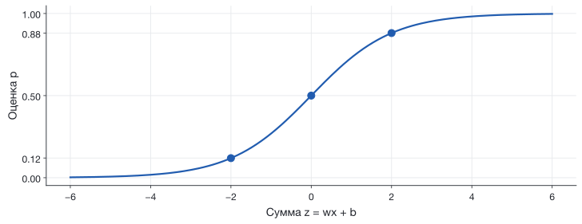
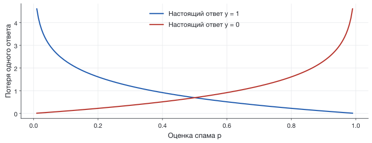
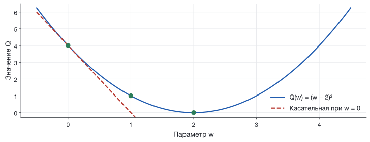
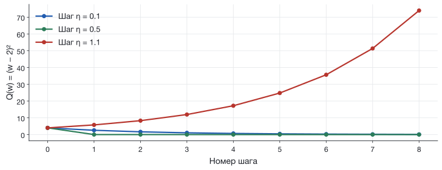
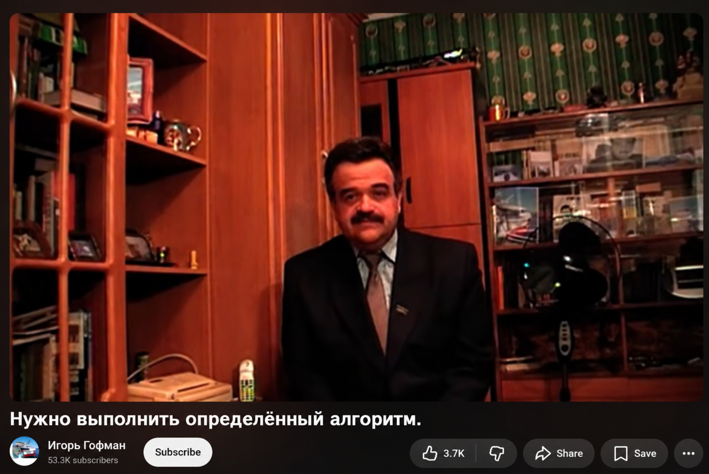
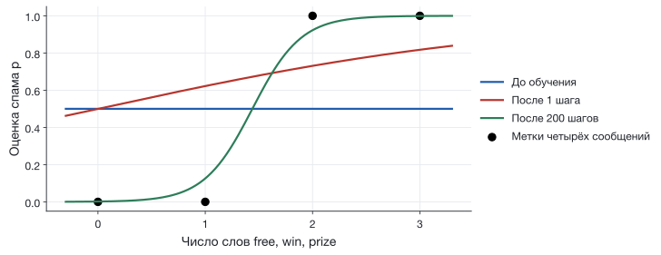

## Та же модель в другой задаче

| | Осмотр привода | Фильтр сообщений |
|---|---|---|
| Исходные данные | Запись измерений | Текст сообщения |
| Признак | Средняя температура | Число определённых слов |
| Ответ $y$ | Осмотр назначен: 1 | Спам: 1 |
| Действие | Предложить осмотр | Поместить в папку «Спам» |

Сегодня проследим, как **ошибка меняет параметры** модели.

## Вам пишет принц. Снова. {.discussion .letter-slide}

::: {.mail-example .full-letter}
**Тема: Конфиденциальное предложение о наследстве**

Уважаемый друг!

Я принц Эммануэль, наследник семьи из Зимбабве. После смерти моего
отца в банке осталось 10 миллионов долларов. Из-за семейного спора
я временно не могу получить эти деньги.

Мой советник выбрал вас как честного и надёжного человека.
Помогите перевести наследство, и 30% суммы станут вашими.

Для оформления документов требуется только 500 долларов.
Прошу ответить сегодня и сохранить наше соглашение в тайне.

С глубоким уважением, принц Эммануэль.
:::

[Учебный пример; отправитель и история вымышлены.]{.figcap}

## Принц попал и в научную статью {.discussion}

**Cormac Herley, Microsoft Research, 2012.**
Гипотеза работы: нелепая история может отсеивать тех,
кто не поверит и только займёт время мошенника.

**Как бы вы удаляли такие сообщения автоматически?**

::: {.fragment}
Правило «есть слово “принц”» спрячет приглашение
на «Маленького принца». Мошенник может представиться банкиром.

Нужна модель, которая учится сочетаниям признаков на примерах.
:::

[Исследование Herley, 2012](https://www.microsoft.com/en-us/research/publication/why-do-nigerian-scammers-say-they-are-from-nigeria-3/){.source} · [Описание схемы FTC, 2002](https://www.govinfo.gov/content/pkg/GOVPUB-FT-PURL-LPS29727/pdf/GOVPUB-FT-PURL-LPS29727.pdf){.source}

## Подал статью — уже DEAR DR MASHKOV {.discussion .letter-slide}

::: {.mail-example .full-letter}
**Тема: Персональное приглашение к публикации**

DEAR DR MASHKOV,

Ваша выдающаяся научная работа произвела большое впечатление
на нашу редакцию. Мы будем рады опубликовать вашу следующую
статью в нашем международном журнале.

Для завершения ближайшего выпуска нам не хватает одной работы.
Пришлите рукопись до пятницы. Рецензирование займёт три дня.
Стоимость публикации сообщим после принятия.

С нетерпением ждём вашего бесценного вклада!

С уважением, редакционный офис.
:::

[Составной учебный пример. Обращение — из опыта преподавателя.]{.figcap}

## Иногда даже DEAR [NAME SURNAME] {.discussion}

**210 незапрошенных академических писем за 3 месяца**
у трёх участников исследования 2022 года.

Это небольшая выборка. Личный опыт преподавателя — отдельный пример.

**Как отсеять рассылку и сохранить настоящее письмо редактора?**

::: {.fragment}
Слова «статья», «журнал» и «оплата» встречаются и в обычной переписке.
Нужно учитывать сочетание признаков и проверять ошибки фильтра.
:::

[Sureda-Negre et al., Learned Publishing, 2022.](https://doi.org/10.1002/leap.1450){.source}

## Сентябрь 2026: прогноз погоды

**3 сентября. Google представила WeatherNext 3.**

| Доступный вход | Предсказание | Проверка |
|---|---|---|
| Наблюдения, включая спутниковые | Погода в будущем | Последующие измерения |

В анонсе заявлены почасовые прогнозы и использование спутниковых наблюдений.

Температуру можно предсказывать числом. Вероятность дождя нужна для решения,
брать ли зонт или переносить работы.

[Источник: Google, 03.09.2026. Обзор проверен 22.09.2026.](https://blog.google/innovation-and-ai/models-and-research/google-deepmind/introducing-weathernext-3/){.source}

## Сентябрь 2026: поиск в биологии

**8 сентября. Google DeepMind представила AlphaGenome Atlas.**

Атлас содержит предсказания молекулярных эффектов
**9 млрд однонуклеотидных изменений ДНК**.

Практическое применение: выбрать варианты, которые стоит исследовать
в лаборатории.

Предсказанный эффект и результат эксперимента требуют отдельного сравнения.

[Источник: Google DeepMind, 08.09.2026. 9 млрд — число предсказанных вариантов.](https://deepmind.google/blog/alphagenome-atlas-a-predictive-map-of-every-possible-dna-letter-change-in-the-human-genome/){.source}

## Сентябрь 2026: Навье—Стокс и поиск доказательства

**8 сентября. OpenAI представила заявленное решение задачи тысячелетия.**

Исследуют, может ли из гладкого начала возникнуть
неограниченная скорость за конечное время.

В работе построен случай **с гладкой внешней силой**:
скорость становится неограниченной, энергия остаётся ограниченной.

Опубликованы математический текст и формализация в Lean.
Проверяется доказательство конкретного утверждения.

[OpenAI, 08.09.2026](https://openai.com/index/navier-stokes-solution/){.source} · [Статья, теорема 1.1](https://cdn.openai.com/pdf/32d9f210-8b73-45e0-91bc-82a30aef8a9a/navier-stokes.pdf){.source} · [Постановка Clay](https://www.claymath.org/millennium/navier-stokes-equation/){.source}

## Четыре сообщения

| Текст | Смысл | Метка $y$ |
|---|---|:--:|
| See you at six | Увидимся в шесть | 0 |
| Are you free tomorrow | Завтра свободен | 0 |
| Win a free ticket | Выиграй бесплатный билет | 1 |
| Free prize win now | Бесплатный приз, выиграй сейчас | 1 |

$y=1$: спам. $y=0$: обычное сообщение.

[Сообщения придуманы для вычислений. На S4 будет реальный исторический корпус UCI.]{.figcap}

## Текст превращается в число

[Опр.]{.definition} **Признак** $x$ — численное описание сообщения.

Считаем вхождения слов `free`, `win`, `prize`.

| Сообщение | $x$ | $y$ |
|---|:--:|:--:|
| See you at six | 0 | 0 |
| Are you **free** tomorrow | 1 | 0 |
| **Win** a **free** ticket | 2 | 1 |
| **Free prize win** now | 3 | 1 |

Модель получает только столбец $x$. Метка нужна при обучении.

## Два параметра модели

$$z=wx+b$$

$w$ — вес признака. $b$ — свободный член.

| $x$ | $w=1$, $b=-1.5$ | $z$ |
|:--:|---|:--:|
| 0 | $1\cdot0-1.5$ | $-1.5$ |
| 2 | $1\cdot2-1.5$ | $0.5$ |
| 3 | $1\cdot3-1.5$ | $1.5$ |

Параметры пока выбраны для иллюстрации. При обучении их найдёт алгоритм.

## Сигмоида переводит сумму в оценку

$$p=\sigma(z)=\frac{1}{1+e^{-z}},\qquad 0<p<1$$

{height=350 fig-alt="Сигмоида: при z=-2 оценка около 0.12, при нуле 0.5, при двух 0.88"}

$p$ — оценка вероятности метки «спам» в выбранной модели.

## Полный расчёт одного прогноза

«Win a free ticket»: $x=2$.

При $w=1$, $b=-1.5$:

$$z=1\cdot2-1.5=0.5$$
$$p=\frac{1}{1+e^{-0.5}}\approx0.622$$

При пороге $\tau=0.5$ сообщение попадает в папку «Спам».

Оценка $p$ и порог $\tau$ выполняют разные действия в вычислении.

## Цена уверенного ошибочного ответа

Для сообщения с $y=1$ потеря равна $-\ln p$.

{height=345 fig-alt="Логистическая потеря растёт при уверенной ошибке; для двух классов графики зеркальны"}

$p=0.9$: потеря $0.105$. $p=0.1$: потеря $2.303$.

## От вероятности ответа к потере

Вероятность наблюдаемой метки:

$$q=p^y(1-p)^{1-y}$$

При $y=1$: $q=p$. При $y=0$: $q=1-p$.

Для независимых обучающих примеров максимизируем $\prod_i q_i$.
Логарифм превращает произведение в сумму. Знак минус задаёт минимизацию:

$$\ell(y,p)=-\ln q=-y\ln p-(1-y)\ln(1-p)$$

## Одна ошибка на всю выборку

[Опр.]{.definition} **Функция потерь** $L(w,b)$ — средняя потеря на обучающих сообщениях.

$$L(w,b)=\frac1n\sum_{i=1}^{n}\ell\bigl(y_i,\sigma(wx_i+b)\bigr)$$

Для четырёх сообщений:

$$L=\frac{\ell_1+\ell_2+\ell_3+\ell_4}{4}$$

Обучение: подобрать $w$ и $b$, чтобы уменьшить $L$.

## Начальная точка

Начинаем с $w=0$, $b=0$. У всех сообщений $p=0.5$.

| $x$ | $y$ | $p$ | Потеря |
|:--:|:--:|:--:|:--:|
| 0 | 0 | 0.5 | 0.693 |
| 1 | 0 | 0.5 | 0.693 |
| 2 | 1 | 0.5 | 0.693 |
| 3 | 1 | 0.5 | 0.693 |

$$L(0,0)=-\ln(0.5)\approx0.693147$$

## Производная показывает местный наклон

$$Q(w)=(w-2)^2,\qquad Q'(w)=2(w-2)$$

{height=325 fig-alt="Парабола Q(w)=(w-2)^2 и касательная в нуле с наклоном -4"}

При $w=0$: $Q'= -4$. Малое увеличение $w$ уменьшает $Q$.

## Почему шаг идёт против производной

Для малого изменения $\Delta w$:

$$Q(w+\Delta w)\approx Q(w)+Q'(w)\Delta w$$

Выбираем $\Delta w=-\eta Q'(w)$, где $\eta>0$:

$$Q(w+\Delta w)-Q(w)\approx-\eta\bigl(Q'(w)\bigr)^2\leq0$$

[Опр.]{.definition} **Градиентный спуск** повторяет такие шаги по параметрам.
Для нескольких параметров градиент содержит их частные производные.

## Длина шага влияет на обучение

{height=395 fig-alt="Для параболы шаг 0.1 снижает потерю постепенно, 0.5 приводит в минимум сразу, 1.1 увеличивает потерю"}

$\eta$ — скорость обучения. Слишком большой шаг может увеличить потерю.

## Производная сигмоиды

$$p=(1+e^{-z})^{-1}$$

$$\frac{dp}{dz}=-(1+e^{-z})^{-2}\cdot(-e^{-z})
=\frac{e^{-z}}{(1+e^{-z})^2}$$

Поскольку $1-p=\dfrac{e^{-z}}{1+e^{-z}}$,

$$\boxed{\frac{dp}{dz}=p(1-p)}$$

## Производная потери по оценке

$$\ell=-y\ln p-(1-y)\ln(1-p)$$

При вычислении производной метка $y$ фиксирована:

$$\frac{\partial\ell}{\partial p}
=-\frac{y}{p}+\frac{1-y}{1-p}$$

$$=\frac{-y(1-p)+(1-y)p}{p(1-p)}
=\frac{p-y}{p(1-p)}$$

## Цепочка производных сокращается

Параметры задают $z$, затем вычисляется $p$, затем потеря $\ell$.

$$\frac{\partial\ell}{\partial z}
=\frac{\partial\ell}{\partial p}\frac{dp}{dz}$$

$$=\frac{p-y}{p(1-p)}\cdot p(1-p)=\boxed{p-y}$$

Для спама с $p=0.5$: $p-y=-0.5$.
Для обычного сообщения с $p=0.5$: $p-y=+0.5$.

## Производные по параметрам

Из $z=wx+b$ получаем:

$$\frac{\partial z}{\partial w}=x,\qquad
\frac{\partial z}{\partial b}=1$$

По правилу цепочки:

$$\boxed{\frac{\partial\ell}{\partial w}=(p-y)x},\qquad
\boxed{\frac{\partial\ell}{\partial b}=p-y}$$

Частная производная меняет один параметр при фиксированном другом.

## Градиент средней потери

$$g_w=\frac{\partial L}{\partial w}=\frac1n\sum_{i=1}^n(p_i-y_i)x_i$$
$$g_b=\frac{\partial L}{\partial b}=\frac1n\sum_{i=1}^n(p_i-y_i)$$

Производная суммы равна сумме производных. Деление на $n$ сохраняется.

$$w_{\text{нов}}=w-\eta g_w,\qquad
b_{\text{нов}}=b-\eta g_b$$

Обе производные вычисляем при **одних и тех же старых параметрах**.

## Первый шаг по четырём сообщениям

:::: {.r-stack}
::: {.fragment .fade-out data-fragment-index="0" style="width: 100%; text-align: center;"}
{height=490 fig-alt="Учебный мем с подписью «Нужно выполнить определённый алгоритм»"}
:::
::: {.fragment data-fragment-index="0" style="width: 100%;"}
При $w=0$, $b=0$ все $p_i=0.5$.

| $x_i$ | $y_i$ | $p_i-y_i$ | $(p_i-y_i)x_i$ |
|:--:|:--:|:--:|:--:|
| 0 | 0 | $+0.5$ | $0$ |
| 1 | 0 | $+0.5$ | $+0.5$ |
| 2 | 1 | $-0.5$ | $-1$ |
| 3 | 1 | $-0.5$ | $-1.5$ |

$$g_w=-2/4=-0.5,\qquad g_b=0/4=0$$
$$\eta=1:\quad w_{\text{нов}}=0.5,\quad b_{\text{нов}}=0$$
:::
::::

## Потеря после первого шага

При $w=0.5$, $b=0$:

| $x$ | $y$ | Новое $p$ | Новая потеря |
|:--:|:--:|:--:|:--:|
| 0 | 0 | 0.500 | 0.693 |
| 1 | 0 | 0.622 | 0.974 |
| 2 | 1 | 0.731 | 0.313 |
| 3 | 1 | 0.818 | 0.201 |

$$L(0.5,0)\approx0.545475\quad\text{вместо}\quad0.693147$$

У одного сообщения потеря выросла. Средняя потеря уменьшилась.

## Повторение меняет правило

{height=390 fig-alt="На одних данных показана оценка до обучения, после первого шага и после 200 шагов градиентного спуска"}

Через 200 шагов: $w\approx4.417$, $b\approx-6.357$, $L\approx0.0544$.

[4 учебных сообщения, η=1; вычисление: starter/lessons/s03.py.]{.figcap}

## Знакомые слова могут скрывать другой смысл

«Are you **free** to **win** a **prize** at our family quiz».

Смысл: приглашение на семейную викторину.

У нашего признака $x=3$. После обучения $p\approx0.999$.

Для модели это то же число, что у рекламного сообщения.

Качество на новых сообщениях проверим отдельно на S4.

## Закрытая проверка нужна и большим моделям

**27 августа 2026. Google DeepMind объявила пилот
двойной слепой оценки модели.**

Партнёры проверяют модель на конфиденциальных заданиях
в защищённой вычислительной среде.

Смысл для нашего эксперимента: примеры для окончательной проверки
должны оставаться вне настройки модели.

[Источник: Google DeepMind, 27.08.2026. Речь о пилотном проекте.](https://deepmind.google/blog/piloting-the-worlds-first-double-blind-ai-evaluations/){.source}

## Несколько признаков и следующая модель

Если признаков несколько:

$$z=w_1x_1+w_2x_2+\dots+w_dx_d+b$$
$$\frac{\partial\ell}{\partial w_j}=(p-y)x_j$$

Для каждого веса повторяется тот же расчёт.

В нейросети появятся промежуточные вычисления.
Производные через них также связывает правило цепочки.

## Одно новое сообщение после обучения

«You **win** a **prize** today»: $x=2$.

$$z\approx4.417\cdot2-6.357\approx2.477$$
$$p\approx0.923$$

Параметры уже известны. Для прогноза достаточно текста сообщения.

На S3 напишем вычисления от $x$ до обновления $w$ и $b$.
На S4 проверим такой признак на реальных сообщениях.

## Источники {.smaller}

- [Е. Соколов, ВШЭ, 2026: градиентный спуск и оценка качества](https://github.com/esokolov/ml-course-hse/blob/master/ml1-2026-spring/lecture-notes/lecture03-linregr.tex).
- [Е. Соколов, ВШЭ, 2026: логистическая регрессия и правдоподобие](https://github.com/esokolov/ml-course-hse/blob/master/ml1-2026-spring/lecture-notes/lecture05-linclass.tex).
- Ссылки и даты новостей указаны на соответствующих слайдах. Срез: 22.09.2026.
- Письма о наследстве и журнале, четыре SMS и примеры с викториной придуманы для занятия.
- Академические рассылки: [Sureda-Negre et al., 2022](https://doi.org/10.1002/leap.1450); [Nature Index, 2017](https://www.nature.com/nature-index/news/keep-predators-out-with-a-low-spam-diet).
- Численные результаты и графики воспроизводятся кодом
  [S3](../starter/lessons/s03.py).
