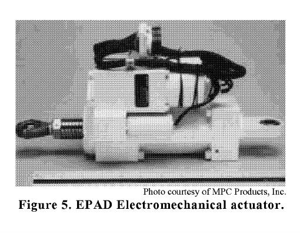
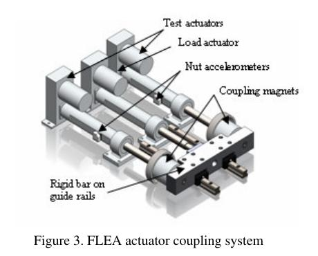
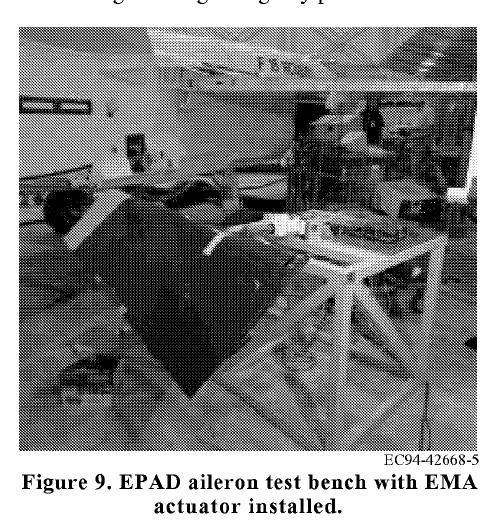

```{python}
#| echo: false
#| output: false
#| warning: false
import sys
sys.path.append("../assets")

import numpy as np
import matplotlib.pyplot as plt

from course_case import (
    PHYSICAL_FEATURES,
    course_holdout_masks,
    generate_course_case,
)
from figstyle import set_style, INK, ACCENT, ACCENT2, GREEN, AMBER, MUTED
from sklearn.calibration import calibration_curve
from sklearn.ensemble import RandomForestClassifier
from sklearn.linear_model import LogisticRegression
from sklearn.metrics import (
    average_precision_score,
    brier_score_loss,
    confusion_matrix,
    precision_recall_curve,
    roc_auc_score,
)
from sklearn.model_selection import GroupShuffleSplit, train_test_split
from sklearn.pipeline import make_pipeline
from sklearn.preprocessing import StandardScaler

set_style()
case = generate_course_case()
train_mask, validation_mask, test_mask = course_holdout_masks(case)

physical_idx = np.arange(len(PHYSICAL_FEATURES))
baseline = make_pipeline(
    StandardScaler(),
    LogisticRegression(class_weight="balanced", max_iter=2000, random_state=42),
)
baseline.fit(case.X[train_mask][:, physical_idx], case.y[train_mask])
validation_probability = baseline.predict_proba(
    case.X[validation_mask][:, physical_idx]
)[:, 1]
```

## Один вопрос перед вылетом

:::: {.columns}
::: {.column width="46%"}
Привод элерона пока отрабатывает команду.

Но ток, температура и ошибка слежения медленно растут.

> **Нужно ли снимать привод после посадки?**

Ответ модели полезен только вместе с честным протоколом проверки.
:::
::: {.column width="54%"}
{fig-alt="Исследовательский самолёт NASA F/A-18B на полосе." height="420"}

[NASA F/A‑18B Systems Research Aircraft: электромеханический привод испытывали на левом элероне.]{.figcap}
:::
::::

::: {.notes}
**Тайминг:** 0:00–0:03. Не начинать с определения классификации. Попросить зал назвать данные,
действие и цену двух ошибок. Зафиксировать на доске: «снять исправный» и «оставить деградирующий».

[Sources]
- https://ntrs.nasa.gov/api/citations/20010039533/downloads/20010039533.pdf
[/Sources]
:::

## Сегодня строим не модель, а доказательство

К концу пары вы сможете:

1. превратить эксплуатационный вопрос в $x$, $y$, горизонт и действие;
2. выбрать единицу независимости и split без утечки;
3. сопоставить дисбаланс классов с PR-метриками;
4. выбрать порог по цене ошибок на validation;
5. сформулировать протокол, который завтра реализуем на **S3**.

::: {.fragment}
**Главная мысль:** качество оценивается на том будущем, в котором модель должна работать.
:::

::: {.notes}
**Тайминг:** 0:03–0:05. Результат пары — не список терминов, а готовый план эксперимента.
Подчеркнуть связку: L1 отвечает «почему так», S3 — «как сделать и оставить артефакт».
:::

## Реальный объект, учебные данные

:::: {.columns}
::: {.column width="48%"}
**Физическая основа**

- электромеханический привод поверхности управления;
- команда, положение, ток, температура, нагрузка, вибрация;
- разные режимы и экземпляры оборудования;
- решение для технического обслуживания.
:::
::: {.column width="52%"}
{fig-alt="Электромеханический привод EPAD, испытанный NASA." height="380"}

[EPAD EMA — реальная аппаратура. Таблица курса — синтетическая и воспроизводимая.]{.figcap}
:::
::::

::: {.notes}
**Тайминг:** 0:05–0:07. Чётко проговорить provenance: фотографии, архитектура и типы датчиков
реальны; численные строки курса сгенерированы открытым кодом. Мы не выдаём синтетику за flight data.

[Sources]
- https://ntrs.nasa.gov/api/citations/20010039533/downloads/20010039533.pdf
[/Sources]
:::

## Привод — часть распределённой системы

:::: {.columns}
::: {.column width="52%"}
{fig-alt="Расположение компонентов системы EPAD EMA на самолёте F/A-18." height="410"}
:::
::: {.column width="48%"}
На борту распределены:

- EMA у левого элерона;
- силовой преобразователь PCU;
- управляющая электроника PCME;
- интерфейсные блоки;
- cockpit switches;
- штатный flight-control computer.

**Следствие:** контекст измерения не менее важен, чем сам сенсор.
:::
::::

::: {.notes}
**Тайминг:** 0:07–0:09. Показать, что модель видит данные из системы с кабелями, преобразованием,
контроллерами и задержками. Ошибка интерфейса может выглядеть как деградация механики.

[Sources]
- https://ntrs.nasa.gov/api/citations/20010039533/downloads/20010039533.pdf
[/Sources]
:::

## Сквозной кейс курса

```text
телеметрия EMA
  → окно 20 с
  → риск деградации в горизонте 30 мин
  → решение после посадки
  → проверка на новом полёте / новом приводе
  → ONNX-инференс и assurance
```

Сегодня фиксируем задачу и доказательство. На следующих модулях меняется **модель**,
но не эксплуатационный вопрос.

::: {.notes}
**Тайминг:** 0:09–0:11. Это контракт всего семестра. Просить студентов каждый раз отвечать:
«Что именно стало лучше в системе — качество, устойчивость, latency или доказуемость?».
:::

## Один полёт становится лабораторией всего курса {.mission-lab-slide}

<iframe
  class="mission-frame"
  src="../interactive/flight-mission.html?view=flight&embed=1"
  title="Интерактивный 3D-полёт со связанными сигналами телеметрии"
  loading="eager"
  allow="fullscreen"
></iframe>

::: {.notes}
**Тайминг:** 0:11–0:14. Запустить полёт, перейти кнопками к взлёту, манёвру и посадке. Показать,
что курсор времени одновременно перемещает воздушное судно и все сигналы. Это общий объект
последующих интерактивов, а не визуальная заставка.

Управление камерой: «за самолётом» показывает динамику, «орбита» разрешает вращение мышью,
«сверху» делает видимой геометрию маршрута.

[Sources]
- https://science.nasa.gov/3d-resources/global-hawk/
[/Sources]
:::

# Часть 1 · Сначала задача, потом алгоритм {.divider background-color="#23373B"}

::: {.notes}
**Тайминг:** 0:09. Переход: таблица признаков ещё не делает задачу supervised.
:::

## Граница системы определяет правильный ответ

:::: {.columns}
::: {.column width="51%"}
Модель получает окно телеметрии:

$$x_i \in \mathbb{R}^{T \times C}$$

и возвращает:

$$\hat p_i=P(y_i=1\mid x_i)$$
:::
::: {.column width="49%"}
**Но решение принимает система**

1. агрегирует окна;
2. сравнивает риск с порогом;
3. учитывает режим;
4. формирует рекомендацию;
5. сохраняет evidence.
:::
::::

::: {.notes}
**Тайминг:** 0:09–0:11. Вопрос: «Является ли 0.73 решением?» Нет: это оценка, пока нет порога,
правила агрегации и действия.
:::

## Один объект порождает много строк

```{python}
#| echo: false
flight = case.flight_id == "EMA-05-F04"
t = case.window_start_s[flight]
tracking = case.X[flight, 0]
current = case.X[flight, 1]

fig, ax1 = plt.subplots(figsize=(10.5, 4.5))
ax1.plot(t, tracking, color=ACCENT, lw=2.8, label="ошибка слежения")
ax1.set_xlabel("начало окна, с")
ax1.set_ylabel("RMSE положения, град", color=ACCENT)
ax2 = ax1.twinx()
ax2.plot(t, current, color=AMBER, lw=2.2, label="ток")
ax2.set_ylabel("RMS тока, А", color=AMBER)
ax1.set_title("24 перекрывающихся окна одного полёта")
plt.show()
```

::: {.notes}
**Тайминг:** 0:11–0:13. Строки рядом по времени видят почти один и тот же физический процесс.
Следствие раскроем в части про split.
:::

## Признак должен иметь физический смысл

| Признак окна | Что измеряет | Возможная ловушка |
|---|---|---|
| `tracking_rmse_deg` | качество отработки команды | зависит от режима |
| `current_rms_a` | электрическую нагрузку | зависит от момента |
| `temperature_c` | тепловое состояние | зависит от охлаждения |
| `vibration_rms_g` | механическую динамику | зависит от места датчика |
| `load_rms_kn` | нагрузку на привод | не является «здоровьем» |
| `supply_voltage_v` | питание | общий источник сдвига |

::: {.notes}
**Тайминг:** 0:13–0:15. Нельзя называть ток «признаком отказа»: он одновременно отражает
нагрузку, режим и здоровье. Смысл появляется только в контексте.
:::

## Метка — событие в будущем

Для окна, заканчивающегося в момент $t_i$:

$$
y_i =
\mathbb{1}\left[
\text{событие деградации произошло в }(t_i,\ t_i+30\text{ мин}]
\right]
$$

**Запрещено:** использовать при построении $x_i$ данные после $t_i$.

::: {.fragment}
Иначе в признаки незаметно попадёт ответ из будущего.
:::

::: {.notes}
**Тайминг:** 0:15–0:17. Нарисовать вертикальную границу «now». Всё справа разрешено только
для построения label, но не feature.
:::

## Горизонт меняет саму задачу

| Горизонт | Доступное действие | Какой сигнал нужен |
|---:|---|---|
| 30 с | аварийная реакция | быстрый, очень надёжный |
| 30 мин | решение после посадки | тренд + режим |
| 10 полётов | планирование ТО | медленная деградация |

Одинаковое слово «отказ» здесь означает три разных датасета.

::: {.notes}
**Тайминг:** 0:17–0:19. Наша учебная постановка — 30 минут и решение после посадки.
Мы не заявляем управление поверхностью в замкнутом контуре.
:::

## Цена ошибки задаётся действием

:::: {.columns}
::: {.column width="50%"}
### False negative

Риск признан низким, но деградация была.

- незапланированный отказ;
- повторный вылет с дефектом;
- высокая цена пропуска.
:::
::: {.column width="50%"}
### False positive

Риск признан высоким, но привод исправен.

- лишняя диагностика;
- простой борта;
- расход ресурса обслуживания.
:::
::::

::: {.notes}
**Тайминг:** 0:19–0:21. Не утверждать универсально, что FN всегда дороже. Для конкретного действия
это должен подтвердить владелец процесса.
:::

## ODD — пространство обещаний

Наша первая версия работает только если:

- тип привода и набор каналов совпадают с контрактом;
- частоты и единицы прошли проверки S2;
- режим принадлежит `{cruise, maneuver, approach}`;
- отсутствуют длинные разрывы и отказ датчика;
- решение принимается **после посадки**, не в контуре управления.

Вне ODD модель должна вернуть **«не знаю»**, а не красивую вероятность.

::: {.notes}
**Тайминг:** 0:21–0:23. Связать с L0: ODD — не юридическая сноска, а условие истинности метрик.
:::

## Baseline — лестница, а не одна модель

1. **Operational:** обслуживать по регламенту.
2. **Constant:** всегда предсказывать базовую частоту события.
3. **Rule:** температура + ошибка слежения выше порогов.
4. **Linear:** логистическая регрессия на агрегатах.
5. **Flexible:** дерево / ансамбль / нейросеть.

Новый уровень имеет смысл только если проходит тот же протокол.

::: {.notes}
**Тайминг:** 0:23–0:25. Спросить: «Почему правило тоже модель?» Потому что отображает наблюдения
в действие и имеет ошибки.
:::

## Аппаратура диктует доступные признаки

:::: {.columns}
::: {.column width="54%"}
{fig-alt="Схема механической части стенда FLEA с тремя приводами и акселерометрами." height="420"}
:::
::: {.column width="46%"}
Стенд FLEA содержит:

- два тестовых привода;
- привод нагрузки;
- датчики положения;
- акселерометры;
- ток, напряжение, температуру;
- нагрузочную ячейку.

[Не «что хотелось бы измерять», а что физически установлено.]{.figcap}
:::
::::

::: {.notes}
**Тайминг:** 0:25–0:27. Показать на изображении test actuators, load actuator, nut accelerometers.
Список сенсоров в публикации NASA напрямую мотивирует признаки нашего учебного кейса.

[Sources]
- https://c3.ndc.nasa.gov/dashlink/static/media/publication/2010_PHM_EMA.pdf
[/Sources]
:::

## Контрольная точка 1

За 60 секунд сформулируйте:

> По окну **каких сигналов** предсказываем **какое событие**,
> в **каком горизонте**, чтобы принять **какое действие**?

Проверка:

- в признаках нет будущего;
- действие действительно возможно;
- две ошибки имеют разную цену;
- ODD можно проверить кодом.

::: {.notes}
**Тайминг:** 0:27–0:29. Дать 30 секунд в парах, затем взять один ответ и улучшить его вслух.
:::

# Часть 2 · Split моделирует будущее {.divider background-color="#23373B"}

::: {.notes}
**Тайминг:** 0:29. Переход: теперь понятно, что предсказываем; осталось определить честное «не видел».
:::

## Случайная строка — не независимое наблюдение

В нашем датасете:

- 24 окна на полёт;
- окна длиной 20 с;
- шаг 10 с;
- общий экземпляр привода;
- общий режим и температурный фон;
- одна метка события для короткого фрагмента.

Если окна одного полёта разделить случайно, test узнаваем.

::: {.notes}
**Тайминг:** 0:29–0:31. Это не абстрактная «корреляция»: соседние окна делят половину исходных
отсчётов и общий контекст.
:::

## Перекрытие создаёт близнецов

```{python}
#| echo: false
fig, ax = plt.subplots(figsize=(10.8, 3.8))
for row, start in enumerate([0, 10, 20, 30]):
    ax.broken_barh([(start, 20)], (row - 0.32, 0.64),
                   facecolors=ACCENT if row % 2 == 0 else ACCENT2)
    ax.text(start + 10, row, f"окно {row}", ha="center", va="center", color="white")
ax.axvline(25, color=AMBER, lw=3, label="случайная граница")
ax.set_xlim(-2, 55); ax.set_ylim(-0.8, 3.8)
ax.set_xlabel("время исходного сигнала, с")
ax.set_yticks([])
ax.set_title("Соседние окна делят 50% исходных отсчётов")
ax.legend(loc="upper right")
plt.show()
```

::: {.notes}
**Тайминг:** 0:31–0:33. Если окно 1 в train, а окно 2 в test, часть тестового сигнала уже была
в обучении буквально теми же отсчётами.
:::

## Неверный эксперимент выглядит убедительно

```python
train_idx, test_idx = train_test_split(
    np.arange(len(y)),
    test_size=0.25,
    stratify=y,
    random_state=42,
)
```

Код воспроизводим. Доли классов совпадают. Seed зафиксирован.

::: {.fragment}
Но вопрос эксперимента: **«узнает ли модель знакомый полёт по соседнему окну?»**
:::

::: {.notes}
**Тайминг:** 0:33–0:35. Хороший код может реализовать неправильный научный вопрос.
:::

## Утечка даёт «вау-метрику»

```{python}
#| echo: false
idx = np.arange(len(case.y))
row_train, row_test = train_test_split(
    idx, test_size=0.25, stratify=case.y, random_state=42
)
group_split = GroupShuffleSplit(n_splits=1, test_size=0.25, random_state=42)
flight_train, flight_test = next(
    group_split.split(case.X, case.y, groups=case.flight_id)
)

scores = {}
for label, tr, te in [
    ("случайные строки", row_train, row_test),
    ("новые полёты", flight_train, flight_test),
]:
    model = RandomForestClassifier(
        n_estimators=180, min_samples_leaf=2, random_state=42
    )
    model.fit(case.X[tr], case.y[tr])
    score = model.predict_proba(case.X[te])[:, 1]
    scores[label] = average_precision_score(case.y[te], score)

fig, ax = plt.subplots(figsize=(9.5, 4.4))
bars = ax.bar(scores.keys(), scores.values(), color=[ACCENT, AMBER], width=0.58)
ax.axhline(case.y.mean(), color=MUTED, ls="--", label="частота события")
ax.set_ylim(0, 1); ax.set_ylabel("Average Precision")
ax.set_title("Та же модель, другой вопрос к данным")
ax.bar_label(bars, fmt="%.2f", padding=5)
ax.legend()
plt.show()
```

::: {.notes}
**Тайминг:** 0:35–0:38. Не запоминать конкретные цифры — они относятся к синтетическому
учебному набору. Запомнить направление: протокол меняет смысл результата сильнее, чем алгоритм.

[Sources]
- https://scikit-learn.org/stable/modules/cross_validation.html
[/Sources]
:::

## Мини-эксперимент: смените единицу split {.live-code}

```{pyodide}
#| caption: "Запустите и сравните AP: строки против полётов"
#| max-lines: 13
import numpy as np
from sklearn.ensemble import RandomForestClassifier
from sklearn.metrics import average_precision_score
from sklearn.model_selection import GroupShuffleSplit, train_test_split

rng = np.random.default_rng(7)
groups = np.repeat(np.arange(80), 18)
group_label = rng.binomial(1, 0.18, 80)
y = np.repeat(group_label, 18)
signature = np.repeat(rng.uniform(-3, 3, 80), 18)
physical = y + rng.normal(0, 1.2, len(y))
X = np.c_[physical, signature]

row_tr, row_te = train_test_split(np.arange(len(y)), test_size=.25, random_state=1)
grp_tr, grp_te = next(GroupShuffleSplit(test_size=.25, n_splits=1, random_state=1).split(X, y, groups))

for name, tr, te in [("строки", row_tr, row_te), ("полёты", grp_tr, grp_te)]:
    model = RandomForestClassifier(n_estimators=120, random_state=1).fit(X[tr], y[tr])
    ap = average_precision_score(y[te], model.predict_proba(X[te])[:, 1])
    print(f"{name:7s}: AP={ap:.3f}, общих групп={len(set(groups[tr]) & set(groups[te]))}")
```

::: {.notes}
**Тайминг:** 0:38–0:41. Дать студентам запустить код. Затем удалить `signature` из `X` и сравнить:
утечка особенно опасна, когда есть стабильный отпечаток объекта.
:::

## Group split отвечает на инженерный вопрос

$$
G_\text{train}\cap G_\text{test}=\varnothing
$$

Группа выбирается по будущему сценарию:

| Будущее | Группа |
|---|---|
| новое окно того же полёта | почти никогда неинтересно |
| новый полёт известного борта | `flight_id` |
| новый экземпляр привода | `actuator_id` |
| новая машина / новый стенд | `aircraft_id` / `rig_id` |

::: {.notes}
**Тайминг:** 0:41–0:43. `GroupKFold` не «лучше KFold вообще»; он соответствует определённому
эксплуатационному утверждению.

[Sources]
- https://scikit-learn.org/stable/modules/generated/sklearn.model_selection.GroupKFold.html
[/Sources]
:::

## Время добавляет вторую ось честности

Для известного парка:

```text
ранние полёты ─────────► поздние полёты
      train        validation / test
```

Требование:

$$\max(t_\text{train}) < \min(t_\text{validation}) < \min(t_\text{test})$$

Перемешивание прошлого и будущего скрывает drift и старение.

::: {.notes}
**Тайминг:** 0:43–0:45. Группа и время решают разные проблемы: одна не допускает общих объектов,
другая не переносит знания из будущего в прошлое.
:::

## Gap защищает границу

Если feature-окно использует $[t-T, t]$, а label — $(t,t+H]$, то рядом с границей возникают
пересекающиеся области информации.

$$
\text{purge interval} \ge T + H_\text{операционный overlap}
$$

На S3 gap зададим явно и проверим тестом.

::: {.notes}
**Тайминг:** 0:45–0:47. Не давать универсальную формулу для всех задач. Gap выводится из геометрии
окон, лага признаков и горизонта label.
:::

## Три уровня проверки

| Уровень | Для чего | Когда смотреть |
|---|---|---|
| train + grouped CV | обучение и устойчивость | сколько угодно |
| validation, позже по времени | модель, признаки, порог | итеративно |
| test, новые приводы | финальное утверждение | один раз |

Test не участвует ни в выборе модели, ни в выборе порога.

::: {.notes}
**Тайминг:** 0:47–0:49. Если после test поменяли признак — test стал validation. Нужен новый test
или честное признание.
:::

## Split manifest делает протокол наблюдаемым

```json
{
  "strategy": "known-actuator temporal + unseen-actuator test",
  "group_key": "flight_id",
  "train": {"actuators": "EMA-00..17", "flights": "F00..F04"},
  "validation": {"actuators": "EMA-00..17", "flights": "F05..F06"},
  "test": {"actuators": "EMA-18..23", "status": "sealed"},
  "seed": 1126
}
```

Хеш manifest входит в паспорт эксперимента.

::: {.notes}
**Тайминг:** 0:49–0:51. Manifest хранит не массив случайных индексов без смысла, а инженерную
семантику выделения будущего.
:::

## Контрольная точка 2

Какой split нужен для утверждения:

> «Модель переносится на новый привод того же типа»?

::: {.fragment}
**Ответ:** привод целиком должен быть невидим train и validation; test группируем по `actuator_id`.
:::

::: {.notes}
**Тайминг:** 0:51–0:53. Дополнительный вопрос: «А если обещаем только будущий полёт известного
привода?» Тогда нужен временной holdout и группы по полётам.
:::

# Часть 3 · Метрика должна видеть редкое событие {.divider background-color="#23373B"}

::: {.notes}
**Тайминг:** 0:53. Переход: split честный; теперь не испортим вывод одной цифрой.
:::

## Высокая accuracy без модели

В учебном наборе событие редкое:

```{python}
#| echo: false
positive = int(case.y.sum())
total = len(case.y)
print(f"окон: {total}")
print(f"событие: {positive} ({positive / total:.1%})")
print(f"accuracy константы 'всё исправно': {1 - positive / total:.1%}")
```

Высокая accuracy может означать **ноль найденных событий**.

::: {.notes}
**Тайминг:** 0:53–0:55. Сначала показать только 87,5% и спросить: «Устраивает?». Затем раскрыть
константный классификатор.
:::

## Матрица ошибок связывает модель с действием

| | Событие $y=1$ | Нет события $y=0$ |
|---|:--:|:--:|
| **Сигнал $\hat y=1$** | TP · нашли | FP · лишняя проверка |
| **Нет сигнала $\hat y=0$** | FN · пропустили | TN · не тревожили |

$$
\text{recall}=\frac{TP}{TP+FN},
\qquad
\text{precision}=\frac{TP}{TP+FP}
$$

::: {.notes}
**Тайминг:** 0:55–0:57. Читать ячейки не как буквы, а как последствия для обслуживания.
:::

## Recall и precision отвечают на разные вопросы

:::: {.columns}
::: {.column width="50%"}
### Recall

> Какую долю будущих событий мы нашли?

Растёт, если снижать порог.
:::
::: {.column width="50%"}
### Precision

> Какая доля сигналов была оправдана?

Обычно падает, если снижать порог.
:::
::::

Нельзя максимизировать оба независимо от базовой частоты события.

::: {.notes}
**Тайминг:** 0:57–0:59. Попросить выбрать важнее для safety screening, но затем напомнить:
очень низкая precision перегружает обслуживание и разрушает доверие.
:::

## ROC может скрыть цену false positive

```{python}
#| echo: false
precision, recall, _ = precision_recall_curve(
    case.y[validation_mask], validation_probability
)
base_rate = case.y[validation_mask].mean()

fig, ax = plt.subplots(figsize=(8.8, 4.5))
ax.plot(recall, precision, color=ACCENT, lw=3)
ax.axhline(base_rate, color=MUTED, ls="--", label=f"baseline = {base_rate:.2f}")
ax.set(xlabel="Recall", ylabel="Precision", xlim=(0, 1), ylim=(0, 1))
ax.set_title("PR-кривая показывает качество среди редких событий")
ax.legend()
plt.show()
```

::: {.notes}
**Тайминг:** 0:59–1:01. Для редкого положительного класса PR-кривая делает видимой долю
ложных тревог среди всех тревог.

[Sources]
- https://scikit-learn.org/stable/modules/model_evaluation.html#precision-recall-f-measure-metrics
[/Sources]
:::

## Average Precision — площадь с правильным baseline

$$
\mathrm{AP}=\sum_n (R_n-R_{n-1})P_n
$$

Для случайного ранжирования ориентир — доля положительного класса:

$$\mathrm{AP}_{random}\approx P(y=1)$$

AP оценивает **ранжирование**, но ещё не выбирает рабочий порог.

::: {.notes}
**Тайминг:** 1:01–1:03. Сравнивать AP между наборами с разной prevalence нужно осторожно.
:::

## Порог превращает вероятность в действие

$$
\hat y_\tau = \mathbb{1}[\hat p \ge \tau]
$$

Меняя $\tau$, мы не переобучаем модель, но меняем:

- число проверок;
- число пропусков;
- загрузку обслуживания;
- итоговую стоимость.

Поэтому threshold — часть versioned decision policy.

::: {.notes}
**Тайминг:** 1:03–1:05. Порог нельзя выбирать на test. Он настраивается на validation при
зафиксированной функции стоимости или ограничении.
:::

## Мини-эксперимент: цена порога {.live-code}

```{pyodide}
#| caption: "Измените threshold, cost_fn и cost_fp"
#| max-lines: 13
import numpy as np
from sklearn.metrics import confusion_matrix

y = np.array([0, 0, 0, 0, 0, 1, 0, 1, 0, 1, 0, 0])
p = np.array([.04, .08, .12, .21, .31, .36, .38, .55, .62, .74, .81, .92])

threshold = 0.50
cost_fn = 25
cost_fp = 2

pred = p >= threshold
tn, fp, fn, tp = confusion_matrix(y, pred).ravel()
cost = cost_fn * fn + cost_fp * fp
print(f"τ={threshold:.2f} | TP={tp}, FP={fp}, FN={fn}, TN={tn}")
print(f"стоимость = {cost_fn}·{fn} + {cost_fp}·{fp} = {cost}")
```

::: {.notes}
**Тайминг:** 1:05–1:08. Попросить найти порог с меньшей стоимостью вручную. Затем поменять
отношение цен и показать, что «лучший порог» меняется.
:::

## Проведите decision review на живом полёте {.mission-lab-slide}

<iframe
  class="mission-frame"
  src="../interactive/flight-mission.html?view=decision&embed=1"
  title="Интерактивный выбор порога и стоимости ошибок"
  loading="lazy"
  allow="fullscreen"
></iframe>

::: {.notes}
**Тайминг:** 1:08–1:12. Перейти к манёвру, включить воспроизведение и двигать threshold.
Сначала снизить порог при высокой цене FN, затем увеличить цену FP. Студенты должны вслух
назвать, какое действие изменилось и почему одна и та же probability не задаёт решение сама.

Матрица и метрики считаются на фиксированной учебной validation; текущий score полёта нужен
для операционного решения.
:::

## Ограничение часто честнее одной стоимости

Если цена FN неизвестна в рублях:

$$
\min_\tau \ \mathrm{FP}(\tau)
\quad
\text{при условии}\quad
\mathrm{Recall}(\tau)\ge 0.90
$$

Это читается как инженерное требование:

> найти не менее 90% событий при минимуме лишних проверок.

::: {.notes}
**Тайминг:** 1:08–1:10. Такое ограничение всё равно требует validation и доверительного интервала,
особенно когда положительных объектов мало.
:::

## Вероятность должна иметь операционный смысл

Калибровка требует:

$$
P(y=1\mid \hat p \approx 0.7)\approx 0.7
$$

Ранжирование и калибровка — разные свойства:

- ROC-AUC / AP: кто выше;
- Brier / reliability: насколько числу можно верить;
- threshold utility: что делать.

::: {.notes}
**Тайминг:** 1:10–1:12. Модель может идеально ранжировать объекты, но выдавать 0.99 там,
где реальная частота 0.6.

[Sources]
- https://scikit-learn.org/stable/modules/calibration.html
[/Sources]
:::

## Reliability diagram обнаруживает самоуверенность

```{python}
#| echo: false
fraction, mean_pred = calibration_curve(
    case.y[validation_mask], validation_probability, n_bins=6, strategy="quantile"
)
brier = brier_score_loss(case.y[validation_mask], validation_probability)

fig, ax = plt.subplots(figsize=(7.5, 4.7))
ax.plot([0, 1], [0, 1], color=MUTED, ls="--", label="идеально")
ax.plot(mean_pred, fraction, "o-", color=ACCENT, lw=2.8, ms=7, label="baseline")
ax.set(xlabel="средняя предсказанная вероятность",
       ylabel="наблюдаемая частота", xlim=(0, 1), ylim=(0, 1))
ax.set_title(f"Калибровка на validation · Brier={brier:.3f}")
ax.legend()
plt.show()
```

::: {.notes}
**Тайминг:** 1:12–1:14. На маленьких данных диаграмма шумная. Поэтому показываем число объектов
в bin и не делаем сильных выводов из одной точки.
:::

## Средняя метрика скрывает режим

```{python}
#| echo: false
rows = []
regimes = case.regime[validation_mask]
y_val = case.y[validation_mask]
for regime in ["cruise", "maneuver", "approach"]:
    mask = regimes == regime
    rows.append(
        (
            regime,
            int(mask.sum()),
            float(y_val[mask].mean()),
            average_precision_score(y_val[mask], validation_probability[mask]),
        )
    )

print("режим       n    prevalence    AP")
for regime, n, prevalence, ap in rows:
    print(f"{regime:9s} {n:4d}     {prevalence:6.1%}   {ap:.3f}")
```

Нужны срезы по режиму, экземпляру, температуре и качеству данных.

::: {.notes}
**Тайминг:** 1:14–1:16. AP может меняться из-за сложности режима и из-за prevalence.
Срез — повод исследовать, а не автоматически объявлять дискриминацию.
:::

## Стек метрик для нашего решения

| Слой | Метрика | Зачем |
|---|---|---|
| ranking | AP + ROC-AUC | отделяет ли риск |
| decision | recall, precision, FP/flight | что произойдёт при пороге |
| probability | Brier + reliability | можно ли трактовать риск |
| robustness | худший режим | где обещание ломается |
| system | latency, RAM, coverage | можно ли эксплуатировать |

Одна итоговая цифра не заменяет этот стек.

::: {.notes}
**Тайминг:** 1:16–1:18. Latency появится в L6, но место для него в протоколе фиксируем уже сейчас.
:::

# Часть 4 · Протокол должен пережить модель {.divider background-color="#23373B"}

::: {.notes}
**Тайминг:** 1:18. Переход к форме эксперимента, которую реализуем на S3.
:::

## Preprocessing учится только на train

Нельзя:

```python
X_scaled = scaler.fit_transform(X)
cross_validate(model, X_scaled, y, ...)
```

Нужно:

```python
pipeline = make_pipeline(
    StandardScaler(),
    LogisticRegression(class_weight="balanced"),
)
```

В каждом фолде `fit` вызывается заново только на его train.

::: {.notes}
**Тайминг:** 1:18–1:20. Масштабирование кажется безобидным, но среднее и дисперсия test —
информация о будущем.

[Sources]
- https://scikit-learn.org/stable/modules/compose.html#pipeline
[/Sources]
:::

## Pipeline фиксирует порядок преобразований

```text
raw features
  → quality gate
  → imputation
  → scaling
  → estimator
  → calibrated probability
  → threshold policy
```

В sklearn Pipeline входят обучаемые преобразования и estimator.
Quality gate и threshold policy могут жить рядом, но версионируются вместе.

::: {.notes}
**Тайминг:** 1:20–1:22. Не пытаться запихнуть всё в sklearn-класс. Важна воспроизводимая
граница ответственности.
:::

## Honest CV возвращает распределение

Вместо «AP = 0.41»:

$$
\mathrm{AP}_{fold}=[0.28,\ 0.35,\ 0.44,\ 0.50,\ 0.31]
$$

Показываем:

- среднее и разброс;
- число событий в каждом фолде;
- идентификаторы групп;
- самый плохой фолд и его режим.

::: {.notes}
**Тайминг:** 1:22–1:24. Дисперсия — часть результата. Особенно при малом числе приводов и событий.
:::

## Сравнение моделей — парный эксперимент

Для каждой модели неизменны:

- split manifest;
- feature contract;
- preprocessing;
- метрики;
- threshold protocol;
- seed и версия данных.

Тогда разность метрик относится к модели, а не к другой реальности.

::: {.notes}
**Тайминг:** 1:24–1:26. Это подготовка к L2–L3: нейросеть сравнивается с тем же baseline
на тех же группах.
:::

## Validation — рабочий стол, test — сейф

На validation разрешено:

- выбирать признаки;
- настраивать гиперпараметры;
- калибровать вероятность;
- выбирать threshold;
- анализировать ошибки.

На test разрешено одно: **проверить заранее зафиксированное решение**.

::: {.notes}
**Тайминг:** 1:26–1:28. Предложить метафору «пломба»: test IDs известны pipeline, но labels
не используются до model freeze.
:::

## Ошибка — источник следующей гипотезы

Для каждого FP/FN сохраняем:

- `flight_id`, `actuator_id`, время окна;
- режим и качество каналов;
- сырые графики вокруг события;
- расстояние до ODD;
- версию модели и порог.

Error analysis заканчивается новой проверяемой гипотезой, не оправданием.

::: {.notes}
**Тайминг:** 1:28–1:30. Пример: FN сосредоточены на approach при низком напряжении. Следующий шаг —
не сразу новая сеть, а проверка покрытия и признаков режима.
:::

## Стенд до полёта важнее красивого графика

:::: {.columns}
::: {.column width="54%"}
{fig-alt="Стенд Iron Bird для испытаний привода элерона NASA." height="440"}
:::
::: {.column width="46%"}
NASA сначала проверяла EMA на hardware-in-the-loop стенде:

- интеграция;
- отказные сценарии;
- режимы полёта;
- аварийные процедуры;
- только затем борт.

ML-протокол повторяет ту же логику evidence.
:::
::::

::: {.notes}
**Тайминг:** 1:30–1:32. Не утверждать, что ML-валидация заменяет HIL. Аналогия только в порядке
наращивания доказательств.

[Sources]
- https://ntrs.nasa.gov/api/citations/20010039533/downloads/20010039533.pdf
[/Sources]
:::

## Паспорт эксперимента

```yaml
question: degradation_within_30min
data_version: actuator-case-v1
split_manifest: sha256:...
features: physical-v1
model: logistic-regression
selection_metric: average_precision
threshold_rule: min_fp_at_recall_ge_0.90
validation_result: ...
test_status: sealed
```

Если число нельзя связать с паспортом, оно не является результатом.

::: {.notes}
**Тайминг:** 1:32–1:34. На S3 этот паспорт станет JSON-артефактом.
:::

## Что именно сделаем на S3

```text
generate_case
  → audit
  → split_manifest.json
  → DummyClassifier
  → sklearn Pipeline
  → GroupKFold
  → PR + calibration
  → threshold on validation
  → one-shot test
  → metrics.json + model.joblib
```

Каждая стрелка получает assert или сохраняемый артефакт.

::: {.notes}
**Тайминг:** 1:34–1:36. Это мост между лекцией и практикой. Попросить студентов открыть
репозиторий S1/S2 до следующего занятия.
:::

## Возвращаемся к решению после посадки

Модель можно рекомендовать к следующему этапу, только если:

1. данные и label соответствуют горизонту;
2. validation позже train, test содержит новые приводы;
3. AP лучше константы и устойчив по режимам;
4. выбран threshold с ограничением по recall;
5. вероятность проверена на калибровку;
6. test ещё не использован для настройки.

::: {.fragment}
**Не «модель сказала 0.73», а «протокол разрешает такое действие при этих условиях».**
:::

::: {.notes}
**Тайминг:** 1:36–1:38. Разрешить студентам оспорить любой пункт: полезно обнаружить, что
без данных о стоимости и покрытия решение пока условное.
:::

## Карта доказательства

| Утверждение | Evidence |
|---|---|
| данные корректны | отчёт S2 |
| нет утечки | split manifest + asserts |
| baseline полезен | grouped CV |
| решение управляемо | threshold curve |
| риск имеет смысл | calibration |
| перенос на новый привод | sealed test |
| результат повторяем | commit + environment + artifacts |

Следующий уровень модели не отменяет ни одну строку.

::: {.notes}
**Тайминг:** 1:38–1:40. Этот слайд можно использовать как чек-лист ревью на всём курсе.
:::

## Exit ticket

Напишите три строки:

1. **единица независимости** в вашем проекте;
2. что именно изображает **будущее** в validation;
3. какое действие определяет цену **FP/FN**.

Если третья строка не формулируется — задача ещё не поставлена.

::: {.notes}
**Тайминг:** 1:40–1:42. Собрать ответы анонимно или попросить обменяться с соседом и найти
один риск утечки.
:::

## Выводы

- Supervised ML начинается с события, горизонта и действия.
- Split — это исполняемая модель будущей эксплуатации.
- При редком событии нужны PR-метрики, threshold utility и calibration.
- Pipeline защищает preprocessing внутри каждого фолда.
- Test остаётся запечатанным до фиксации модели и порога.
- На S3 всё это станет воспроизводимым baseline-релизом.

::: {.notes}
**Тайминг:** 1:42–1:44. Завершить одной фразой: «Самая опасная модель — не слабая, а убедительно
проверенная на неправильном будущем».
:::

## Источники и реальные материалы {.smaller}

- Jensen et al. *Flight Test Experience With an Electromechanical Actuator on the F‑18 SRA*. NASA, 2000.
- Balaban et al. *Airborne Electro-Mechanical Actuator Test Stand for PHM Systems*. PHM Society, 2010.
- scikit-learn: cross-validation, `GroupKFold`, `Pipeline`, precision–recall, calibration.

Фотографии и схемы NASA показаны с подписями из оригинальных публикаций.
Все численные данные кейса сгенерированы `assets/course_case.py`.

::: {.notes}
[Sources]
- https://ntrs.nasa.gov/api/citations/20010039533/downloads/20010039533.pdf
- https://c3.ndc.nasa.gov/dashlink/static/media/publication/2010_PHM_EMA.pdf
- https://scikit-learn.org/stable/modules/cross_validation.html
- https://scikit-learn.org/stable/modules/compose.html#pipeline
- https://scikit-learn.org/stable/modules/model_evaluation.html
- https://scikit-learn.org/stable/modules/calibration.html
[/Sources]
:::
