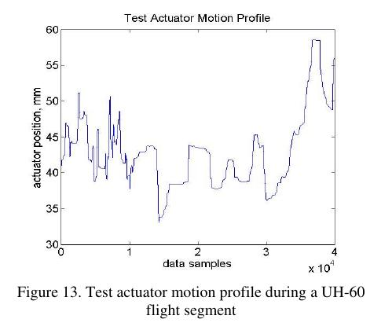
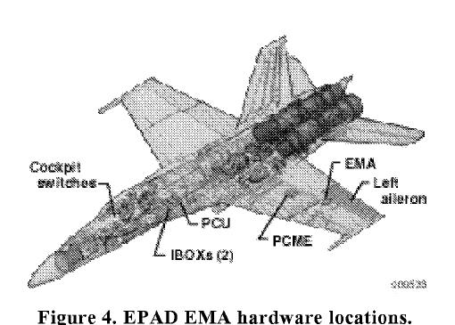
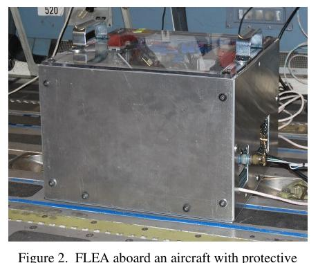

```{python}
#| echo: false
#| output: false
import sys

sys.path.append("../assets")

import matplotlib.pyplot as plt
import numpy as np
import lesson_figures as lf
from sklearn.linear_model import LogisticRegression
from sklearn.metrics import average_precision_score, confusion_matrix, precision_recall_curve
from sklearn.pipeline import make_pipeline
from sklearn.preprocessing import StandardScaler

from course_case import (
    PHYSICAL_FEATURES,
    aggregate_flight_scores,
    course_holdout_masks,
    generate_course_case,
)
from figstyle import ACCENT, ACCENT2, GREEN, MUTED, set_style

set_style()
case = generate_course_case()
train_mask, validation_mask, test_mask = course_holdout_masks(case)
feature_idx = np.arange(len(PHYSICAL_FEATURES))
model = make_pipeline(
    StandardScaler(),
    LogisticRegression(class_weight="balanced", max_iter=2000, random_state=42),
)
model.fit(case.X[train_mask][:, feature_idx], case.y[train_mask])
window_score = model.predict_proba(case.X[validation_mask][:, feature_idx])[:, 1]
validation_flights, validation_target, validation_score = aggregate_flight_scores(
    window_score, case.y[validation_mask], case.flight_id[validation_mask]
)
```

## Инженерная задача

::: {.columns}
::: {.column width="55%"}
Модель выдала для полёта оценку `0.74`. Требуется определить, при каких условиях
эта оценка может привести к назначению осмотра.

Нужно установить:

- на каких независимых объектах проверена модель;
- что означает численная оценка;
- какой порог выбран и по какой цене ошибок;
- когда разрешено посмотреть тестовый результат.
:::
::: {.column width="45%"}
{fig-alt="Исследовательский самолёт NASA F/A-18B SRA" width="500"}

[NASA F/A-18B SRA — физический объект переноса, а не строка таблицы. Jensen et al., 2000.]{.figcap}
:::
:::

::: {.notes}
0:00–0:04. Зафиксировать ключевой вывод: значение 0.74 само по себе не является
ни решением, ни доказанной вероятностью.
:::

## Входные знания

Из L0 и S1 нужны четыре различия:

1. объект и строка таблицы;
2. признаки $X$ и цель $y$;
3. обучение (`fit`) и вывод;
4. оценка модели (`score`) и решение по порогу.

::: {.notes}
0:04–0:07. Кратко восстановить роли строк `fit` и `predict_proba`; при
затруднении открыть итог L0.
:::

## Результат лекции

После занятия студент может:

1. составить манифест разбиения для будущих полётов и новых приводов;
2. обнаружить утечку между зависимыми окнами;
3. вручную получить precision, recall и матрицу ошибок;
4. выбрать порог только по валидационной выборке.

::: {.notes}
0:07–0:09. Все результаты применяются в одном разобранном примере.
:::

# 1 · Что именно проверяем {.divider background-color="#23373B"}

## Единица решения и зависимость

::: {.columns}
::: {.column width="54%"}
В задаче курса:

- строка данных — окно 20 секунд;
- **единица решения** — объект, которому назначается одно действие; здесь полёт;
- **зависимая группа** — строки с общим контекстом; здесь `flight_id`;
- **объект переноса** — новая физическая система; здесь `actuator_id`.

Окна одного полёта имеют общий режим, привод и целевую метку. Они не являются
независимыми испытаниями модели.
:::
::: {.column width="46%"}
{fig-alt="Положение испытательного привода во время участка полёта UH-60" width="510"}

[Соседние отсчёты одного профиля зависимы. Balaban et al., 2010.]{.figcap}
:::
:::

::: {.notes}
0:09–0:14. Развести четыре роли: решение, зависимость, перенос и время. Одно поле
`group` не фиксирует их смысл.
:::

## Интуиция разбиения

Представьте настройку регулятора на стенде. Если один и тот же прогон
использован для настройки и приёмки, приёмка не проверяет новый прогон.

В ML роли данных также разделяются заранее:

```text
обучение параметров → выбор модели и порога → единственная итоговая проверка
       train                validation                    test
```

```{python}
#| echo: false
#| fig-height: 2.4
#| fig-width: 8
lf.split_matrix();
```

::: {.notes}
0:14–0:19. Обсудить, какое решение принимается на каждом этапе. Test не является
третьей площадкой для настройки.
:::

## Определение выборок train, validation, test

**Разбиение** — назначение независимых объектов непересекающимся ролям:

- **train**: алгоритм видит $X$ и $y$ и оценивает параметры $\widehat\theta$;
- **validation**: инженер выбирает семейство, гиперпараметры, агрегацию и порог;
- **test**: один раз оценивается весь зафиксированный протокол.

После изменения признаков, модели, агрегации или порога по результатам теста
прежний тест перестаёт быть независимым.

::: {.notes}
0:19–0:24. Привести пример двух попыток на тесте и объяснить накопление
информации о нём.
:::

## Разобранный пример · две оси переноса

::: {.columns}
::: {.column width="54%"}
Для приводов `EMA-00…EMA-17` доступны семь последовательных полётов:

- полёты 0–4 → обучение;
- будущие полёты 5–6 тех же приводов → валидация;
- все полёты `EMA-18…EMA-23` → тест на новых приводах.

Такой тест строже валидации: одновременно меняется физический объект. Поэтому
его нельзя описать только фразой «разбиение по `flight_id`».
:::
::: {.column width="46%"}
{fig-alt="Компоненты системы EPAD EMA на исследовательском F/A-18B" width="520"}

[Новый полёт и новый привод — разные оси переноса. NASA, Jensen et al., 2000, fig. 4.]{.figcap}
:::
:::

::: {.notes}
0:24–0:30. Нарисовать оси «время внутри привода» и «новый привод». Validation
проверяет будущий полёт известного привода, test — перенос на новый привод.
:::

## Формализация · манифест разбиения

```yaml
decision_unit: flight
dependence_group: flight_id
validation_policy: future_flights_of_known_actuators
test_policy: unseen_actuators
deployment_group: actuator_id
time_order_key: flight_order
test_access: instructor_gate
split_version: course-holdout-v2
```

Манифест фиксирует смысл разбиения до обучения модели.

::: {.notes}
0:30–0:34. Прочитать каждую строку как проверяемое утверждение.
:::

## Контрольный разбор · новый полёт известного привода

Известный привод выполнил восьмой полёт после формирования датасета.

1. В обучение текущего запуска его не добавляют без новой версии разбиения.
2. Он подходит как новая validation для временного переноса.
3. Перенос на новый привод он не проверяет.

::: {.notes}
0:34–0:38. Связать каждый вывод с полями манифеста и правилом версионирования
данных.
:::

# 2 · Утечка и уровень метрики {.divider background-color="#23373B"}

## Утечка зависимых окон

**Утечка данных** возникает, когда обучение или настройка использует информацию,
которая в заявленном сценарии недоступна, либо сведения из validation/test.
При случайном разделении соседние окна одного полёта оказываются по обе стороны:

```text
полёт F05: [0–20] train · [10–30] validation · [20–40] train
```

Модель узнаёт режим и шум конкретного полёта. Высокая метрика описывает похожее
окно того же полёта, хотя эксплуатационный сценарий требует нового полёта.

```{python}
#| echo: false
#| fig-height: 2.35
#| fig-width: 8.4
lf.window_leakage();
```

::: {.notes}
0:38–0:43. Отметить общий сырой интервал первых двух окон: 10 секунд.
:::

## Утечка преобразований

Преобразование с `fit` тоже является частью обучения. Даже при правильных
индексах можно подсмотреть validation:

```python
# неверно: статистики вычислены до разбиения
X_scaled = scaler.fit_transform(X)

# верно: fit только на train
scaler.fit(X_train)
X_train = scaler.transform(X_train)
X_validation = scaler.transform(X_validation)
```

То же правило действует для заполнения пропусков, выбора признаков и порога.

```{python}
#| echo: false
#| fig-height: 2.35
#| fig-width: 7.8
lf.scaler_leakage();
```

::: {.notes}
0:43–0:47. Показать, что в первом варианте значения validation уже повлияли на
среднее и стандартное отклонение.
:::

## Окно даёт score, полёт требует агрегации

**Агрегация** переводит набор оценок окон одного полёта в одну оценку решения:

$$
\{s_{F1},\ldots,s_{Fm_F}\}\longmapsto S_F,
\qquad S_F=\max_{i\in F}s_{Fi}.
$$

Максимум — явная эвристика «одно подозрительное окно поднимает тревогу». Это не
часть логистической регрессии и не вероятность всего полёта. Эвристику нужно
сравнить со средним, квантилем или отдельной моделью агрегации.

```{python}
#| echo: false
#| fig-height: 2.35
#| fig-width: 7.8
lf.flight_aggregation();
```

::: {.notes}
0:47–0:51. Назвать достоинство и недостаток максимума: чувствительность к
краткому событию и к выбросу.
:::

## Score, класс и вероятность

| Выход | Смысл | Как проверяется |
|---|---|---|
| score $S_F$ | порядок полётов по свидетельству класса 1 | метрика ранжирования |
| класс $\widehat y$ | действие после порога | матрица ошибок |
| вероятность | частота события для объектов с близкой оценкой | калибровка |

**Калибровка** означает, что среди объектов с оценкой около `0.7` доля класса 1
близка к 70 процентам. После максимума по окнам это свойство не предполагается;
в курсе `flight_score` используется для ранжирования и выбора порога.

::: {.notes}
0:51–0:55. Развести три выхода на одном полёте. Подчеркнуть, что sigmoid и
название `predict_proba` сами по себе не доказывают калибровку после агрегации.
:::

## Разобранный пример · ранжирование пяти полётов

**Score** — число, по которому модель упорядочивает объекты: больше означает
больше свидетельств в пользу класса 1. Без отдельной проверки калибровки score
`0.80` не означает 80 процентов риска.

| Полёт | правильный класс $y$ | `flight_score` |
|---|---:|---:|
| F1 | 1 | 0.90 |
| F2 | 0 | 0.80 |
| F3 | 1 | 0.70 |
| F4 | 0 | 0.40 |
| F5 | 1 | 0.20 |

Модель правильно ставит F1 первым, но F2 опережает F3, а F5 получает низкую
оценку. Метрика ранжирования должна учесть весь порядок.

::: {.notes}
0:55–0:59. Сначала читать ранжирование при закрытом столбце $y$, затем открыть
ответы и последовательно посчитать вклад положительных полётов.
:::

## Precision и recall

После порога каждый полёт попадает в одну клетку матрицы: $TP$ — верный осмотр,
$FP$ — лишний осмотр, $FN$ — пропущенный осмотр, $TN$ — верный штатный режим.

$$
\mathrm{precision}=\frac{TP}{TP+FP}, \qquad
\mathrm{recall}=\frac{TP}{TP+FN}.
$$

- **precision** считает долю верных среди назначенных осмотров;
- **recall** считает долю найденных среди всех нужных осмотров.

При редком событии accuracy может оставаться высокой у бесполезного правила
«всегда штатно».

::: {.notes}
0:59–1:03. Проговорить TP, FP, FN словами задачи и показать контрпример с 99
штатными полётами и одним требующим осмотра.
:::

## Average Precision до выбора порога

::: {.columns}
::: {.column width="48%"}
Average Precision (AP) суммирует precision в точках, где найден очередной
положительный объект. Сначала полёты сортируют по score, затем проходят список
сверху вниз и фиксируют precision на каждом положительном полёте:

$$
\mathrm{AP}=\sum_k (R_k-R_{k-1})P_k.
$$

Для таблицы при положительных позициях 1, 3 и 5:

$$
\mathrm{AP}=\frac{1 + 2/3 + 3/5}{3}\approx0.756.
$$

AP оценивает ранжирование и ещё не задаёт рабочий порог.
:::
::: {.column width="52%"}
```{python}
#| echo: false
#| fig-height: 4.2
#| fig-width: 5.8
lf.precision_recall(validation_target, validation_score);
```
:::
:::

::: {.notes}
1:03–1:08. Вручную получить precision на позициях положительных объектов.
Отдельно показать, почему F2 ухудшает второе слагаемое.
:::

# 3 · Порог и протокол {.divider background-color="#23373B"}

## Разобранный пример · порог 0.65

::: {.columns}
::: {.column width="56%"}
Для пяти полётов прогноз положителен при `score ≥ 0.65`:

| | предсказано 0 | предсказано 1 |
|---|---:|---:|
| фактически 0 | TN = 1 | FP = 1 |
| фактически 1 | FN = 1 | TP = 2 |

$$
precision=2/3,\qquad recall=2/3.
$$

Понижение порога до 0.15 найдёт все положительные полёты, но назначит осмотр всем.
:::
::: {.column width="44%"}
```{python}
#| echo: false
#| fig-height: 4.2
#| fig-width: 4.6
lf.confusion(
    np.array([1, 0, 1, 0, 1]),
    np.array([1, 1, 1, 0, 0]),
);
```
:::
:::

::: {.notes}
1:08–1:13. Сначала заполнить четыре клетки по готовой таблице. Сверить знаменатели
precision и recall.
:::

## Выбор порога — инженерное ограничение

**Порог** $\tau$ — параметр правила решения
$\widehat y=\mathbb{1}[S_F\ge\tau]$, а не параметр обученной модели.
Пример правила:

> среди порогов с `recall ≥ 0.85` выбрать порог с максимальным precision;
> при равенстве выбрать больший порог.

Правило фиксируется до теста и применяется на уровне полётов. Для бинарных
задач курса установлено `recall ≥ 0.85`: это достаточно жёсткое ограничение,
чтобы константная accuracy не скрывала пропуски, но оно не является нормой
сертификации авиационной системы.

```{python}
#| echo: false
#| fig-height: 2.35
#| fig-width: 7.4
lf.threshold_tradeoff(validation_target, validation_score);
```

::: {.notes}
1:13–1:18. Разобрать tie-break. Минимальную полноту в реальном проекте задаёт
владелец инженерного риска, а не библиотека метрик.
:::

## Контрольный разбор · границы настройки

Модель уже оценена на validation, тест закрыт.

| Действие | Статус |
|---|---|
| подобрать порог по validation | допустимо, версия фиксируется |
| заменить максимум средним по validation | допустимо как новая версия |
| открыть test и вернуть прежний максимум | test уже раскрыт |
| после test добавить признак | нужен новый независимый test |

::: {.notes}
1:18–1:22. 1–2 допустимы с фиксацией версии; 3 уже раскрывает test; 4 требует
нового независимого теста или честной маркировки результата как исследовательского.
:::

## Полный протокол S3

::: {.columns}
::: {.column width="62%"}
```text
манифест разбиения
  → fit преобразований и модели только на train
  → window_score на validation
  → flight_score по заранее выбранной агрегации
  → AP и сравнение с базовым правилом
  → порог по ограничению recall
  → матрица и разбор FP/FN
  → фиксация конфигурации
  → test только на контрольной точке
```
:::
::: {.column width="38%"}
{fig-alt="Стенд FLEA, установленный на борту воздушного судна" width="450"}

[Измерительный стенд FLEA на борту: протокол должен связывать физический опыт и артефакты данных. Balaban et al., 2010.]{.figcap}
:::
:::

::: {.notes}
1:22–1:26. Каждый переход должен оставлять проверяемый файл или тест.
:::

## Самостоятельная практика · манифест

Для распознавания режима по IMU двух аппаратов запишите:

- единицу решения;
- зависимую группу;
- будущую validation;
- объект тестового переноса;
- одно преобразование, которое обучается только на train.

::: {.notes}
1:26–1:28. Индивидуальная запись, затем один ответ. Возможный вариант: окно,
полёт, будущий полёт известных аппаратов, третий аппарат, нормировка.
:::

## Итог

Оценка `0.74` становится частью решения только вместе с:

1. независимой единицей и манифестом разбиения;
2. явно названной агрегацией `window_score → flight_score`;
3. метрикой ранжирования и рабочим порогом;
4. закрытым тестом для зафиксированного протокола.

На S3 студент реализует агрегацию и выбор порога, затем объяснит FP и FN.

::: {.notes}
1:28–1:30. Завершить полным условием применения оценки 0.74: независимое
разбиение, агрегация, метрика, порог и закрытый test.
:::

## Источники {.smaller}

- [Е. Соколов: введение, переобучение и отложенная выборка](https://github.com/esokolov/ml-course-hse/blob/master/ml1-2026-spring/lecture-notes/lecture01-intro.tex)
- [scikit-learn: model evaluation](https://scikit-learn.org/stable/modules/model_evaluation.html)
- [scikit-learn: common pitfalls and leakage](https://scikit-learn.org/stable/common_pitfalls.html)
- [scikit-learn: precision–recall](https://scikit-learn.org/stable/auto_examples/model_selection/plot_precision_recall.html)

Числа и данные примеров синтетические.

::: {.notes}
Справочный слайд после основного маршрута.
:::
