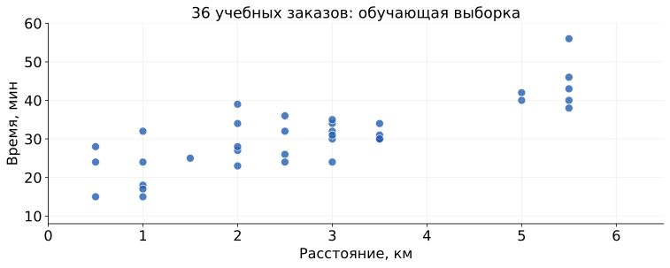
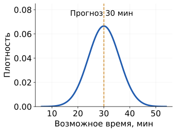
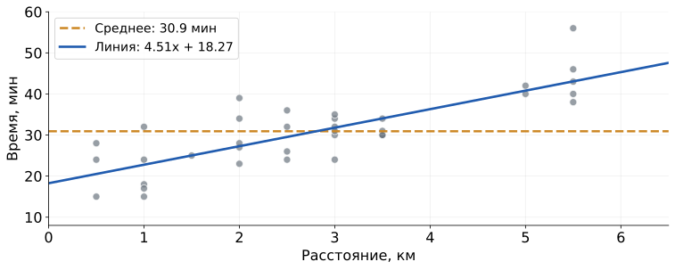
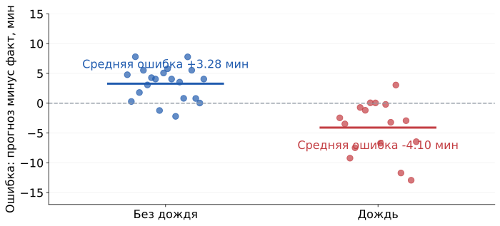
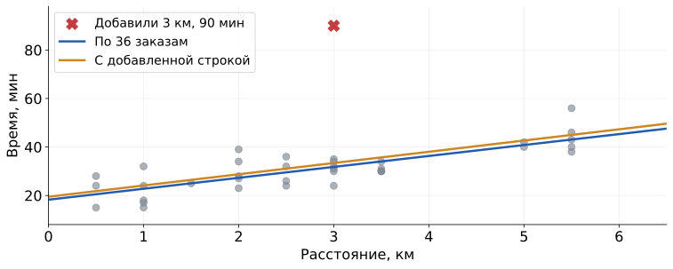
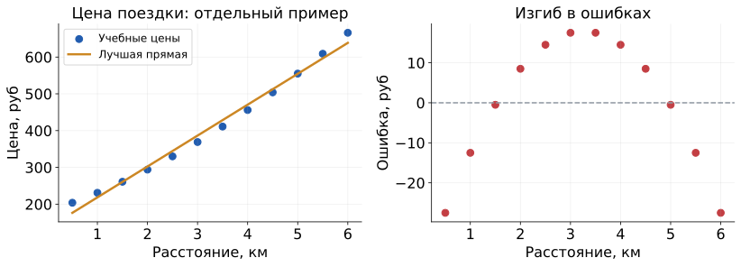

## Курьер уже близко {#l2-02}

::: {.columns}
::: {.column width="47%"}
{height=370 fig-alt="Готовый игровой мем с курьерами доставки"}
:::
::: {.column width="49%"}
**Условие примера:** до выхода на пару 35 минут; приложение показывает доставку за 25 минут.

Запас по этому прогнозу: $35-25=10$ минут.

**Заказываем или берём еду по дороге?**

25 минут пока заданы в условии. Дальше построим собственный прогноз по прошлым заказам.
:::
:::

## Два прогноза погоды {#l2-03}

::: {.columns}
::: {.column width="48%"}
### Будет ли завтра дождь?

[Опр.]{.definition} **Классификация** - задача предсказания категории по известным признакам.

Метка: **нет = 0, да = 1**. Это выбранные обозначения классов.

Логистическая модель оценивает вероятность: $p\in[0,1]$, от невозможного до достоверного события.

Выбираем порог и получаем класс.
:::
::: {.column width="48%"}
### Сколько выпадет осадков?

[Опр.]{.definition} **Регрессия** - задача предсказания количественной величины по известным признакам.

Метка: **количество, мм**.

Регрессия оценивает величину $\hat y$ в той же шкале.

Для сравнения возьмём **1 мм и 20 мм**: важна величина дождя.
:::
:::

[Пример и определения: Google, введение в ML.](https://developers.google.com/machine-learning/intro-to-ml/what-is-ml){.figcap}

## Успею поесть до пары? {#l2-04}

**Условие:** до выхода 35 минут, заказ ещё не оформлен.

[Опр.]{.definition} **Целевая величина** $y$ - измеряемый ответ, который учится предсказывать модель.

Здесь: время **от принятия заказа до вручения**, в минутах.

Сравним два возможных прогноза, заданных для обсуждения:

| Прогноз | До выхода |
|---|---|
| 25 мин | $35-25=10$ мин запаса |
| 50 мин | $50-35=15$ мин задержки |

**В каком случае заказываем?**

Вопрос «доставят ли за 35 минут?» даёт метку да / нет. Это отдельная задача классификации.

## Данные: 48 заказов {#l2-05}

**Учебный CSV:** 48 синтетических заказов. Ниже строки D01-D03 для ручного счёта.

| Заказ | Расстояние, км | Заказов в очереди | Дождь | Время, мин |
|---|---:|---:|:--:|---:|
| D01 | 1 | 0 | нет | 18 |
| D02 | 2 | 4 | нет | 27 |
| D03 | 3 | 0 | нет | 24 |

**Почему заказ с 2 км оказался медленнее заказа с 3 км?**

Разбиение задано заранее: **D01-D36 для обучения**, **D37-D48 для проверки**; $36+12=48$.

[Все значения в таблице созданы для занятия. Полный CSV](../starter/data/delivery-orders-synthetic.csv){.figcap}

## Одинаковое расстояние, разное время {#l2-06}

{height=365 fig-alt="36 учебных заказов с разбросом времени при одном и том же расстоянии"}

Точки: **D01-D36 из учебного CSV**. По горизонтали км, по вертикали фактические минуты.

**Одно расстояние, несколько разных времён. Какой ответ дать?**

## Линейная модель времени {#l2-07}

[Опр.]{.definition} **Линейная регрессия** описывает численную цель линейной функцией признаков с обучаемыми коэффициентами.

$$\hat y=wx+b$$

| Параметр | Смысл в прогнозе | Единица |
|---|---|---|
| $w$ | Изменение прогноза на дополнительный км | мин/км |
| $b$ | Прогноз при нулевом расстоянии | мин |

Ищем общие параметры по прошлым заказам.

**Если ресторан рядом, ждать совсем не придётся?**

## Почему здесь убираем сигмоиду? {#l2-08}

| | Логистическая модель из L1 | Линейная модель сегодня |
|---|---|---|
| Линейная часть | $z=wx+b$ | $wx+b$ |
| Выход | $p=\sigma(z)$ | $\hat y=wx+b$ |
| Что оцениваем | Вероятность события | Время в минутах |
| Целевая метка | $y\in\{0,1\}$ | $y>0$, измеренное время |

Метки $0$ и $1$ кодируют отсутствие и наличие события; сигмоида ограничивает ответ интервалом $(0,1)$. Минуты этим интервалом не ограничены.

**Что получится, если оставить сигмоиду?**

## Средняя ошибка может скрыть промахи {#l2-09}

[Опр.]{.definition} **Ошибка прогноза** $e=\hat y-y$ - разность прогноза и факта.

Факты берём из **D01-D03**. Для примера зададим правило $\hat y=3x+17$.

| $x$, км | Факт, мин | Прогноз, мин | Ошибка, мин |
|---:|---:|---|---|
| 1 | 18 | $3\cdot1+17=20$ | $20-18=+2$ |
| 2 | 27 | $3\cdot2+17=23$ | $23-27=-4$ |
| 3 | 24 | $3\cdot3+17=26$ | $26-24=+2$ |

Средняя ошибка: $(2-4+2)/3=0$ минут; **3 в знаменателе = три заказа**.

**Как три промаха дали нулевую среднюю ошибку?**

## Средний квадрат ошибки {#l2-10}

[Опр.]{.definition} **Средний квадрат ошибки (MSE)** - среднее квадратов ошибок прогноза.

$$L(w,b)=\frac1n\sum_{i=1}^{n}(wx_i+b-y_i)^2$$

На D01-D03 факты: **18, 27, 24 мин**. Прогнозы по $3x+17$: **20, 23, 26 мин**.

$$e=(20-18,\ 23-27,\ 26-24)=(2,-4,2)$$
$$\mathrm{MSE}=\frac{2^2+(-4)^2+2^2}{3}=\frac{4+16+4}{3}=8\ \text{мин}^2$$

**Почему промах в 4 минуты получил штраф вчетверо больше?**

$4^2/2^2=16/4=4$. Делим сумму на **3 заказа**.

## Почему меняется функция потерь {#l2-11}

В L1 выбирали метки классов: $y=0$ для обычного сообщения, $y=1$ для спама.

$$\ell=-y\ln p-(1-y)\ln(1-p)$$

Два слагаемых соответствуют **двум исходам**: событие произошло или нет.

Теперь возьмём строку **D02: $y=27$ минут**. Тогда $1-y=1-27=-26$: прежний вероятностный смысл теряется.

**Как описать возможные значения времени около прогноза?**

## От распределения ошибок к MSE {#l2-12}

::: {.columns}
::: {.column width="40%"}
{height=310 fig-alt="Нормальная плотность времени вокруг прогноза 30 минут"}
:::
::: {.column width="56%"}
**На рисунке задаём прогноз 30 мин** для иллюстрации плотности, без обучения.

Время $y=\hat y+\varepsilon$. Шум $\varepsilon\sim\mathcal N(0,\sigma^2)$.

$q(y\mid x)$: плотность времени при заданном $x$. $C=\ln(\sigma\sqrt{2\pi})$ не зависит от параметров.

$$-\ln q(y\mid x)=C+\frac{(y-\hat y)^2}{2\sigma^2}$$

При независимых ошибках с общей фиксированной $\sigma$ отрицательный логарифм правдоподобия даёт сумму квадратов.
:::
:::

[Это обоснование MSE при указанном допущении. Нормальность ошибок доставки мы не проверяли. Stanford CS229, §1.3.]{.figcap}

## Какой прогноз вам подходит? {#l2-13}

[Опр.]{.definition} **Средняя абсолютная ошибка (MAE)** - среднее модулей ошибок прогноза.

**Зададим два варианта ошибок на одних трёх заказах**, чтобы сравнить частые и крупные промахи.

| Вариант | $|e|$, мин | MAE, мин | MSE, мин² |
|---|---|---|---|
| A | 0, 0, 12 | $(0+0+12)/3=4$ | $(0+0+144)/3=48$ |
| B | 5, 5, 5 | $(5+5+5)/3=5$ | $(25+25+25)/3=25$ |

$$\mathrm{MAE}=\frac1n\sum_i|\hat y_i-y_i|,\qquad n=3\text{ заказа}$$

**Какой вариант выберем по MAE? А по MSE?**

## Ошибка в минутах {#l2-14}

[Опр.]{.definition} **Корень из среднего квадрата ошибки (RMSE)** - квадратный корень из MSE.

$$\mathrm{RMSE}=\sqrt{\frac1n\sum_i e_i^2}$$

Для заданных ошибок A = **0, 0, 12** и B = **5, 5, 5 мин**:

$$\mathrm{RMSE}_A=\sqrt{(0+0+12^2)/3}=\sqrt{48}\approx6.93\text{ мин}$$
$$\mathrm{RMSE}_B=\sqrt{(5^2+5^2+5^2)/3}=5\text{ мин}$$

**Можем ошибиться на 12 минут, если RMSE равна 5 минутам?**

Возьмём шесть ошибок **$12,\sqrt6,0,0,0,0$ мин**:
$\sqrt{(144+6)/6}=5$ мин. RMSE усредняет все ошибки.

## Как ошибка меняет параметры {#l2-15}

[Опр.]{.definition} **Градиент** - вектор частных производных функции по её параметрам.

$e_i=wx_i+b-y_i$. Для квадрата ошибки применяем правило цепочки:

$$\frac{\partial e_i^2}{\partial w}=2e_i x_i,\qquad
\frac{\partial e_i^2}{\partial b}=2e_i$$

Множитель **2** возник при дифференцировании квадрата; $n$ - число заказов.

Для всей обучающей выборки:

$$g_w=\frac2n\sum_i e_i x_i,\qquad g_b=\frac2n\sum_i e_i$$

Шаг $\eta$ выбираем до обучения.

$$w_{\text{new}}=w-\eta g_w,\qquad b_{\text{new}}=b-\eta g_b$$

## Один шаг на трёх заказах {#l2-16}

Берём **D01-D03**. Начальные параметры **выбраны для примера**: $w=0$, $b=20$; поэтому $\hat y=0x+20=20$.

| $x$, км | $y$, мин | $\hat y$ | $e=\hat y-y$ | $ex$ |
|---:|---:|---:|---:|---:|
| 1 | 18 | 20 | 2 | 2 |
| 2 | 27 | 20 | -7 | -14 |
| 3 | 24 | 20 | -4 | -12 |

$$\sum e=2-7-4=-9,\qquad\sum ex=2-14-12=-24$$
$$g_w=\frac23(-24)=-16,\qquad g_b=\frac23(-9)=-6$$

$\mathrm{MSE}=(2^2+(-7)^2+(-4)^2)/3=23$ мин². **3 = число заказов**.

## Проверка шага обучения {#l2-17}

**D01-D03:** $x=(1,2,3)$ км, $y=(18,27,24)$ мин. Старт задан: $w=0,b=20$.

$g_w=\frac23(2\cdot1-7\cdot2-4\cdot3)=-16$; $g_b=\frac23(2-7-4)=-6$.

Выберем шаг $\eta=0.1$ для этого опыта:

$$w_{new}=0-0.1(-16)=1.6,\qquad b_{new}=20-0.1(-6)=20.6$$

Прогнозы по $1.6x+20.6$: **22.2, 23.8, 25.4** мин. Вычитаем **18, 27, 24**:

$$\mathrm{MSE}_{после}=\frac{4.2^2+(-3.2)^2+1.4^2}{3}=\frac{29.84}{3}\approx9.95\text{ мин}^2$$

**Увеличим выбранный шаг в десять раз: $0.1\cdot10=1$?**

## Прямую можно найти без итераций {#l2-18}

[Опр.]{.definition} **Метод наименьших квадратов** подбирает параметры по минимуму суммы квадратов ошибок.

В минимуме обе частные производные равны нулю:

$$w^*=\frac{\sum_i(x_i-\bar x)(y_i-\bar y)}{\sum_i(x_i-\bar x)^2},\qquad b^*=\bar y-w^*\bar x$$

**D01-D03:** $x=(1,2,3)$, $y=(18,27,24)$.

$$\bar x=(1+2+3)/3=2,\qquad\bar y=(18+27+24)/3=23$$
$$w^*=\frac{(-1)(-5)+0\cdot4+1\cdot1}{(-1)^2+0^2+1^2}=\frac62=3,\qquad b^*=23-3\cdot2=17$$

По найденному правилу $3x+17$ прогнозы **20, 23, 26** мин. Вычитаем **18, 27, 24**:

$$\mathrm{MSE}_{min}=\frac{(20-18)^2+(23-27)^2+(26-24)^2}{3}=\frac{4+16+4}{3}=8\text{ мин}^2.$$

## Что получилось на 36 заказах {#l2-19}

{height=265 fig-alt="Прямая по 36 заказам и постоянный прогноз среднего времени"}

**Источник: D01-D36.** Суммы по CSV: $\sum x=101$, $\sum y=1113$, $\sum x^2=369.5$, $\sum xy=3511$.

$$w=\frac{3511-101\cdot1113/36}{369.5-101^2/36}\approx4.50919,\quad b=\frac{1113}{36}-w\frac{101}{36}\approx18.26588$$

Среднее: $1113/36\approx30.92$ мин. Для нового заказа задаём $x=2$ км:

$$\hat y\approx4.50919\cdot2+18.26588=27.28426\approx27.3\text{ мин}$$

**Можно уже спокойно ждать?**

## В дождь модель ошибается иначе {#l2-20}

{height=240 fig-alt="Ошибки однофакторной модели на обучающих заказах с дождём и без"}

На **D01-D36** обучили $\hat y\approx4.50919x+18.26588$ минимизацией MSE. Для каждого заказа вычитаем факт: $e=\hat y-y$.

| Группа из CSV | Число заказов | Сумма $e$, мин | Средняя ошибка, мин |
|---|---:|---:|---|
| Без дождя | 20 | $+65.5593$ | $65.5593/20\approx+3.28$ |
| С дождём | 16 | $-65.5593$ | $-65.5593/16\approx-4.10$ |

**В дождь люди ждут дольше прогноза. Что дать модели на вход?**

## Несколько признаков в линейной регрессии {#l2-21}

[Опр.]{.definition} **Множественная линейная регрессия** использует несколько признаков, каждый со своим обучаемым коэффициентом.

$x$: км; $q$: заказов в очереди; $r=0$: сухо, $r=1$: дождь.

**Обучение на D01-D36:** подбираем все четыре параметра вместе, минимизируя

$$\frac1{36}\sum_{i=1}^{36}(w_1x_i+w_2q_i+w_3r_i+b-y_i)^2.$$

Полученные коэффициенты, округлённые до сотых:

$$\hat y\approx4.11x+1.14q+7.09r+12.75$$

**Условие нового заказа:** $x=2$ км, $q=8$ заказов, $r=1$.

$$\hat y\approx\underbrace{4.11\cdot2}_{8.22}+\underbrace{1.14\cdot8}_{9.12}+\underbrace{7.09\cdot1}_{7.09}+12.75=37.18\text{ мин}$$

Неокруглённые коэффициенты дают **37.1865 мин**, округлённые до сотых дают **37.18 мин**.

## Проверка на 12 новых заказах {#l2-22}

Все параметры обучены по **D01-D36**. Теперь фиксируем их и прогнозируем **D37-D48: 12 заказов**. Ошибка $e=\hat y-y$.

$$\mathrm{MAE}=\frac{\sum|e|}{12},\qquad\mathrm{RMSE}=\sqrt{\frac{\sum e^2}{12}}$$

| Модель | $\sum|e|$, мин | $\sum e^2$, мин² | RMSE, мин | MAE, мин |
|---|---:|---:|---:|---:|
| Среднее train $1113/36$ | 66.3333 | 676.4167 | 7.51 | 5.53 |
| Только расстояние | 66.9365 | 548.9946 | 6.76 | 5.58 |
| Расстояние, очередь, дождь | 34.3937 | 127.2790 | 3.26 | 2.87 |

Пример: $\sqrt{548.9946/12}\approx6.76$; $66.9365/12\approx5.58$.

**Линия лучше среднего во всём?**

[Суммы посчитаны по 12 синтетическим заказам, без изменения параметров.]{.figcap}

## Что известно в момент заказа? {#l2-23}

Заказ оформляем сейчас. Какие сведения уже доступны?

1. Расстояние до ресторана.
2. Число заказов перед нами при оформлении.
3. Дождь при оформлении.
4. Время, когда курьер забрал готовый заказ.
5. Фактическую длительность поездки курьера.

**Какие пункты допустимы для нашего момента прогноза?**

## Один заказ длился 90 минут {#l2-24}

{height=290 fig-alt="Добавленный учебный заказ 3 км и 90 минут сдвигает общую линию наименьших квадратов"}

**Отдельный учебный случай задан:** 3 км, 90 минут. Добавляем к копии D01-D36: $36+1=37$ заказов.

Старая линия обучена на 36 строках: $\hat y\approx4.50919x+18.26588$.
Для 3 км: $4.50919\cdot3+18.26588\approx31.79$ мин;
ошибка $31.79-90\approx-58.21$ мин.

Вторая линия заново минимизирует MSE на **37 строках**.

**Ошибка записи или настоящая задержка? Что проверим?**

## Когда прямой недостаточно {#l2-25}

{height=205 fig-alt="Отдельная синтетическая задача цены поездки: линейная модель оставляет дугу ошибок"}

Это **отдельная учебная таблица цены поездок**. По горизонтали км; слева цена в рублях, справа ошибка $e=\hat y-y$ в рублях. Ноль ошибки означает точный прогноз.

[Опр.]{.definition} **Преобразование признаков** - вычисление новых признаков из исходных. Добавим квадрат расстояния:

$$\hat y=w_1x+w_2x^2+b;\quad x=5\text{ км}\ \Longrightarrow\ x^2=5\cdot5=25\text{ км}^2.$$

Степень **2** выбрана для новой формы зависимости. Линейность относится к обучаемым параметрам.

## Среднее время и обещанный срок {#l2-26}

**Заданный пример:** прогноз среднего времени 30 минут, выйти нужно через 35 минут. Хотим обещание «успеем с вероятностью 90%».

Сравним **два придуманных распределения**:

| Возможное время | Среднее, мин | Шанс успеть к 35 мин |
|---|---|---|
| Всегда 30 мин | 30 | $100\%$: $30<35$ всегда |
| 20 или 40 мин с равными шансами | $(20+40)/2=30$ | $50\%$: успевает один из двух исходов |

**Одного среднего 30 минут хватает для обещания 90%?**

90% здесь желаемая надёжность. Её надо отдельно оценить и проверить по новым заказам.

## Хватит ли денег на поездки? {#l2-27}

Нужно заранее оценить **траты на поездки за следующий месяц**, в рублях.

1. Какую целевую величину записывать в таблицу?
2. Какие признаки будут известны до начала месяца?
3. Какую метрику выбрать, если особенно неприятны крупные промахи?
4. С каким простым прогнозом сравнить модель?

Для другого вопроса **зададим порог бюджета 5000 рублей**:

**Чем изменится задача, если спрашивать только «превысят ли траты 5000 рублей»?**
