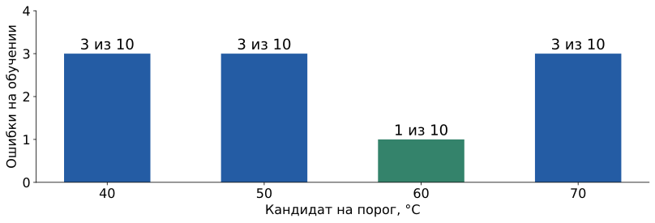
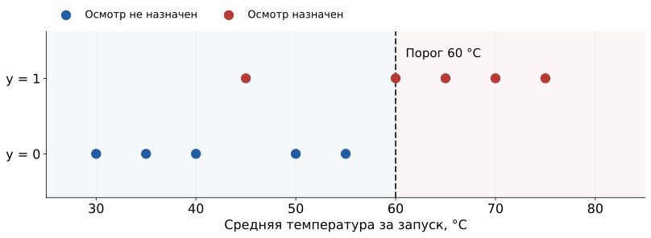
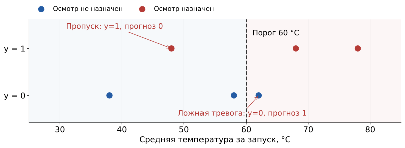

## Один понятный опыт

Температура запуска → правило с порогом → ответ 0 или 1.

**Входные знания:** пример из L0; синтаксис Python разберём по ходу.

**Что построим:** выбор порога из **40, 50, 60 и 70 °C** и проверку на новых данных.

[Начальный notebook](../starter/notebooks/S01-live-coding.ipynb) ·
[Выполненный notebook](../starter/notebooks/solutions/S01-complete.ipynb)

[Данные синтетические. Полный опыт: starter/lessons/s01.py.]{.figcap}

## Два списка описывают одни запуски

```python
train_temperature = [30, 35, 40, 45, 50, 55, 60, 65, 70, 75]
train_target =      [ 0,  0,  0,  1,  0,  0,  1,  1,  1,  1]
```

Одинаковый номер в двух списках относится к одному запуску.

Индексы Python: **0, 1, 2, …, 9**.

## Код 1 · прочитать данные

```python
print(train_temperature[0])
print(train_target[0])
print(len(train_temperature))
```

Получим **30**, **0**, **10**.

`print` показывает значение. `len` считает элементы.

## Условие выбирает ответ

```python
if temperature >= threshold:
    prediction = 1
else:
    prediction = 0
```

`>=` — не меньше. `if` — если. `else` — иначе.

Отступ объединяет строки одной ветки.

## Код 2 · одно предсказание

Температура **58 °C**, временный порог **50 °C**.

$$58\ge50\quad\Rightarrow\quad\widehat y=1.$$

Выполняется ветка `prediction = 1`.

## Повторение для каждой строки

```python
for i in range(len(train_temperature)):
    print(i, train_temperature[i], train_target[i])
```

`range(10)` даёт номера **0–9**.

Цикл берёт очередной номер и повторяет строки с отступом.

## Код 3 · посчитать ошибки

```python
if prediction != train_target[i]:
    errors = errors + 1
```

Фрагмент внутри цикла. Перед циклом записываем `errors = 0`.

Счётчик растёт только при несовпадении.

При пороге **50 °C** получим **3 ошибки**.

## Одинаковый расчёт для четырёх правил

{height=365 fig-alt="Число ошибок каждого температурного порога"}

Каждый кандидат проверяется на тех же десяти строках.

## Код 4 · подобрать параметр

```python
if errors < best_errors:
    best_errors = errors
    best_threshold = threshold
```

Кандидаты: **40, 50, 60, 70**.

Ошибки: **3, 3, 1, 3**. Сохраняем **60 °C**.

## Модель после обучения

{height=365 fig-alt="Выбранный температурный порог и одна оставшаяся ошибка"}

`best_threshold == 60`. На обучении осталось **1 несовпадение из 10**.

## Код 5 · применить модель

Новый запуск: **58 °C**. Обученный порог: **60 °C**.

```python
if new_temperature >= best_threshold:
    new_prediction = 1
else:
    new_prediction = 0
```

Получим **0**.

## Новые данные для проверки

| Температура, °C | 38 | 48 | 58 | 62 | 68 | 78 |
|---|---:|---:|---:|---:|---:|---:|
| Известный ответ | 0 | 1 | 0 | 0 | 1 | 1 |
| Прогноз порога 60 | 0 | 0 | 0 | 1 | 1 | 1 |

Порог выбран до открытия этой таблицы.

## Код 6 · проверить результат

[Опр.]{.definition} **Accuracy** — доля верных ответов.

```python
accuracy = correct / len(check_target)
```

**4 из 6** ответов верны: $4/6\approx0.667$.

Постоянный ответ 0: **3 из 6**, то есть $0.5$.

## Ошибки остаются видимыми

{height=365 fig-alt="Пропуск при 48 и ложная тревога при 62 градусах"}

## Что дальше меняется в модели

Сейчас: один признак, четыре кандидата, перебор.

Дальше: вероятность ответа, численный штраф, изменение параметров по производным.

Списки, условия и циклы останутся знакомыми.

## Источники и материалы {.smaller}

- Все температуры, метки и назначения осмотра придуманы для занятия.
- [Код S1](../starter/lessons/s01.py): выбор порога и проверка.
- [Код S2](../starter/lessons/s02.py): подготовка таблицы.
- [Описание данных](../starter/data/INTRO-README.md).
- [Начальный notebook](../starter/notebooks/S01-live-coding.ipynb) · [выполненный notebook](../starter/notebooks/solutions/S01-complete.ipynb).
