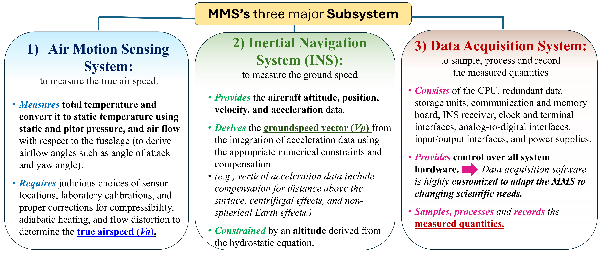
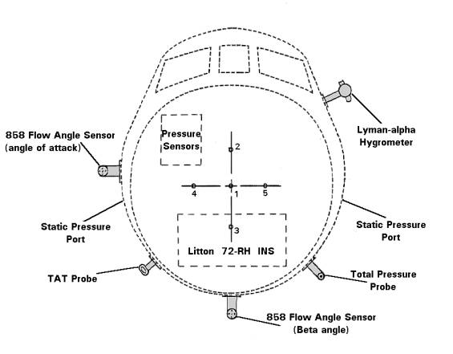

```{python}
#| echo: false
#| output: false
import sys

sys.path.append("../assets")

import lesson_figures as lf
from figstyle import set_style

set_style()
```

## Инженерная задача

::: {.columns}
::: {.column width="52%"}
IMU работает примерно на 100 Гц, GNSS — на 10 Гц. В IMU есть повтор времени и
разрыв связи 0.45 с. Молчаливая интерполяция всего лога недопустима: сначала
нужна явная политика времени, единиц и длинных разрывов.
:::
::: {.column width="48%"}
{fig-alt="Беспилотный исследовательский самолёт NASA Global Hawk в полёте" width="560"}

[NASA Global Hawk 872 — пример платформы с многоканальной бортовой телеметрией. NASA / Carla Thomas.]{.figcap}
:::
:::

::: {.notes}
0:00–0:05. Показать следствие молчаливой интерполяции: внутри длинного разрыва
появляется вычисленное значение без измеренного физического сигнала.
:::

## Входные знания

Из L0–S1 нужны:

- строка данных, признак и единица измерения;
- индексация NumPy и булева маска;
- различие готового runner и функции, где принимается предметное решение.

Диагностический пример: `np.diff([0.00, 0.01, 0.01, 0.04])` даёт
`[0.01, 0.00, 0.03]`; ноль указывает повтор timestamp.

::: {.notes}
0:05–0:09. Ответ: 0.01, 0, 0.03; ноль указывает повтор timestamp. При
затруднении разобрать пример на доске.
:::

## Результат и приёмка

Студент реализует только две функции:

1. `timestamp_report` — диагностика часов;
2. `interpolate_with_gap_mask` — явная политика разрывов.

Готовый код строит окна и сохраняет `reports/s2-quality.json` с контрактом
признаков. Студент добавляет граничные тесты и объясняет одно отброшенное окно.

{fig-alt="Модульная авиационная измерительная система NASA с датчиками и стойкой регистрации" width="700"}

[Modular Aerial Sensing System: измерительный тракт — физическая аппаратура, а не абстрактный CSV. NASA.]{.figcap}

::: {.notes}
0:09–0:13. Показать `sensor.py`: TODO находятся только в двух функциях.
:::

## Почему здесь отдельный IMU/GNSS-лог

::: {.columns}
::: {.column width="40%"}
S1/S3 используют готовую таблицу признаков привода. В S2 отдельный синтетический
лог выбран потому, что в нём наглядны разные часы, единицы и потеря пакетов.

Это не телеметрия того же аппарата. Переносимый результат S2 — **контракт
обработки**: что проверяется до построения признаков и какие окна считаются
допустимыми.
:::
::: {.column width="60%"}
{fig-alt="Официальная схема трёх подсистем авиационной измерительной системы MMS: датчики воздушного движения, инерциальная навигация и сбор данных" width="720"}

[Три подсистемы MMS и три источника контрактов данных. NASA Airborne Science.]{.figcap}
:::
:::

::: {.notes}
0:13–0:17. Сохранить сильное решение курса — отдельный учебный кейс — и честно
назвать связь с S3.
:::

# Этап 1 · Проверить часы {.divider background-color="#23373B"}

## Определение дефектов времени

Для последовательности $t_0,\ldots,t_{N-1}$:

- `non_finite`: число `NaN` и бесконечностей;
- `duplicate`: число конечных соседних пар с $t_i-t_{i-1}=0$;
- `backward`: число конечных соседних пар с $t_i-t_{i-1}<0$.

Большой положительный $\Delta t$ — разрыв сигнала, но его допустимая длина
зависит от последующей политики и задаётся отдельно.

```{python}
#| echo: false
#| fig-height: 2.3
#| fig-width: 8
lf.timestamp_defects();
```

::: {.notes}
0:17–0:23. Прочитать определения на примере входной диагностики. Уточнить, что
несортированный массив нельзя тихо сортировать без сохранения соответствия каналов.
:::

## Задача 1 · сначала тесты

Создайте `tests/test_sensor.py` и зафиксируйте три случая:

```python
assert timestamp_report(np.array([0.0, 0.1, 0.1]))["duplicate"] == 1
assert timestamp_report(np.array([0.0, 0.2, 0.1]))["backward"] == 1
assert timestamp_report(np.array([0.0, np.nan]))["non_finite"] == 1
```

Добавьте один собственный граничный случай и только затем реализуйте функцию.

::: {.notes}
0:23–0:34. Самостоятельная работа. Подсказка выдаётся после попытки: маска
конечных соседних пар и `np.diff`.
:::

## Разбор задачи 1

Проверьте инварианты:

- вход не изменяется;
- пустой массив и один timestamp дают нулевые счётчики;
- `NaN` не превращается одновременно в `duplicate` или `backward`;
- значения отчёта — обычные `int`, пригодные для JSON.

```bash
uv run python -m pytest -q tests/test_sensor.py
```

::: {.notes}
0:34–0:39. Один студент показывает решение, другой — тест, который способен его
сломать. Команда запускает проверку, но не заменяет аргументацию.
:::

# Этап 2 · Зафиксировать единицы и разрывы {.divider background-color="#23373B"}

## До интерполяции — единицы SI

::: {.columns}
::: {.column width="55%"}
Генератор выдаёт ускорение в $g$ и угловую скорость в градусах/с. Runner явно
преобразует их:

$$
a_{\mathrm{m/s^2}}=a_g\cdot9.80665,
\qquad
\omega_{\mathrm{rad/s}}=\omega_{\mathrm{deg/s}}\frac{\pi}{180}.
$$

Преобразование единиц относится к контракту данных и выполняется до обучения
любой модели.
:::
::: {.column width="45%"}
{fig-alt="Схема размещения датчиков системы TAMMS вокруг фюзеляжа NASA P-3B" width="510"}

[Размещение датчиков TAMMS на P-3B: разные измерители дают разные физические величины. NASA Langley.]{.figcap}
:::
:::

::: {.notes}
0:39–0:44. Проверить размерность и показать два опорных пересчёта:
`1 g = 9.80665 m/s²`, `180 deg/s = π rad/s`.
:::

## Интуиция интерполяции

Линейная интерполяция соединяет соседние измерения отрезком. Это разумное
локальное приближение только тогда, когда соседние точки действительно соседние
по времени.

Если $t_{i+1}-t_i>\Delta t_{\max}$, значения новой сетки между ними получают
`NaN`. За пределами исходного диапазона экстраполяция также запрещена.

```{python}
#| echo: false
#| fig-height: 2.35
#| fig-width: 8
lf.gap_policy();
```

::: {.notes}
0:44–0:49. Нарисовать два близких отсчёта и две точки через длинный разрыв.
Отрезок внутри разрыва изображает отсутствие данных как будто это измеренный сигнал.
:::

## Формализация политики

Для точки сетки $g$ между $t_i$ и $t_{i+1}$:

$$
v(g)=v_i+\frac{g-t_i}{t_{i+1}-t_i}(v_{i+1}-v_i),
$$

если $t_{i+1}-t_i\le\Delta t_{\max}$. Иначе $v(g)=\mathrm{NaN}$.

Контракт функции должен отдельно проверить строгий рост `t_s`, согласованную
длину массивов и положительный `max_gap_s`.

::: {.notes}
0:49–0:55. Прочитать формулу и проверить крайние точки $g=t_i$ и $g=t_{i+1}$.
:::

## Задача 2 · интерполяция с маской

Реализуйте `interpolate_with_gap_mask`. Обязательные тесты:

1. середина между `(0, 0)` и `(1, 2)` равна 1;
2. точка внутри слишком длинного разрыва равна `NaN`;
3. точка вне диапазона равна `NaN`;
4. двумерный `values` сохраняет число каналов;
5. нестрогое время вызывает `ValueError`.

::: {.notes}
0:55–1:08. 9 минут индивидуально, 4 минуты взаимной проверки тестов. Допустима
реализация через `np.interp` по каждому столбцу с последующей маской интервалов.
:::

## Что уже делает runner

::: {.columns}
::: {.column width="56%"}
После двух функций готовый `write_quality_report`:

1. оставляет первый отсчёт дубликата;
2. переводит каналы в SI;
3. строит сетку 50 Гц;
4. маскирует разрывы длиннее 0.10 с;
5. строит окна 100 отсчётов с шагом 50;
6. отбрасывает окна с нечисловыми значениями и пишет JSON.

Изучите `build_windows`. Конечность проверяется по оси времени и по всем каналам;
одно нечисловое значение делает окно непригодным.
:::
::: {.column width="44%"}
{fig-alt="Инженеры NASA проверяют аппаратуру Advanced Data Acquisition and Telemetry System" width="510"}

[Наземная проверка ADATS перед лётным экспериментом. NASA / Ken Ulbrich.]{.figcap}
:::
:::

::: {.notes}
1:08–1:14. Студент не переписывает orchestration. Проверить понимание формы
`(n_windows, window_size, n_channels)`.
:::

# Этап 3 · Передать контракт {.divider background-color="#23373B"}

## Артефакт S2

::: {.columns}
::: {.column width="40%"}
```bash
uv run python -m ml_sau.sensor
make check
```

В `reports/s2-quality.json` должны быть:

- счётчики дефектов timestamps;
- имена каналов и единицы SI;
- частота сетки, допустимый разрыв, длина и шаг окна;
- число допустимых окон;
- явная маркировка синтетического отдельного набора.
:::
::: {.column width="60%"}
```{python}
#| echo: false
#| fig-height: 4.1
#| fig-width: 5.8
lf.window_validity();
```
:::
:::

::: {.notes}
1:14–1:19. Сверить JSON со своей реализацией. Если отчёт не сериализуется,
проверить типы NumPy против обычных Python `int`/`float`.
:::

## Проверка переноса в S3

В S3 таблица признаков привода уже подготовлена. Перед обучением студент обязан
применить к ней тот же контракт:

| Контракт S2 | Проверка таблицы S3 |
|---|---|
| единицы каналов | единицы каждого агрегата |
| происхождение окна | `window_start_s`, длина и шаг |
| длинный разрыв | правило исключения окна |
| общие часы | принадлежность `flight_id` |

Запишите один пункт, который генератор S3 гарантирует кодом, и один пункт,
который в реальном проекте потребовал бы исходного паспорта данных.

::: {.notes}
1:19–1:24. Это содержательный мост между двумя разными наборами, без заявления
об общей физической записи.
:::

## Самостоятельная мини-задача

Окно длится 2 с, шаг — 1 с, внутри находится разрыв 0.12 с при допустимом 0.10 с.

Зафиксируйте четыре следствия заданной политики:

1. точки сетки внутри разрыва получают `NaN`;
2. всё окно отбрасывается;
3. при `max_gap_s = 0.15 с` пригодных окон становится не меньше;
4. новый риск — больше вычисленных значений без опоры на измерения.

::: {.notes}
1:24–1:28. Ответы: NaN; окно отброшено; окон станет не меньше; модель получит
больше выдуманных значений. Четыре минуты входят в практическую часть.
:::

## Приёмка

Индивидуально показать:

- две реализованные функции;
- минимум шесть тестов, включая собственный граничный случай;
- `reports/s2-quality.json`;
- объяснение одного отброшенного окна и одного риска более длинной интерполяции;
- перенос двух пунктов контракта на таблицу S3.

::: {.notes}
1:28–1:30. Быстрая индивидуальная приёмка двух решений; письменный артефакт и
полный набор тестов преподаватель проверяет после пары.
:::
