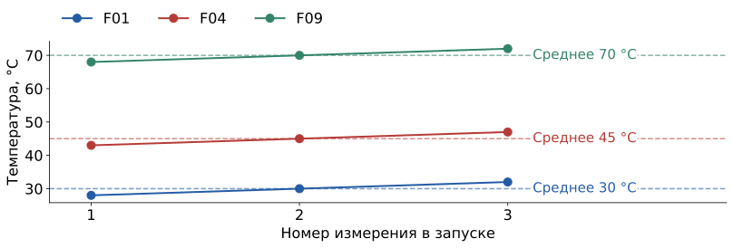
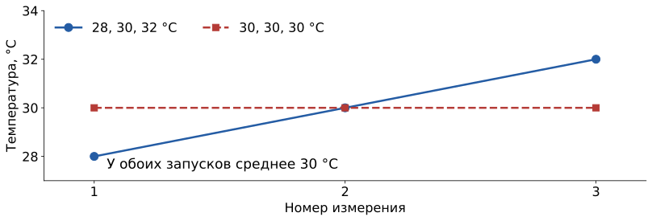
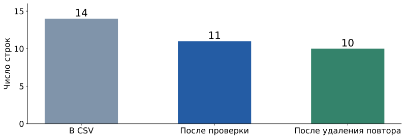

## Три измерения на каждый запуск

| run_id | t1_c | t2_c | t3_c | inspection |
|---|---:|---:|---:|:---:|
| F01 | 28 | 30 | 32 | 0 |
| F04 | 43 | 45 | 47 | 1 |

Все температуры — в °C. Все числа придуманы.

**Входные знания:** списки, условия и циклы из S1.

**Что построим:** таблицу средних температур и меток из CSV.

**Дополнительный материал:** S2 отдельно не проводится и не требуется для S3–S4.

## Код 1 · значения в CSV — текст

```python
first_row["run_id"]   # "F01"
first_row["t1_c"]     # "28"
```

Имя столбца выбирает значение из строки.

В файле **14 строк**. Значение `"28"` пока является текстом.

## Три видимых проблемы

| Запуск | Значение | Проблема |
|---|---|---|
| F11 | пустое t2_c | измерение отсутствует |
| F12 | «горячо» | требуется число градусов |
| F13 | метка отсутствует | неизвестен ответ |

Для этого опыта откладываем такие строки и сохраняем причину.

## Код 2 · проверка и преобразование

`float("28")` → число **28.0**.

`int("1")` → целая метка **1**.

`continue` → перейти к следующей строке.

После проверки: **11 строк**, ещё одна будет точным повтором.

## Код 3 · точный повтор

[Опр.]{.definition} **Точный повтор** — строка, совпадающая во всех полях.

```python
if row in unique_rows:
    duplicates = duplicates + 1
else:
    unique_rows.append(row)
```

Повторяется целиком строка **F03**. Остаётся **10 строк**.

## Среднее из трёх измерений

[Опр.]{.definition} **Среднее** — сумма значений, делённая на их число.

{height=365 fig-alt="Три измерения для трёх запусков и средние температуры"}

Для F01: $(28+30+32)/3=30$ °C.

## Код 4 · построить признак

```python
mean_temperature = (row[1] + row[2] + row[3]) / 3
```

Три списка: номера запусков, средние температуры, метки.

Температуры: **30, 35, 40, 45, 50, 55, 60, 65, 70, 75**.

## Код 5 · проследить одну строку

F01: **28, 30, 32** °C → среднее **30 °C**, метка **0**.

```python
first_measurements = unique_rows[0][1:4]
```

Срез `1:4` берёт позиции **1, 2, 3**. Правая граница не включается.

## Среднее сохраняет не всё

{height=365 fig-alt="Разные последовательности 28, 30, 32 и 30, 30, 30 имеют среднее 30 градусов"}

Уровень одинаковый, поведение температуры различается.

## Код 6 · сохранить таблицу

`reports/s2-temperature-features.csv`

| run_id | mean_temperature_c | inspection |
|---|---:|:---:|
| F01 | 30.0 | 0 |
| F04 | 45.0 | 1 |

Имя столбца сохраняет смысл и единицу признака.

## От четырнадцати строк к десяти

{height=365 fig-alt="14 исходных строк, 11 после проверки и 10 после удаления точного повтора"}

## Что переносится в другие задачи

Проверить значения и метки. Разобрать точные повторы.
Объяснить вычисление признака. Сохранить связь с исходной строкой.

Для новых типов данных правила подготовки выбираются отдельно.

## Источники и материалы {.smaller}

- Все температуры, метки и назначения осмотра придуманы для занятия.
- [Код S1](../starter/lessons/s01.py): выбор порога и проверка.
- [Код S2](../starter/lessons/s02.py): подготовка таблицы.
- [Описание данных](../starter/data/INTRO-README.md).
- [Начальный notebook](../starter/notebooks/S02-live-coding.ipynb) · [выполненный notebook](../starter/notebooks/solutions/S02-complete.ipynb).
