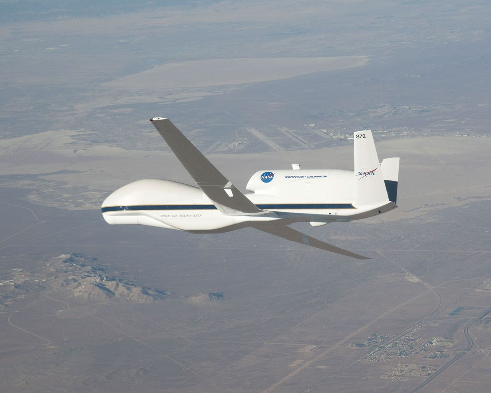
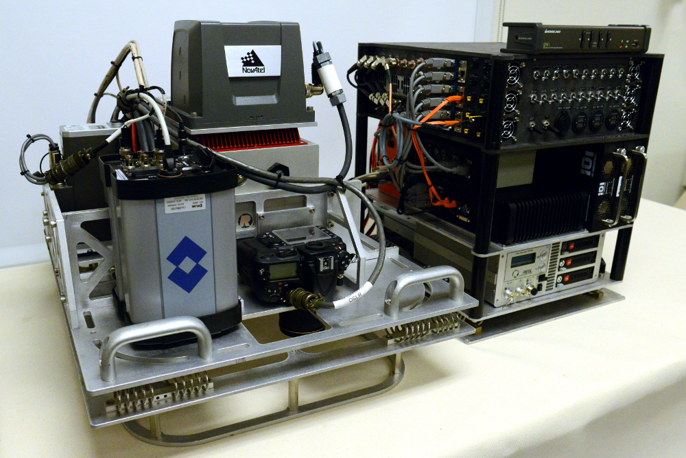
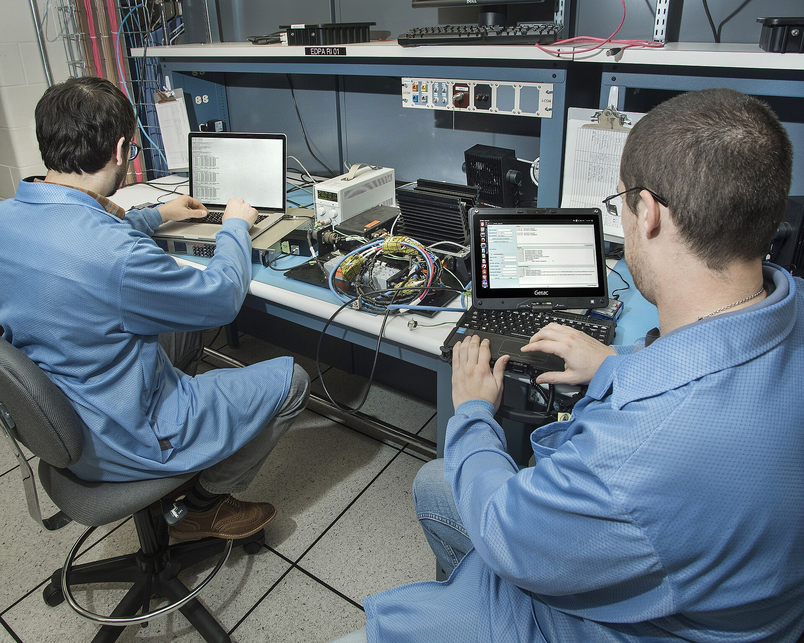

```{python}
#| echo: false
#| output: false
#| warning: false
import sys
sys.path.append("../assets")

import numpy as np
import matplotlib.pyplot as plt
from matplotlib.patches import Rectangle
from scipy import optimize, signal

from figstyle import set_style, INK, ACCENT, ACCENT2, GREEN, AMBER, MUTED, GRID
from s02_data import G0, generate_sensor_log

set_style()
log = generate_sensor_log()

# Для визуализаций удаляем единственный дубликат, но исходный log сохраняем неизменным.
imu_unique = np.r_[True, np.diff(log.imu_t_s) > 0]
imu_t = log.imu_t_s[imu_unique]
imu_accel_g = log.accel_g[imu_unique]
imu_gyro_dps = log.gyro_dps[imu_unique]
```

## Артефакт пары

К концу S2 в репозитории из S1 есть **проверенный data pipeline**, который:

1. приводит каналы к каноническим единицам;
2. валидирует timestamps и явно маркирует разрывы;
3. синхронизирует часы IMU и GNSS;
4. строит равномерную сетку без скрытого aliasing;
5. формирует окна и split manifest без утечки между полётами.

**Definition of done:** `make data-check` печатает отчёт качества и завершается зелёным.

::: {.notes}
**Тайминг:** 0:00–0:03.

**Ход:** начать не с pandas и не с форматов файлов, а с проверяемого результата. Попросить студентов
создать ветку `s2/sensor-pipeline` в репозитории S1. К концу пары они показывают команду, отчёт и
формы тензоров.

**Ключевой тезис:** модель не исправляет неверную шкалу времени. Если pipeline сдвинул сигнал,
модель честно выучит сдвинутую физику.
:::

## Один полёт, пять несовместимых часов

:::: {.columns}
::: {.column width="39%"}
В нашем логе:

- IMU: **100 Гц**, `g`, `deg/s`
- GNSS: **10 Гц**, `m/s`
- jitter timestamps
- дубликат + разрыв **450 мс**
- GNSS: offset **180 мс**
- drift **220 ppm**

Задача — получить тензор, которому можно доверять.
:::
::: {.column width="61%"}
{fig-alt="Беспилотный исследовательский самолёт NASA Global Hawk в полёте." height="430"}

[NASA Global Hawk № 872 — реальная платформа для многосенсорных исследовательских миссий. Фото: NASA / Carla Thomas.]{.figcap}
:::
::::

::: {.notes}
**Тайминг:** 0:03–0:05.

**Ход:** перечислять дефекты, показывая соответствующий поток на иллюстрации. Все числа известны
только преподавателю: pipeline должен оценить их из данных. Drift намеренно увеличен, чтобы эффект
был различим в пределах одной записи.

**Вопрос:** «Что опаснее: NaN или правдоподобное значение, стоящее не в том времени?» Ожидаемый
ответ: второе — оно бесшумно проходит в обучение.

[Sources]
- https://www.bipm.org/en/publications/si-brochure/
- https://science.nasa.gov/earth/earth-observatory/global-hawk-nasas-new-remote-controlled-plane-43291/
:::

## Сюжет пары: от строк к доказательству

```text
raw log
  → contract
  → units
  → timestamp audit
  → resampling
  → synchronization
  → windows + split
  → quality report
```

На каждом переходе отвечаем на три вопроса:

1. **что** изменилось;
2. **какое допущение** сделано;
3. **какая проверка** доказывает результат.

::: {.notes}
**Тайминг:** 0:05–0:07.

**Ход:** это маршрут на следующие 83 минуты. Подчеркнуть, что порядок важен: нельзя оценивать
синхронизацию каналов, пока не понятны их единицы и временные шкалы; нельзя делать окна до split.
:::

## Pre-flight: продолжаем репозиторий S1

```{.bash code-line-numbers="1-6"}
git switch main
git pull --ff-only
git switch -c s2/sensor-pipeline
mkdir -p src/ml_sau/data tests artifacts/s02
uv add numpy scipy
git status -sb
```

Работаем в **ветке**; `.csv`, `.npz` и отчёты не коммитим без явной политики данных.

::: {.notes}
**Тайминг:** 0:07–0:09.

**Действие студентов:** создать ветку и каталоги. Если зависимости уже есть, `uv add` обновит только
явные требования проекта. Напомнить: учебный синтетический лог можно хранить в репозитории, реальную
телеметрию — только после проверки лицензии, приватности и размера.

**Контроль:** `git status -sb` показывает `## s2/sensor-pipeline`.
:::

# Часть 1 · Сначала контракт, потом массив {.divider background-color="#23373B"}

## Сырые каналы выглядят убедительно

```{python}
#| echo: false
#| fig-width: 10.6
#| fig-height: 5.1
fig, axes = plt.subplots(3, 1, sharex=True, figsize=(10.6, 5.1))
zoom_imu = imu_t < 24
zoom_gnss = log.gnss_t_s < 24

axes[0].plot(imu_t[zoom_imu], imu_gyro_dps[zoom_imu], color=ACCENT, lw=1.4)
axes[0].set_ylabel("gyro z\n[deg/s]")
axes[1].plot(imu_t[zoom_imu], imu_accel_g[zoom_imu, 0], color=GREEN, lw=1.2)
axes[1].set_ylabel("accel x\n[g]")
axes[2].scatter(
    log.gnss_t_s[zoom_gnss],
    log.gnss_speed_mps[zoom_gnss],
    color=AMBER,
    s=14,
)
axes[2].set_ylabel("speed\n[m/s]")
axes[2].set_xlabel("timestamp из файла, с")
for ax in axes:
    ax.axvspan(log.gap_start_s, log.gap_end_s, color=ACCENT2, alpha=0.12)
plt.show()
```

[Красная зона — пропуск IMU. На общем масштабе он почти незаметен.]{.figcap}

::: {.notes}
**Тайминг:** 0:09–0:12.

**Вопрос группе:** «Можно ли по этому рисунку подтвердить, что данные готовы?» Ответ: нет. График не
проверяет единицы, монотонность, частоту, offset часов, допустимую длину разрыва и происхождение
строк.

**Мини-демо:** закрыть красную полосу пальцем/курсором — разрыв почти исчезает. Это пример дефекта,
который визуально правдоподобен, но алгоритмически важен.
:::

## Data contract описывает смысл, не только dtype

:::: {.columns}
::: {.column width="58%"}
| Поле | Значение контракта |
|---|---|
| `timestamp` | sensor clock, секунды, начало неизвестно |
| `gyro_z` | угловая скорость, `deg/s`, body FRD |
| `accel_x,z` | specific force, `g`, body FRD |
| `speed` | ground speed, `m/s`, GNSS |
| `flight_id` | неделимая группа для split |
| `valid` | измерение прошло аппаратный quality flag |

`float64` не отвечает ни на один физический вопрос.
:::
::: {.column width="42%"}
{fig-alt="Реальная модульная авиационная сенсорная система NASA MASS с инерциальной навигацией, оптическими приборами и блоком сбора данных." width="100%"}

[MASS: оптика + lidar + tactical-grade INS в одном airborne package. Фото: NASA.]{.figcap}
:::
::::

::: {.notes}
**Тайминг:** 0:12–0:15.

**Действие студентов:** создать `data_contract.yaml` или аналогичный JSON/YAML. Для каждого канала
зафиксировать имя, dtype, единицу, систему координат, источник timestamp, допустимый диапазон и
семантику пропусков.

**Акцент:** specific force акселерометра и кинематическое ускорение — не синонимы. На этом семинаре
мы не решаем навигационное уравнение, но обязаны назвать измеряемую величину.

[Sources]
- https://www.bipm.org/en/publications/si-brochure/
- https://airbornescience.nasa.gov/instrument/Modular_Aerial_Sensing_System
:::

## Канонические единицы — один раз на входе

Внутренний контракт pipeline:

$$
a_{\mathrm{SI}} = g_0\,a_g,\qquad
\omega_{\mathrm{SI}} = \frac{\pi}{180}\,\omega_{\mathrm{deg/s}},
\qquad g_0=9.80665\ \mathrm{m/s^2}.
$$

```{python}
#| echo: false
#| fig-width: 10
#| fig-height: 4.4
sel = (imu_t > 4) & (imu_t < 9)
fig, (ax1, ax2) = plt.subplots(1, 2, figsize=(10, 4.4))
ax1.plot(imu_t[sel], imu_gyro_dps[sel], color=ACCENT)
ax1.set(title="как записано", xlabel="t, с", ylabel="ω, deg/s")
ax2.plot(imu_t[sel], np.deg2rad(imu_gyro_dps[sel]), color=GREEN)
ax2.set(title="внутри pipeline", xlabel="t, с", ylabel="ω, rad/s")
plt.show()
```

::: {.notes}
**Тайминг:** 0:15–0:18.

**Ход:** попросить оценить масштаб справа до показа формулы. Если `deg/s` ошибочно назвать `rad/s`,
амплитуда отличается в $180/\pi \approx 57.3$ раза — сигнал остаётся гладким и потому опасным.

**Правило:** преобразование выполняется на границе ingestion; дальше единица зашита в имя
(`gyro_rad_s`) и проверяется тестом.

[Sources]
- https://www.bipm.org/documents/20126/41483022/SI-Brochure-9-EN.pdf
:::

## Преобразование должно быть явным кодом

```{pyodide}
#| caption: "Единицы измерения · исполняемый контракт"
#| max-lines: 10
import numpy as np

G0 = 9.80665

def canonicalize(raw: dict[str, np.ndarray]) -> dict[str, np.ndarray]:
    return {
        "t_s": raw["timestamp_s"].astype(np.float64),
        "accel_mps2": raw["accel_g"].astype(np.float64) * G0,
        "gyro_rad_s": np.deg2rad(raw["gyro_dps"].astype(np.float64)),
        "speed_mps": raw["speed_mps"].astype(np.float64),
        "flight_id": raw["flight_id"],
    }

raw = {
    "timestamp_s": np.array([0.0]),
    "accel_g": np.array([[1.0, 0.0, 0.0]]),
    "gyro_dps": np.array([[0.0, 0.0, 180.0]]),
    "speed_mps": np.array([12.0]),
    "flight_id": np.array(["flight-007"]),
}
out = canonicalize(raw)
assert np.isclose(out["gyro_rad_s"][0, 2], np.pi)
print(f"1 g → {out['accel_mps2'][0, 0]:.5f} m/s²")
print(f"180 deg/s → {out['gyro_rad_s'][0, 2]:.5f} rad/s")
```

::: {.notes}
**Тайминг:** 0:18–0:20.

**Действие студентов:** перенести функцию в `src/ml_sau/data/units.py`. Многоточие на слайде означает
остальные обязательные поля fixture — в рабочем коде его быть не должно.

**Акцент:** не делить на 57.3 «по месту» в ноутбуке. Имя функции и тест превращают знание о единице
в исполняемый контракт.
:::

## Чекпоинт 1 · Смысл данных зафиксирован

```text
✓ у каждого канала есть quantity + unit + frame
✓ timestamp описан: источник, шкала, точность
✓ canonicalize() выдаёт SI и меняет имя поля
✓ flight_id сохраняется до самого split
✓ тест ловит deg/s ↔ rad/s
```

Если единица или frame неизвестны — ставим **unknown**, а не угадываем.

::: {.notes}
**Тайминг:** 0:20.

**Формат проверки:** короткая взаимопроверка соседями файла контракта. Проверяющий должен найти
единицу, систему координат и временную шкалу за 30 секунд.
:::

# Часть 2 · Timestamp — измерение, а не номер строки {.divider background-color="#23373B"}

## У сенсора есть собственные часы

Модель timestamp одного устройства:

$$
t_s = (1+\varepsilon)t_{\mathrm{ref}} + b + \eta_t
$$

где:

- $b$ — постоянный offset;
- $\varepsilon$ — относительный drift, часто в ppm;
- $\eta_t$ — jitter;
- reset/rollover — **разрыв модели**, а не большой jitter.

`row_index / 100` молча предполагает $b=\varepsilon=\eta_t=0$.

::: {.notes}
**Тайминг:** 0:20–0:23.

**Ход:** связать формулу с курсом ТАУ: это модель измерительного канала времени. Offset двигает все
события; drift линейно накапливает ошибку; jitter меняет отдельные интервалы.

**Число:** 220 ppm означает 220 микросекунд ошибки на секунду; за 180 секунд — около 40 мс.
:::

## Частота — статистика интервалов

Для отсортированных timestamps:

$$
\Delta t_i = t_i-t_{i-1},\qquad
\widehat f_s = \frac{1}{\operatorname{median}(\Delta t_i)}.
$$

Проверяем отдельно:

| Признак | Условие |
|---|---|
| backwards | $\Delta t_i < 0$ |
| duplicate | $\Delta t_i = 0$ |
| gap | $\Delta t_i > k\cdot\operatorname{median}(\Delta t)$ |
| jitter | robust spread $\Delta t$ |

::: {.notes}
**Тайминг:** 0:23–0:26.

**Почему median:** единичный разрыв не должен превращать оценку 100 Гц в 99.7 Гц. Для порога gap на
практике используют физический предел задачи и/или множитель типичного интервала.

**Вопрос:** «Почему сначала нельзя сортировать?» Ответ: сортировка исправит порядок, но уничтожит
улику о сбое записи. Сначала audit исходного порядка, затем документированное исправление.
:::

## Одна гистограмма уже выдаёт четыре режима

```{python}
#| echo: false
#| fig-width: 10.4
#| fig-height: 4.5
dt_ms = np.diff(log.imu_t_s) * 1000
positive_dt = dt_ms[dt_ms > 0]
median_dt_ms = np.median(positive_dt)

fig, (ax1, ax2) = plt.subplots(1, 2, figsize=(10.4, 4.5))
ax1.plot(dt_ms, color=ACCENT, lw=0.8)
ax1.axhline(median_dt_ms, color=GREEN, ls="--", label=f"median = {median_dt_ms:.2f} ms")
ax1.set(xlabel="номер интервала", ylabel="Δt, ms", ylim=(-8, 470))
ax1.legend()

ax2.hist(positive_dt[positive_dt < 16], bins=35, color=ACCENT, alpha=0.85)
ax2.axvline(median_dt_ms, color=GREEN, ls="--")
ax2.set(xlabel="обычные Δt, ms", ylabel="число интервалов")
plt.show()
```

[Пик около 10 мс, один нулевой интервал и один разрыв примерно 460 мс.]{.figcap}

::: {.notes}
**Тайминг:** 0:26–0:29.

**Ход:** сначала показать левый график целиком, затем правый. Левая ось сохраняет редкий gap, правая
показывает структуру jitter. Нулевой интервал не попал в histogram положительных значений — поэтому
нужен счётчик, а не только картинка.
:::

## Audit возвращает числа, не только исключение

```{pyodide}
#| caption: "Audit времени · измените timestamps"
#| max-lines: 11
from dataclasses import dataclass
import numpy as np

@dataclass(frozen=True)
class TimeAudit:
    rate_hz: float
    duplicates: int
    backwards: int
    gaps: int
    max_gap_s: float
    jitter_p95_s: float

def audit_time(t: np.ndarray, gap_factor: float = 5.0) -> TimeAudit:
    dt = np.diff(t)
    positive = dt[dt > 0]
    nominal = np.median(positive)
    return TimeAudit(
        rate_hz=1.0 / nominal,
        duplicates=int(np.sum(dt == 0)),
        backwards=int(np.sum(dt < 0)),
        gaps=int(np.sum(dt > gap_factor * nominal)),
        max_gap_s=float(positive.max()),
        jitter_p95_s=float(np.quantile(np.abs(positive - nominal), 0.95)),
    )

t_demo = np.array([0.00, 0.01, 0.02, 0.03, 0.04, 0.04, 0.50])
print(audit_time(t_demo))
```

::: {.notes}
**Тайминг:** 0:29–0:32.

**Действие студентов:** реализовать функцию и вызвать её **до** сортировки/удаления строк. Dataclass
удобно сериализовать в отчёт; решение о допустимости остаётся отдельным quality gate.

**Обсуждение:** почему `gaps > 0` не всегда fatal? Потери пакетов реальны. Важно не интерполировать
через них бесконечно и передать маску дальше.
:::

## Разрыв — это область неизвестности

```{python}
#| echo: false
#| fig-width: 10.2
#| fig-height: 4.3
gap_zoom = (imu_t > 17.25) & (imu_t < 18.75)
fig, ax = plt.subplots(figsize=(10.2, 4.3))
ax.plot(
    imu_t[gap_zoom],
    imu_gyro_dps[gap_zoom],
    "o-",
    color=ACCENT,
    ms=3,
    lw=1,
)
ax.axvspan(log.gap_start_s, log.gap_end_s, color=ACCENT2, alpha=0.16)
ax.annotate(
    "данных нет ≠ сигнал линейный",
    xy=(18.02, 0),
    xytext=(17.35, 24),
    arrowprops={"arrowstyle": "->", "color": ACCENT2},
    color=ACCENT2,
)
ax.set(xlabel="t, с", ylabel="gyro z, deg/s")
plt.show()
```

::: {.notes}
**Тайминг:** 0:32–0:34.

**Акцент:** gap не является NaN в исходном log — строк просто нет. После перехода на равномерную
сетку мы обязаны сделать область неизвестности явной: `valid=False` или NaN плюс маска.
:::

## Чекпоинт 2 · Время прошло audit

```text
IMU:  99.98 Hz · duplicate=1 · backwards=0 · gaps=1 · max_gap=0.46 s
GNSS: 10.00 Hz · duplicate=0 · backwards=0 · gaps=0
```

Порядок действий:

1. сохранить audit исходного log;
2. отклонить backwards/reset или разбить запись на сегменты;
3. дедуплицировать по **заданной политике**;
4. только потом строить grid.

::: {.notes}
**Тайминг:** 0:34.

**Политика дубликата:** нельзя всегда «оставлять последний». Иногда это повтор пакета, иногда два
измерения с округлённым timestamp. Правило зависит от источника и входит в контракт.
:::

# Часть 3 · Ресемплинг без aliasing и выдуманных данных {.divider background-color="#23373B"}

## Общая сетка — новый контракт

Выбираем:

$$t_k=t_0+k\Delta t,\qquad f_\text{grid}=1/\Delta t.$$

Для сегодняшней задачи: **50 Гц**, потому что:

- быстрее GNSS, но медленнее IMU;
- достаточно для динамики до 20 Гц;
- 2‑секундное окно = ровно 100 отсчётов.

Сетка не «истинная» — это инженерное решение с полосой пропускания.

::: {.notes}
**Тайминг:** 0:34–0:37.

**Вопрос:** «Почему не 1000 Гц?» Ответ: interpolation не создаёт информацию; увеличатся вычисления и
ложное ощущение разрешения. «Почему не 10 Гц?» Может потеряться полезная динамика IMU.
:::

## Интерполяция отвечает только между соседями

Для $t_i\le t\le t_{i+1}$:

$$
\hat x(t)=x_i+
\frac{t-t_i}{t_{i+1}-t_i}\left(x_{i+1}-x_i\right).
$$

```{python}
#| echo: false
#| fig-width: 9.8
#| fig-height: 4.2
t_sparse = np.array([0.0, 0.16, 0.31, 0.52, 0.71, 0.91, 1.12])
x_sparse = np.sin(2 * np.pi * 0.72 * t_sparse + 0.3)
t_dense = np.arange(0.0, 1.12, 0.02)
x_dense = np.interp(t_dense, t_sparse, x_sparse)

fig, ax = plt.subplots(figsize=(9.8, 4.2))
ax.plot(t_dense, x_dense, color=ACCENT, label="линейная интерполяция")
ax.scatter(t_sparse, x_sparse, s=55, color=INK, zorder=3, label="измерения")
ax.vlines(t_sparse, -1.2, x_sparse, color=GRID, lw=1)
ax.set(xlabel="t, с", ylabel="x", ylim=(-1.2, 1.2))
ax.legend(ncol=2)
plt.show()
```

::: {.notes}
**Тайминг:** 0:37–0:40.

**Акцент:** `np.interp` требует возрастающие sample points; поведение при нестрого возрастающей
шкале не имеет физического смысла. Поэтому audit и дедупликация были раньше.

[Sources]
- https://numpy.org/doc/stable/reference/generated/numpy.interp.html
:::

## Через большой gap интерполировать нельзя

```{python}
#| echo: false
#| fig-width: 10.2
#| fig-height: 4.4
grid_gap = np.arange(17.25, 18.75, 0.02)
interp_gap = np.interp(grid_gap, imu_t, imu_gyro_dps)

nearest_right = np.searchsorted(imu_t, grid_gap, side="left")
nearest_right = np.clip(nearest_right, 1, len(imu_t) - 1)
left_distance = grid_gap - imu_t[nearest_right - 1]
right_distance = imu_t[nearest_right] - grid_gap
valid_gap = np.maximum(left_distance, right_distance) <= 0.08

fig, (ax1, ax2) = plt.subplots(1, 2, figsize=(10.2, 4.4), sharey=True)
ax1.plot(grid_gap, interp_gap, color=ACCENT)
ax1.scatter(imu_t[gap_zoom], imu_gyro_dps[gap_zoom], s=8, color=INK)
ax1.set(title="наивно: мост через 450 мс", xlabel="t, с", ylabel="gyro z, deg/s")

ax2.plot(grid_gap, np.where(valid_gap, interp_gap, np.nan), color=GREEN)
ax2.fill_between(
    grid_gap,
    -28,
    28,
    where=~valid_gap,
    color=ACCENT2,
    alpha=0.14,
    label="valid = False",
)
ax2.set(title="правильно: gap остаётся видимым", xlabel="t, с")
ax2.legend(loc="lower left")
plt.show()
```

::: {.notes}
**Тайминг:** 0:40–0:43.

**Ход:** сравнить левую правдоподобную линию и правую честную неопределённость. Порог 80 мс — часть
контракта задачи, а не универсальная константа.

**Практика:** хранить одновременно `values` и `valid_mask`; многие модели не принимают NaN, но маску
можно передать отдельным признаком или исключить окно.
:::

## Downsampling без фильтра создаёт другой сигнал

Условие Найквиста для полосоограниченного сигнала:

$$f_s>2f_{\max}.$$

Если $48$ Гц наблюдать с $f_s=60$ Гц, отсчёты совместимы с alias:

$$f_{\mathrm{alias}}=\left|48-1\cdot 60\right|=12\ \text{Гц}.$$

```{python}
#| echo: false
#| fig-width: 10.2
#| fig-height: 4.1
t_true = np.linspace(0, 0.25, 1600)
t_sample = np.arange(0, 0.25, 1 / 60)
x_true = np.sin(2 * np.pi * 48 * t_true)
x_sample = np.sin(2 * np.pi * 48 * t_sample)
x_alias = -np.sin(2 * np.pi * 12 * t_true)

fig, ax = plt.subplots(figsize=(10.2, 4.1))
ax.plot(t_true, x_true, color=MUTED, lw=1.2, label="истина 48 Гц")
ax.plot(t_true, x_alias, color=ACCENT2, lw=2.5, label="alias 12 Гц")
ax.scatter(t_sample, x_sample, color=INK, s=35, zorder=3, label="отсчёты 60 Гц")
ax.set(xlabel="t, с", ylabel="x(t)")
ax.legend(ncol=3, loc="upper center")
plt.show()
```

::: {.notes}
**Тайминг:** 0:43–0:46.

**Демонстрация:** точки лежат на низкочастотной кривой. После выборки невозможно узнать, был ли
исходный сигнал 12 или 48 Гц, если не было аналогового/цифрового anti-alias фильтра.

**Связь с pipeline:** при переходе IMU 100→50 Гц компоненты выше 25 Гц нужно подавить до decimation.
:::

## `resample_poly`: фильтр → decimation

```{python}
#| echo: false
#| fig-width: 10.5
#| fig-height: 4.5
fs_hi, fs_lo = 200, 40
t_hi = np.arange(0, 2, 1 / fs_hi)
x_hi = np.sin(2 * np.pi * 6 * t_hi) + 0.55 * np.sin(2 * np.pi * 70 * t_hi)

x_naive = x_hi[:: fs_hi // fs_lo]
x_poly = signal.resample_poly(x_hi, up=1, down=fs_hi // fs_lo)
t_lo = np.arange(x_poly.size) / fs_lo

freq = np.fft.rfftfreq(x_poly.size, 1 / fs_lo)
spec_naive = np.abs(np.fft.rfft(x_naive)) / x_naive.size
spec_poly = np.abs(np.fft.rfft(x_poly)) / x_poly.size

fig, (ax1, ax2) = plt.subplots(1, 2, figsize=(10.5, 4.5))
view = t_lo < 0.65
ax1.plot(t_lo[view], x_naive[view], "o-", color=ACCENT2, ms=3, label="каждый 5-й")
ax1.plot(t_lo[view], x_poly[view], "o-", color=GREEN, ms=3, label="polyphase FIR")
ax1.set(xlabel="t, с", ylabel="x", title="после 200 → 40 Гц")
ax1.legend()

ax2.plot(freq, spec_naive, color=ACCENT2, label="alias на 10 Гц")
ax2.plot(freq, spec_poly, color=GREEN, label="сохранены 6 Гц")
ax2.set(xlabel="частота, Гц", ylabel="амплитуда", xlim=(0, 20), title="спектр")
ax2.legend()
plt.show()
```

::: {.notes}
**Тайминг:** 0:46–0:49.

**Ход:** исходный сигнал содержит 6 и 70 Гц. Наивная decimation переносит 70 Гц в полосу нового
сигнала как 10 Гц. `resample_poly` повышает частоту в `up` раз, применяет zero-phase low-pass FIR,
затем понижает в `down` раз.

[Sources]
- https://docs.scipy.org/doc/scipy/reference/generated/scipy.signal.resample_poly.html
:::

## Один интерфейс, две разные операции

```{pyodide}
#| caption: "Interpolation и anti-alias downsampling"
#| max-lines: 11
import numpy as np
from scipy import signal

def resample_channel(
    t: np.ndarray,
    x: np.ndarray,
    grid: np.ndarray,
    max_gap_s: float,
) -> tuple[np.ndarray, np.ndarray]:
    y = np.interp(grid, t, x)

    right = np.clip(np.searchsorted(t, grid), 1, len(t) - 1)
    support = np.maximum(grid - t[right - 1], t[right] - grid)
    valid = support <= max_gap_s

    return np.where(valid, y, np.nan), valid

t = np.array([0.00, 0.02, 0.04, 0.12, 0.14])
x = np.sin(2 * np.pi * 2 * t)
grid = np.arange(0.00, 0.141, 0.01)
interpolated, valid = resample_channel(t, x, grid, max_gap_s=0.03)

imu_100hz = np.sin(2 * np.pi * 6 * np.arange(0, 1, 0.01))
imu_50hz = signal.resample_poly(imu_100hz, up=1, down=2, axis=0)

print(f"grid points: {grid.size}; valid: {valid.sum()}")
print(f"downsampling: {imu_100hz.size} → {imu_50hz.size} samples")
```

`np.interp` выравнивает нерегулярные timestamps; `resample_poly` меняет частоту
**равномерного** сигнала с anti-alias фильтром.

::: {.notes}
**Тайминг:** 0:49–0:50.

**Акцент:** эти функции не взаимозаменяемы. Сначала irregular → regular grid с контролем поддержки;
затем при необходимости band-limit + rational resampling равномерного ряда.

[Sources]
- https://numpy.org/doc/stable/reference/generated/numpy.interp.html
- https://docs.scipy.org/doc/scipy/reference/generated/scipy.signal.resample_poly.html
:::

## Чекпоинт 3 · Grid не скрывает незнание

```text
✓ grid rate обоснован полезной полосой
✓ downsampling включает anti-alias filter
✓ timestamps возрастают до np.interp
✓ значения внутри большого gap = NaN
✓ valid mask имеет ту же длину, что и grid
```

Форма после ресемплинга: `values.shape == (T, C)`, `valid.shape == (T, C)`.

::: {.notes}
**Тайминг:** 0:50.

**Быстрая проверка:** попросить студентов назвать, где в их коде живёт порог `max_gap_s` и почему
именно такой. «Потому что на слайде 0.08» — недостаточный ответ; нужен предел из задачи/датчика.
:::

# Часть 4 · Синхронизация: offset — это ещё не drift {.divider background-color="#23373B"}

## Одинаковый манёвр происходит «дважды»

```{python}
#| echo: false
#| fig-width: 10.3
#| fig-height: 4.4
sync_view_imu = (imu_t > 31) & (imu_t < 41)
sync_view_gnss = (log.gnss_t_s > 31) & (log.gnss_t_s < 41)

fig, ax = plt.subplots(figsize=(10.3, 4.4))
ax.plot(
    imu_t[sync_view_imu],
    imu_gyro_dps[sync_view_imu],
    color=ACCENT,
    lw=1.5,
    label="IMU gyro z",
)
ax.scatter(
    log.gnss_t_s[sync_view_gnss],
    log.gnss_yaw_rate_dps[sync_view_gnss],
    color=AMBER,
    s=22,
    label="GNSS yaw rate",
    zorder=3,
)
ax.set(xlabel="timestamp устройства, с", ylabel="yaw rate, deg/s")
ax.legend(ncol=2)
plt.show()
```

[Формы совпадают, пики GNSS систематически правее.]{.figcap}

::: {.notes}
**Тайминг:** 0:50–0:53.

**Вопрос:** «Можно ли просто сдвинуть GNSS на один sample?» Ответ: sample GNSS — 100 мс, реальный
offset не обязан быть кратен ему; кроме того, offset меняется из-за drift.

**Подготовка:** для оценки используем физически связанную пару признаков: угловую скорость из IMU и
оценку yaw rate из GNSS. Коррелировать температуру с курсом бессмысленно, даже если пик красивый.
:::

## Cross-correlation оценивает лаг

Для центрированных сигналов:

$$
R_{xy}[\ell]=\sum_n x[n]\,y[n-\ell],\qquad
\widehat\tau=\Delta t\underset{\ell\in\mathcal L}{\arg\max}\ R_{xy}[\ell].
$$

Ограничиваем физически допустимый диапазон:

$$\mathcal L:\ |\tau|\le 0.5\ \text{с}.$$

Без ограничения периодический манёвр может дать далёкий ложный максимум.

::: {.notes}
**Тайминг:** 0:53–0:56.

**Знак:** договориться, что положительный lag означает «GNSS запаздывает относительно IMU».
Проверить знак синтетическим импульсом до работы с реальными данными.

[Sources]
- https://docs.scipy.org/doc/scipy/reference/generated/scipy.signal.correlate.html
- https://docs.scipy.org/doc/scipy/reference/generated/scipy.signal.correlation_lags.html
:::

## Оценка offset по cross-correlation

```{python}
#| echo: false
#| fig-width: 10.2
#| fig-height: 4.3
xcorr_dt = 0.005
xcorr_grid = np.arange(2.0, 42.0, xcorr_dt)
xcorr_imu = np.interp(xcorr_grid, imu_t, imu_gyro_dps)
xcorr_gnss = np.interp(xcorr_grid, log.gnss_t_s, log.gnss_yaw_rate_dps)

x = (xcorr_imu - xcorr_imu.mean()) / xcorr_imu.std()
y = (xcorr_gnss - xcorr_gnss.mean()) / xcorr_gnss.std()
corr = signal.correlate(y, x, mode="full", method="fft")
lags = signal.correlation_lags(y.size, x.size, mode="full") * xcorr_dt
lag_mask = np.abs(lags) <= 0.5
lag_view = lags[lag_mask]
corr_view = corr[lag_mask] / x.size
offset_xcorr_s = lag_view[np.argmax(corr_view)]

fig, ax = plt.subplots(figsize=(10.2, 4.3))
ax.plot(lag_view * 1000, corr_view, color=ACCENT)
ax.axvline(offset_xcorr_s * 1000, color=ACCENT2, ls="--")
ax.scatter(
    [offset_xcorr_s * 1000],
    [corr_view.max()],
    color=ACCENT2,
    s=65,
    zorder=3,
    label=f"peak = {offset_xcorr_s * 1000:.0f} ms",
)
ax.set(xlabel="lag GNSS относительно IMU, мс", ylabel="нормированная корреляция")
ax.legend()
plt.show()
```

::: {.notes}
**Тайминг:** 0:56–0:59.

**Ход:** код на предыдущем слайде разворачивается в график. FFT-метод ускоряет полную корреляцию;
`correlation_lags` исключает ручные off-by-one ошибки.

**Ограничение:** это средний offset на первых 40 секундах. Для длинной записи одной константы
недостаточно.

[Sources]
- https://docs.scipy.org/doc/scipy/reference/generated/scipy.signal.correlate.html
- https://docs.scipy.org/doc/scipy/reference/generated/scipy.signal.correlation_lags.html
:::

## Функция оценки должна фиксировать знак и диапазон

```{pyodide}
#| caption: "Cross-correlation · проверяем знак лага"
#| max-lines: 11
import numpy as np
from scipy import signal

def estimate_offset(
    reference: np.ndarray,
    delayed: np.ndarray,
    dt_s: float,
    max_lag_s: float,
) -> float:
    x = (reference - reference.mean()) / reference.std()
    y = (delayed - delayed.mean()) / delayed.std()

    corr = signal.correlate(y, x, mode="full", method="fft")
    lags = signal.correlation_lags(y.size, x.size) * dt_s
    allowed = np.abs(lags) <= max_lag_s

    return float(lags[allowed][np.argmax(corr[allowed])])

pulse = np.r_[np.zeros(20), 1.0, np.zeros(40)]
delayed = np.r_[np.zeros(3), pulse[:-3]]
offset_s = estimate_offset(pulse, delayed, 0.01, 0.1)
assert np.isclose(offset_s, 0.03)
print(f"оценённый offset = {offset_s:+.3f} s")
```

::: {.notes}
**Тайминг:** 0:59–1:01.

**Действие студентов:** реализовать функцию и сначала запустить тест с импульсом. Только после
зелёного теста подставлять реальные признаки.

**Акцент:** нормировка не меняет lag, но не даёт амплитуде одного канала доминировать. При NaN
сначала выбирается общий valid interval.
:::

## Drift виден как наклон offset

В коротких перекрывающихся сегментах ищем локальный сдвиг:

$$
\widehat b_j=\arg\min_b
\sum_{t\in W_j}
\left[\widetilde x(t)-\widetilde y(t+b)\right]^2.
$$

Затем:

$$\widehat b(t)=\widehat b_0+\widehat\varepsilon t.$$

Один глобальный lag отвечает на вопрос «в среднем», линия — «как меняются часы».

::: {.notes}
**Тайминг:** 1:01–1:03.

**Почему здесь loss, а не только discrete correlation:** одномерная bounded-оптимизация даёт
субдискретную оценку задержки через интерполяцию GNSS. Cross-correlation остаётся хорошим первым
приближением и способом локализовать диапазон поиска.
:::

## Шесть сегментов восстанавливают ppm‑дрейф

```{python}
#| echo: false
#| fig-width: 10.2
#| fig-height: 4.4
def local_offset(start_s: float, length_s: float = 43.0) -> float:
    grid = np.arange(start_s + 2.0, start_s + length_s, 0.02)
    ref = np.interp(grid, imu_t, imu_gyro_dps)
    ref = (ref - ref.mean()) / ref.std()

    def loss(delay_s: float) -> float:
        other = np.interp(grid + delay_s, log.gnss_t_s, log.gnss_yaw_rate_dps)
        other = (other - other.mean()) / other.std()
        return float(np.mean((ref - other) ** 2))

    result = optimize.minimize_scalar(
        loss,
        bounds=(0.05, 0.35),
        method="bounded",
        options={"xatol": 1e-5},
    )
    return float(result.x)

segment_starts_s = np.arange(0.0, 130.0, 22.0)
segment_mid_s = segment_starts_s + 22.5
segment_offset_s = np.array([local_offset(start) for start in segment_starts_s])
drift_hat, offset_hat = np.polyfit(segment_mid_s, segment_offset_s, deg=1)

fig, ax = plt.subplots(figsize=(10.2, 4.4))
ax.scatter(segment_mid_s, segment_offset_s * 1000, s=60, color=ACCENT, label="локальные оценки")
ax.plot(
    segment_mid_s,
    (offset_hat + drift_hat * segment_mid_s) * 1000,
    color=ACCENT2,
    label=f"fit: {drift_hat * 1e6:.0f} ppm",
)
ax.set(xlabel="время полёта, с", ylabel="offset GNSS, мс")
ax.legend()
plt.show()
```

::: {.notes}
**Тайминг:** 1:03–1:06.

**Результат:** синтетическая истина — 180 мс и 220 ppm; оценка будет близка, но не обязана совпасть
из-за шума, jitter и интерполяции. Это полезнее идеально нарисованной прямой.

**Красный флаг:** если локальные offset скачут на период манёвра, feature недостаточно уникален или
диапазон lag слишком широк.
:::

## Исправляем clock model, а не значения

Из

$$t_s=(1+\varepsilon)t_{\mathrm{ref}}+b$$

получаем

$$
\widehat t_{\mathrm{ref}}
=\frac{t_s-\widehat b}{1+\widehat\varepsilon}.
$$

```{python}
#| echo: false
#| output: false
gnss_t_corrected = (log.gnss_t_s - offset_hat) / (1.0 + drift_hat)

grid_50 = np.arange(1.0, 175.0, 0.02)
gyro_50 = np.interp(grid_50, imu_t, np.deg2rad(imu_gyro_dps))
accel_x_50 = np.interp(grid_50, imu_t, imu_accel_g[:, 0] * G0)
speed_50 = np.interp(grid_50, gnss_t_corrected, log.gnss_speed_mps)

right = np.clip(np.searchsorted(imu_t, grid_50), 1, len(imu_t) - 1)
support = np.maximum(grid_50 - imu_t[right - 1], imu_t[right] - grid_50)
imu_valid_50 = support <= 0.08
features_50 = np.column_stack((accel_x_50, gyro_50, speed_50))
valid_50 = np.column_stack(
    (imu_valid_50, imu_valid_50, np.ones_like(grid_50, dtype=bool))
)
```

Временная коррекция применяется к timestamp GNSS **один раз**, до общей сетки.

::: {.notes}
**Тайминг:** 1:06–1:08.

**Акцент:** не сдвигать сам массив `np.roll` — это циклически переносит хвост в начало и теряет
субдискретный offset. Исправляется координата времени, затем обычный resampling.
:::

## До и после: пики становятся одним событием

```{python}
#| echo: false
#| fig-width: 10.4
#| fig-height: 4.5
view_ref = (imu_t > 134) & (imu_t < 143)
view_raw = (log.gnss_t_s > 134) & (log.gnss_t_s < 143)
view_fixed = (gnss_t_corrected > 134) & (gnss_t_corrected < 143)

fig, (ax1, ax2) = plt.subplots(1, 2, figsize=(10.4, 4.5), sharey=True)
ax1.plot(imu_t[view_ref], imu_gyro_dps[view_ref], color=ACCENT, lw=1.3, label="IMU")
ax1.scatter(
    log.gnss_t_s[view_raw],
    log.gnss_yaw_rate_dps[view_raw],
    color=AMBER,
    s=17,
    label="GNSS",
)
ax1.set(title="исходные часы", xlabel="t, с", ylabel="yaw rate, deg/s")
ax1.legend()

ax2.plot(imu_t[view_ref], imu_gyro_dps[view_ref], color=ACCENT, lw=1.3, label="IMU")
ax2.scatter(
    gnss_t_corrected[view_fixed],
    log.gnss_yaw_rate_dps[view_fixed],
    color=GREEN,
    s=17,
    label="GNSS corrected",
)
ax2.set(title="offset + drift corrected", xlabel="t reference, с")
ax2.legend()
plt.show()
```

::: {.notes}
**Тайминг:** 1:08–1:10.

**Проверка:** оценить residual offset тем же методом на данных, не использованных для fit. Нельзя
доказывать синхронизацию только картинкой обучающего интервала.

**Порог сегодня:** абсолютный residual lag меньше одного шага grid, то есть 20 мс.
:::

## Чекпоинт 4 · Часы имеют проверяемую модель

```text
✓ синхронизируются физически связанные признаки
✓ тест фиксирует знак lag
✓ поиск ограничен допустимым диапазоном
✓ offset оценён на сегментах
✓ drift проверен по наклону
✓ residual lag < 20 ms на holdout-сегменте
```

Если нужен sub-millisecond timing — этот pipeline и эти сенсоры недостаточны.

::: {.notes}
**Тайминг:** 1:10.

**Акцент:** критерий не должен обещать больше точности, чем timestamps, частота GNSS и динамика
признака. Точность синхронизации — измеряемая характеристика pipeline.
:::

# Часть 5 · Окна и split: где рождается утечка {.divider background-color="#23373B"}

## Окно задаётся длительностью, не магическим числом

При $f_s=50$ Гц:

$$
L=T_w f_s,\qquad S=T_s f_s,\qquad
N_w=1+\left\lfloor\frac{N-L}{S}\right\rfloor.
$$

Сегодня:

- $T_w=2$ с → $L=100$ samples;
- stride $T_s=0.5$ с → $S=25$ samples;
- overlap = **75%**.

Больше overlap ≠ больше независимых примеров.

::: {.notes}
**Тайминг:** 1:10–1:12.

**Вопрос:** «Если сделать stride в 10 раз меньше, стало ли данных в 10 раз больше?» Ответ: строк
датасета больше, независимой информации почти нет; соседние окна разделяют большую часть samples.
:::

## Геометрия окна должна быть видна

```{python}
#| echo: false
#| fig-width: 10.4
#| fig-height: 4.3
window_view = (grid_50 >= 34.0) & (grid_50 <= 39.2)
t_window = grid_50[window_view]
x_window = gyro_50[window_view]

fig, ax = plt.subplots(figsize=(10.4, 4.3))
ax.plot(t_window, x_window, color=INK, lw=1.4)
window_starts = [34.0, 34.5, 35.0, 35.5, 36.0, 36.5, 37.0]
window_colors = [ACCENT, GREEN, AMBER, ACCENT2]
for idx, start in enumerate(window_starts):
    ax.axvspan(
        start,
        start + 2.0,
        ymin=0.03 + 0.04 * (idx % 3),
        ymax=0.10 + 0.04 * (idx % 3),
        color=window_colors[idx % len(window_colors)],
        alpha=0.8,
    )
ax.set(xlabel="t, с", ylabel="gyro z, rad/s")
ax.annotate("2.0 s", xy=(34.0, -0.55), xytext=(35.0, -0.55), ha="center", color=ACCENT)
plt.show()
```

[Каждое следующее окно разделяет с предыдущим 75 из 100 samples.]{.figcap}

::: {.notes}
**Тайминг:** 1:12–1:14.

**Ход:** указать один и тот же пик, который попал сразу в несколько окон. Если эти окна разнести в
train и test, модель увидит почти тот же манёвр по обе стороны оценки.
:::

## Окна строим с индексами происхождения

```{pyodide}
#| caption: "Окна сохраняют происхождение"
#| max-lines: 11
from dataclasses import dataclass
import numpy as np

@dataclass(frozen=True)
class WindowBatch:
    x: np.ndarray
    valid: np.ndarray
    start_idx: np.ndarray
    flight_id: np.ndarray

def make_windows(x, valid, flight_id, length=100, stride=25):
    starts = np.arange(0, len(x) - length + 1, stride)
    return WindowBatch(
        x=np.stack([x[i : i + length] for i in starts]),
        valid=np.stack([valid[i : i + length] for i in starts]),
        start_idx=starts,
        flight_id=np.full(starts.size, flight_id),
    )

features_50 = np.arange(240 * 3, dtype=float).reshape(240, 3)
valid_50 = np.ones_like(features_50, dtype=bool)
batch = make_windows(features_50, valid_50, flight_id="flight-007")
assert batch.x.shape[1:] == (100, 3)
print(f"x.shape = {batch.x.shape}")
print(f"starts  = {batch.start_idx.tolist()}")
```

::: {.notes}
**Тайминг:** 1:14–1:16.

**Действие студентов:** сохранить `start_idx` и `flight_id`, а не только `x`. Без происхождения
невозможно расследовать ошибку и построить безопасный split.

**Extension:** для больших файлов возвращать ленивые views/indices вместо копирования всех окон.
:::

## Случайный split окон копирует сигнал в test

```{python}
#| echo: false
#| fig-width: 10.4
#| fig-height: 4.7
rng_split = np.random.default_rng(7)
flights = ["F01", "F02", "F03", "F04"]
n_windows = 16

fig, (ax1, ax2) = plt.subplots(2, 1, figsize=(10.4, 4.7))
for row, flight in enumerate(flights):
    random_test = rng_split.random(n_windows) < 0.25
    for col in range(n_windows):
        color = ACCENT2 if random_test[col] else ACCENT
        ax1.add_patch(Rectangle((col, row), 0.86, 0.72, color=color, alpha=0.9))
    ax1.text(-0.6, row + 0.36, flight, ha="right", va="center")

group_test = {"F04"}
for row, flight in enumerate(flights):
    color = ACCENT2 if flight in group_test else ACCENT
    for col in range(n_windows):
        ax2.add_patch(Rectangle((col, row), 0.86, 0.72, color=color, alpha=0.9))
    ax2.text(-0.6, row + 0.36, flight, ha="right", va="center")

for ax, title in (
    (ax1, "random window split: каждый полёт и в train, и в test"),
    (ax2, "group split: F04 целиком остаётся неизвестным"),
):
    ax.set(xlim=(-1.2, n_windows), ylim=(-0.2, len(flights)), title=title)
    ax.set_xticks([])
    ax.set_yticks([])
    ax.invert_yaxis()
ax2.text(11.4, 3.38, "TEST", color="white", ha="center", va="center", weight="bold")
plt.show()
```

::: {.notes}
**Тайминг:** 1:16–1:19.

**Легенда:** синий — train, красный — test. В верхнем варианте соседние перекрывающиеся окна одного
полёта оказываются по обе стороны. В нижнем неизвестен целый полёт — это честнее для сценария
«обобщиться на новый вылет».

[Sources]
- https://scikit-learn.org/stable/modules/generated/sklearn.model_selection.GroupKFold.html
:::

## Сначала split групп, потом fit и окна

```text
flight_id
  ├── train flights ── fit preprocessing ── windows ── train
  ├── val flights   ── transform only ───── windows ── tune
  └── test flights  ── transform only ───── windows ── final report
```

Если одна длинная запись:

```text
past [ TRAIN ]  gap  [ VALID ]  gap  [ TEST ] future
```

Gap между частями должен быть не меньше окна/памяти признаков.

::: {.notes}
**Тайминг:** 1:19–1:21.

**Акцент:** fit нормировки, imputer, feature selection и порогов выполняется только по train.
Оконная функция детерминирована и получает уже выбранную группу/временной сегмент.

[Sources]
- https://scikit-learn.org/stable/modules/generated/sklearn.model_selection.GroupKFold.html
- https://scikit-learn.org/stable/modules/generated/sklearn.model_selection.TimeSeriesSplit.html
:::

## Метка тоже имеет временную семантику

Для классификации события в окне:

| Стратегия | Вопрос модели |
|---|---|
| label в конце | что происходит **сейчас**? |
| majority | какой режим доминирует? |
| any positive | было ли событие где-либо? |
| horizon label | что случится через $\tau$? |

Для causal inference окно не должно смотреть правее момента решения.

::: {.notes}
**Тайминг:** 1:21–1:23.

**Мини-задача:** детекция отказа должна сработать за 2 секунды до события. Окно заканчивается в
$t$, target относится к $t+2$; samples после $t$ запрещены. Это отдельный источник leakage.
:::

## Чекпоинт 5 · Каждое окно имеет происхождение

```text
✓ length и stride заданы в секундах + samples
✓ окно не пересекает invalid gap
✓ flight_id и start_idx сохранены
✓ один flight_id не встречается в двух split
✓ preprocessing fit только на train
✓ target использует допустимое время
```

Минимальный manifest:

```json
{"flight-001": "train", "flight-004": "valid", "flight-007": "test"}
```

::: {.notes}
**Тайминг:** 1:23.

**Контроль:** выполнить пересечение множеств `train_flights & test_flights` и получить пустое
множество. Manifest коммитится и версионируется вместе с кодом.
:::

# Часть 6 · Pipeline должен оставить след {.divider background-color="#23373B"}

## Реальная система заканчивается не графиком

:::: {.columns}
::: {.column width="53%"}
{fig-alt="Инженеры NASA Armstrong проверяют лабораторную систему сбора данных и телеметрии ADATS." height="350"}

[Проверка Advanced Data Acquisition and Telemetry System в NASA Armstrong. Фото: NASA / Ken Ulbrich, public domain.]{.figcap}
:::
::: {.column width="47%"}
```text
artifacts/s02/
├── quality.json
├── split_manifest.json
├── windows.npz
└── provenance.json
```

`provenance.json`:

- hash входных данных
- git commit
- версия pipeline
- параметры grid/window
- время создания
:::
::::

::: {.notes}
**Тайминг:** 1:23–1:25.

**Связь:** сбор данных — аппаратно-программная система, а не CSV. Фотография показывает реальную
лабораторную проверку ADATS; наши отчёты — программный аналог измерительного журнала.

[Sources]
- https://commons.wikimedia.org/wiki/File:Advanced_Data_Acquisition_and_Telemetry_System_(AFRC2017-0021-02).jpg
- https://images.nasa.gov/details/AFRC2017-0021-02
:::

## Один pipeline, семь наблюдаемых переходов

```{mermaid}
flowchart LR
  A["raw log<br/>immutable"] --> B["contract<br/>units + frame"]
  B --> C["time audit<br/>dt · gaps · reset"]
  C --> D["clock model<br/>offset + drift"]
```

```{mermaid}
flowchart LR
  E["regular grid<br/>filter + mask"] --> F["group/time split<br/>manifest"]
  F --> G["windows<br/>X, mask, origin"]
  G --> H["quality report<br/>gates + provenance"]
```

**↓ исправленные timestamps** · стрелка = тестируемая функция.

::: {.notes}
**Тайминг:** 1:25–1:26.

**Ход:** попросить группу назвать артефакт для каждой стрелки. Immutable raw log не переписывается;
исправления времени и единиц живут в коде и параметрах.
:::

## Quality gates превращают «вроде нормально» в контракт

```{python}
#| echo: false
#| fig-width: 10.4
#| fig-height: 4.5
gate_names = [
    "units canonical",
    "timestamps monotonic",
    "max gap ≤ policy",
    "residual lag < 20 ms",
    "split groups disjoint",
    "window valid ≥ 98%",
]
gate_values = [1.0, 1.0, 1.0, 0.91, 1.0, 0.985]
gate_thresholds = [1.0, 1.0, 1.0, 0.9, 1.0, 0.98]
gate_ok = np.array(gate_values) >= np.array(gate_thresholds)

fig, ax = plt.subplots(figsize=(10.4, 4.5))
y_pos = np.arange(len(gate_names))
ax.hlines(y_pos, 0, 1, color=GRID, lw=8)
ax.scatter(
    gate_values,
    y_pos,
    s=145,
    color=np.where(gate_ok, GREEN, ACCENT2),
    zorder=3,
)
ax.scatter(gate_thresholds, y_pos, marker="|", s=420, color=INK, zorder=4)
for y_idx, ok in enumerate(gate_ok):
    ax.text(1.035, y_idx, "PASS" if ok else "FAIL", va="center", color=GREEN if ok else ACCENT2)
ax.set(
    xlim=(0, 1.12),
    yticks=y_pos,
    yticklabels=gate_names,
    xlabel="нормированное выполнение критерия",
)
ax.invert_yaxis()
plt.show()
```

::: {.notes}
**Тайминг:** 1:26–1:27.

**Акцент:** здесь числа нормированы только для визуализации. В `quality.json` хранятся физические
значения: Hz, seconds, counts, percentages, а также пороги и статус.
:::

## Тесты проверяют инварианты pipeline

```{.python code-line-numbers="1-17"}
def test_pipeline_contract(dataset):
    assert dataset.x.ndim == 3              # [window, time, channel]
    assert dataset.x.shape[1:] == (100, 3)
    assert dataset.valid.shape == dataset.x.shape
    assert np.isfinite(dataset.x[dataset.valid]).all()

def test_split_has_no_flight_leakage(manifest):
    train = {k for k, v in manifest.items() if v == "train"}
    test = {k for k, v in manifest.items() if v == "test"}
    assert train.isdisjoint(test)

def test_alignment_is_within_one_grid_step(report):
    assert abs(report["residual_lag_s"]) < 0.02

def test_no_window_bridges_a_gap(dataset):
    assert dataset.valid.all(axis=(1, 2)).all()
```

::: {.notes}
**Тайминг:** 1:27–1:28.

**Действие студентов:** добавить минимум эти четыре класса инвариантов. Последний тест соответствует
политике «отбрасывать любое окно с gap»; если политика допускает малую долю missing, порог должен быть
явным.
:::

## `make data-check` — публичный интерфейс S2

```{.makefile code-line-numbers="1-8"}
.PHONY: data-check

data-check:
	uv run pytest -q tests/test_data.py
	uv run python -m ml_sau.data.build \
	  --config configs/s02.yaml \
	  --report artifacts/s02/quality.json
	uv run python -m ml_sau.data.verify artifacts/s02/quality.json
```

Ожидаемый stdout:

```text
6 passed
DATA QUALITY: PASS
windows=(681, 100, 3)  valid=98.5%  residual_lag=8.4 ms
```

::: {.notes}
**Тайминг:** 1:28–1:29.

**Акцент:** реальные числа появятся из конкретной реализации студентов. Команда обязана вернуть
ненулевой exit code при нарушенном gate, иначе CI покажет зелёный для плохих данных.
:::

## Финальный Definition of done

```text
✓ data_contract.yaml: unit · frame · clock · range
✓ quality.json: rate · gaps · jitter · residual lag
✓ split_manifest.json: flight → train/valid/test
✓ windows: X [N,100,3] + valid + origin
✓ make data-check: зелёный
✓ PR объясняет допущения и показывает before/after
```

Сдача S2 — ссылка на PR из ветки `s2/sensor-pipeline`.

::: {.notes}
**Тайминг:** 1:29.

**Формат сдачи:** студент открывает PR и показывает Files changed, вывод команды и два графика:
timestamp audit и alignment before/after. Скриншот без кода/manifest не считается.
:::

## Шпаргалка: порядок, который нельзя переставить

```text
CONTRACT
  → AUDIT RAW TIME
  → CANONICAL UNITS
  → SEGMENT RESET/GAPS
  → ESTIMATE CLOCK MODEL
  → FILTER + REGULAR GRID + MASK
  → SPLIT BY FLIGHT/TIME
  → FIT PREPROCESSING ON TRAIN
  → WINDOWS + ORIGIN
  → QUALITY REPORT
```

**Неизвестное должно оставаться видимым.**

::: {.notes}
**Тайминг:** 1:29–1:30.

**Закрытие:** прочитать только жирную фразу. Это критерий хорошего pipeline: он не маскирует
неизвестность правдоподобной интерполяцией.
:::

## Выходной билет

Ответьте одной фразой:

1. Почему `row_index / fs` не заменяет timestamp?
2. Что делает anti-alias filter перед downsampling?
3. Чем clock offset отличается от drift?
4. Почему окна одного полёта нельзя случайно делить между train/test?
5. Какой файл позволит повторить split через месяц?

::: {.notes}
**Резерв / после 1:30.**

**Ожидаемые ответы:** индекс предполагает идеальные часы и отсутствие потерь; фильтр подавляет
частоты выше новой Nyquist; offset постоянен, drift накапливается; перекрывающиеся окна разделяют
сигнал и создают leakage; `split_manifest.json`.
:::

## Источники и изображения {.smaller}

- [BIPM: SI Brochure](https://www.bipm.org/en/publications/si-brochure/)
- [NumPy: `interp`](https://numpy.org/doc/stable/reference/generated/numpy.interp.html)
- [SciPy: `resample_poly`](https://docs.scipy.org/doc/scipy/reference/generated/scipy.signal.resample_poly.html)
- [SciPy: `correlate`](https://docs.scipy.org/doc/scipy/reference/generated/scipy.signal.correlate.html)
- [scikit-learn: GroupKFold](https://scikit-learn.org/stable/modules/generated/sklearn.model_selection.GroupKFold.html)
- [scikit-learn: TimeSeriesSplit](https://scikit-learn.org/stable/modules/generated/sklearn.model_selection.TimeSeriesSplit.html)
- [NASA: Global Hawk](https://science.nasa.gov/earth/earth-observatory/global-hawk-nasas-new-remote-controlled-plane-43291/)
- [NASA: MASS](https://airbornescience.nasa.gov/instrument/Modular_Aerial_Sensing_System)
- [NASA: ADATS, public domain](https://commons.wikimedia.org/wiki/File:Advanced_Data_Acquisition_and_Telemetry_System_(AFRC2017-0021-02).jpg)

::: {.notes}
Формулы, API и описания изображений сверены с официальными источниками 27 июля 2026 года.
Синтетический лог, код и все графики созданы специально для S2 и воспроизводятся при сборке Quarto.
:::
