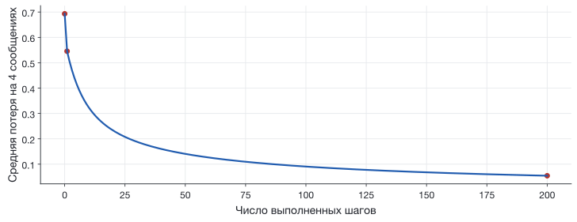

## Тот же первый шаг, теперь в Python

**Входные знания:** $x$, $y$, сигмоида и две производные из L1.
Семинар S2 для запуска не требуется.

**Что построим:** модель с одним признаком и явным циклом обучения.

Число для проверки: после первого шага потеря меняется
с **0.693147** на **0.545475**.

[Начальный notebook](../starter/notebooks/S03-live-coding.ipynb) ·
[Полная версия с результатами](../starter/notebooks/solutions/S03-complete.ipynb)

## Одна строка относится к одному сообщению

| Номер Python $i$ | Текст | $x$ | $y$ |
|:--:|---|:--:|:--:|
| 0 | See you at six | 0 | 0 |
| 1 | Are you free tomorrow | 1 | 0 |
| 2 | Win a free ticket | 2 | 1 |
| 3 | Free prize win now | 3 | 1 |

`messages[2]`, `x[2]` и `y[2]` относятся к **третьему** сообщению.

[Придуманный набор из L1. Индексация Python начинается с нуля.]{.figcap}

## Блок 1 · Подсчёт слов

```python
def count_words(message):
    count = 0
    for word in message.lower().split():
        word = word.strip(".,!?;:")
        if word in ["free", "win", "prize"]:
            count = count + 1
    return count
```

`"Win a free ticket"` даёт слова `win`, `a`, `free`, `ticket`.
Счётчик меняется: $0,1,1,2,2$.

**После запуска:** `x = [0, 1, 2, 3]`.

## У функции есть вход и возвращаемое значение

$$p=\frac1{1+e^{-(wx+b)}}$$

```python
def probability(x_value, w, b):
    z = w * x_value + b
    return 1 / (1 + exp(-z))
```

{height=290 fig-alt="Сигмоида связывает вычисленную линейную сумму с оценкой спама"}

## Блок 2 · Прогноз до обучения

```python
w = 0.0
b = 0.0
for i in range(len(x)):
    p = probability(x[i], w, b)
    print(x[i], y[i], round(p, 3))
```

`len(x)` равно 4. `range(4)` последовательно даёт индексы 0, 1, 2, 3.

У всех четырёх сообщений $p=0.5$.

## Средняя потеря повторяет формулу

$$\ell_i=-y_i\ln p_i-(1-y_i)\ln(1-p_i)$$
$$L=\frac{\ell_1+\ell_2+\ell_3+\ell_4}{4}$$

{height=305 fig-alt="Потеря зависит одновременно от численной оценки и настоящей метки"}

## Блок 3 · Сумма и деление

```python
total = 0.0
for i in range(len(x)):
    p = probability(x[i], w, b)
    loss = -y[i] * log(p) - (1 - y[i]) * log(1 - p)
    total = total + loss
```

После цикла возвращаем `total / len(x)`.

**Проверка до обучения:** `0.693147`.

## Две суммы для градиента

$$g_w=\frac14\sum_i(p_i-y_i)x_i,\qquad
g_b=\frac14\sum_i(p_i-y_i)$$

| $x$ | $y$ | `error = p - y` | `error * x` |
|:--:|:--:|:--:|:--:|
| 0 | 0 | 0.5 | 0 |
| 1 | 0 | 0.5 | 0.5 |
| 2 | 1 | −0.5 | −1 |
| 3 | 1 | −0.5 | −1.5 |

После усреднения: `dw = -0.5`, `db = 0.0`.

## Блок 4 · Изменение параметров

```python
dw, db = gradients(x, y, w, b)
learning_rate = 1.0
w = w - learning_rate * dw
b = b - learning_rate * db
```

Полный код функции `gradients` находится в notebook и сценарии.

**После шага:** $w=0.5$, $b=0$, $L=0.545475$.

Обе производные получены до изменения параметров.

## Повторение знакомого шага

Один проход цикла использует все четыре сообщения.

```python
for step in range(200):
    dw, db = gradients(x, y, w, b)
    w = w - learning_rate * dw
    b = b - learning_rate * db
```

В каждом новом проходе прогнозы зависят от **текущих** $w$ и $b$.

## Блок 5 · История обучения

{height=390 fig-alt="Вычисленная средняя потеря уменьшается с 0.693147 до 0.054416 за 200 шагов"}

После 200 шагов: `w = 4.417`, `b = -6.357`, `L = 0.054416`.

[Те же четыре сообщения, η=1. График строится из loss_history в notebook.]{.figcap}

## Блок 6 · Новое сообщение

```python
new_message = "You win a prize today"
new_x = count_words(new_message)
new_p = probability(new_x, w, b)
```

Получаем $x=2$, $p\approx0.923$.

Обученная модель для прогноза использует найденные $w$ и $b$.

## Одинаковый признак даёт одинаковый ответ

| Сообщение | $x$ | $p$ после обучения |
|---|:--:|:--:|
| Free prize win now | 3 | 0.999 |
| Are you free to win a prize at our family quiz | 3 | 0.999 |

Второе сообщение в нашем примере — обычное приглашение.

На S4 проверим этот признак на **5159 реальных сообщениях**
после удаления текстовых повторов.

## Источники {.smaller}

- Формулы и численные шаги разобраны в [L1](../lectures/L01-how-models-learn.qmd).
- [Исполняемый код всего занятия](../starter/lessons/s03.py).
- [Описание реального набора для S4](../starter/data/README.md).
- Четыре учебных сообщения и приглашение на викторину придуманы для разбора.
