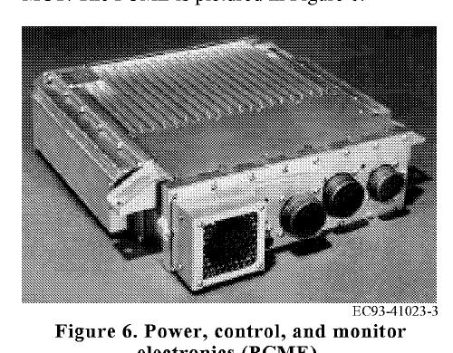

```{python}
#| echo: false
#| output: false
#| warning: false
import sys
sys.path.append("../assets")

import numpy as np
import matplotlib.pyplot as plt

from course_case import (
    FEATURE_NAMES,
    PHYSICAL_FEATURES,
    course_holdout_masks,
    generate_course_case,
)
from figstyle import set_style, INK, ACCENT, ACCENT2, GREEN, AMBER, MUTED
from sklearn.calibration import calibration_curve
from sklearn.dummy import DummyClassifier
from sklearn.ensemble import RandomForestClassifier
from sklearn.linear_model import LogisticRegression
from sklearn.metrics import (
    average_precision_score,
    brier_score_loss,
    confusion_matrix,
    precision_recall_curve,
    roc_auc_score,
)
from sklearn.model_selection import (
    GroupKFold,
    GroupShuffleSplit,
    StratifiedGroupKFold,
    cross_validate,
    train_test_split,
)
from sklearn.pipeline import Pipeline
from sklearn.preprocessing import StandardScaler

set_style()
case = generate_course_case()
train_mask, validation_mask, test_mask = course_holdout_masks(case)
physical_idx = np.arange(len(PHYSICAL_FEATURES))

baseline = Pipeline(
    [
        ("scale", StandardScaler()),
        (
            "model",
            LogisticRegression(
                class_weight="balanced",
                max_iter=2000,
                random_state=42,
            ),
        ),
    ]
)
baseline.fit(case.X[train_mask][:, physical_idx], case.y[train_mask])
val_probability = baseline.predict_proba(
    case.X[validation_mask][:, physical_idx]
)[:, 1]

val_precision, val_recall, val_thresholds = precision_recall_curve(
    case.y[validation_mask], val_probability
)
eligible = val_recall[:-1] >= 0.85
threshold_index = np.flatnonzero(eligible)[
    np.argmax(val_precision[:-1][eligible])
]
chosen_threshold = float(val_thresholds[threshold_index])
```

## Артефакт пары

К концу S3 репозиторий содержит:

1. `split_manifest.json` с группами и временным порядком;
2. sklearn `Pipeline` с Dummy и Logistic baselines;
3. grouped CV и отчёт по фолдам;
4. PR-кривую, калибровку и выбранный на validation порог;
5. одно финальное измерение на sealed test;
6. `metrics.json`, `model.joblib` и тесты инвариантов.

**Публичный интерфейс:** `make baseline`.

::: {.notes}
**Тайминг:** 0:00–0:03. Открыть ветку из S2. Сегодня не соревнуемся архитектурами:
победа — честный и воспроизводимый baseline.
:::

## L1 дала протокол — S3 оставит след

| На L1 | На S3 |
|---|---|
| единица независимости | assert пересечения групп |
| временной holdout | маски train/validation/test |
| baseline ladder | Dummy → Logistic |
| PR вместо accuracy | AP + PR curve |
| порог по ограничению | JSON decision policy |
| test как сейф | однократный test report |

::: {.notes}
**Тайминг:** 0:03–0:05. Слайд нужен для связности пары. Просить студентов вслух объяснить
каждый переход «принцип → код/артефакт».
:::

## Такой стенд действительно летал

:::: {.columns}
::: {.column width="56%"}
{fig-alt="Летающий стенд FLEA, установленный на борту воздушного судна." height="430"}
:::
::: {.column width="44%"}
NASA FLEA:

- три электромеханических привода;
- реальная нагрузка из шины ЛА;
- инъекция дефектов;
- ток, напряжение, температура;
- положение, нагрузка, вибрация;
- лабораторные и полётные эксперименты.
:::
::::

::: {.notes}
**Тайминг:** 0:05–0:07. Это реальная инженерная мотивация, не источник строк нашего датасета.
В публикации стенд описан как неинтрузивная вторичная нагрузка для испытаний PHM.

[Sources]
- https://c3.ndc.nasa.gov/dashlink/static/media/publication/2010_PHM_EMA.pdf
[/Sources]
:::

## Контракт задачи не меняется

> По 20-секундному окну телеметрии оценить риск события деградации
> в горизонте 30 минут для решения о проверке после посадки.

**Положительный класс:** событие в горизонте.
**Primary metric:** Average Precision.
**Decision rule:** минимум FP при recall $\ge 0.85$.
**Final claim:** перенос на новые экземпляры привода.

::: {.notes}
**Тайминг:** 0:07–0:09. Не позволять «по ходу» поменять primary metric после просмотра результатов.
:::

## Pre-flight · продолжаем репозиторий S2

```bash
git switch main
git pull --ff-only
git switch -c s3/honest-baseline
uv sync --frozen
make data-check
pytest -q
```

Стартуем только если S2 сохраняет provenance окна: `flight_id`, `actuator_id`, время.

::: {.notes}
**Тайминг:** 0:09–0:11. Если `make data-check` красный, baseline не начинать: сначала восстановить
контракт данных.
:::

## Структура результата

```text
src/
  data.py
  split.py
  baseline.py
tests/
  test_split.py
  test_baseline.py
artifacts/
  split_manifest.json
  metrics.json
  model.joblib
reports/
  pr_curve.png
  calibration.png
```

Generated artifacts не редактируются руками.

::: {.notes}
**Тайминг:** 0:11–0:13. Попросить создать пустые модули и тесты. Каталог `artifacts/` можно
версионировать для учебной работы; крупные реальные модели позже хранятся иначе.
:::

# Часть 1 · Знаем происхождение каждой строки {.divider background-color="#23373B"}

::: {.notes}
**Тайминг:** 0:13. Сначала проверяем данные, не импортируем модель.
:::

## Синтетика обозначена явно

`assets/course_case.py` генерирует:

- 24 экземпляра EMA;
- 7 полётов на экземпляр;
- 24 перекрывающихся окна на полёт;
- 7 численных признаков;
- редкое событие на уровне короткого полётного фрагмента.

**Физический контекст реален; все числа учебного набора синтетические.**

::: {.notes}
**Тайминг:** 0:13–0:15. Открыть генератор. Seed и механизм генерации доступны для аудита.
Проговорить, что результат на этом наборе не является заявлением о реальном F/A‑18.
:::

## За агрегатом стоит физическое устройство

:::: {.columns}
::: {.column width="58%"}
{fig-alt="Электромеханический линейный привод UltraMotion Bug со стенда NASA FLEA." height="420"}
:::
::: {.column width="42%"}
Признак `tracking_rmse_deg` рождается из цепочки:

```text
команда
 → мотор
 → шарико-винтовая пара
 → линейное перемещение
 → датчик положения
 → sampled signal
 → окно
 → RMSE
```
:::
::::

::: {.notes}
**Тайминг:** 0:15–0:17. На FLEA применялись компактные линейные приводы с ballscrew-механизмом.
Попросить назвать, где в цепочке могут возникнуть bias, drift и saturation.

[Sources]
- https://c3.ndc.nasa.gov/dashlink/static/media/publication/2010_PHM_EMA.pdf
[/Sources]
:::

## Загружаем не только $X$ и $y$

```python
case = generate_course_case(seed=1126)

X = case.X
y = case.y
groups = case.flight_id
actuators = case.actuator_id
times = case.window_start_s
regimes = case.regime
```

Без provenance честный split невозможно восстановить после агрегации.

::: {.notes}
**Тайминг:** 0:15–0:17. Если в реальном проекте сохранили только `.npy` с окнами,
происхождение нужно добавить до обучения.
:::

## Первая проверка — формы и кардинальности

```{python}
#| echo: true
print("X:", case.X.shape)
print("y:", case.y.shape)
print("полётов:", np.unique(case.flight_id).size)
print("приводов:", np.unique(case.actuator_id).size)
print("доля события:", f"{case.y.mean():.1%}")
```

Ожидаем: 4032 окна, 168 полётов, 24 привода.

::: {.notes}
**Тайминг:** 0:17–0:19. Числа становятся контрактом теста. Если генератор изменён, изменение
должно быть осознанным и отражено в версии данных.
:::

## Одна строка без provenance обманывает

```{python}
#| echo: false
i = 1234
for name, value in zip(FEATURE_NAMES, case.X[i], strict=True):
    print(f"{name:22s} = {value:8.3f}")
print(f"{'target':22s} = {case.y[i]}")
print(f"{'flight_id':22s} = {case.flight_id[i]}")
print(f"{'actuator_id':22s} = {case.actuator_id[i]}")
print(f"{'window_start_s':22s} = {case.window_start_s[i]:.1f}")
```

`flight_signature` — намеренный nuisance для демонстрации утечки.

::: {.notes}
**Тайминг:** 0:19–0:21. Попросить найти подозрительный признак. Он стабилен внутри полёта,
но не связан с физикой деградации.
:::

## Класс редкий и меняется во времени

```{python}
#| echo: false
fractions = []
for order in range(7):
    mask = case.flight_order == order
    fractions.append(case.y[mask].mean())

fig, ax = plt.subplots(figsize=(9.4, 4.4))
ax.plot(range(7), fractions, "o-", color=ACCENT, lw=3, ms=8)
ax.set(xlabel="номер полёта экземпляра", ylabel="доля события", ylim=(0, 0.6))
ax.set_title("Поздние полёты содержат больше деградации")
ax.grid(axis="y", alpha=.25)
plt.show()
```

::: {.notes}
**Тайминг:** 0:21–0:23. Это специально встроенный temporal shift. Случайное перемешивание
маскировало бы изменение prevalence.
:::

## Реальный flight profile не похож на IID-шум

:::: {.columns}
::: {.column width="50%"}
{fig-alt="Профили движения тестового привода и нагрузки стенда FLEA во время полёта UH-60." height="430"}
:::
::: {.column width="50%"}
В опубликованном фрагменте UH‑60:

- положение меняется режимами;
- нагрузка нестационарна;
- соседние samples зависимы;
- редкие участки несут важную динамику.

**Поэтому окно и полёт — не взаимозаменяемые единицы split.**
:::
::::

::: {.notes}
**Тайминг:** 0:25–0:27. Графики на рисунке — реальная иллюстрация из публикации NASA, а не наши
синтетические данные. Сопоставить их с искусственным `flight_order` только концептуально.

[Sources]
- https://c3.ndc.nasa.gov/dashlink/static/media/publication/2010_PHM_EMA.pdf
[/Sources]
:::

## Признаки меняются по режимам

```{python}
#| echo: false
fig, ax = plt.subplots(figsize=(10.5, 4.5))
for regime, color in zip(
    ["cruise", "maneuver", "approach"],
    [ACCENT, AMBER, GREEN],
    strict=True,
):
    mask = case.regime == regime
    ax.hist(
        case.X[mask, 1],
        bins=28,
        density=True,
        histtype="step",
        lw=2.5,
        color=color,
        label=regime,
    )
ax.set(xlabel="current_rms_a", ylabel="плотность")
ax.set_title("Ток отражает и здоровье, и режим нагрузки")
ax.legend()
plt.show()
```

::: {.notes}
**Тайминг:** 0:23–0:25. Нельзя интерпретировать высокий ток как дефект без учёта режима.
:::

## Минимальный audit

```python
assert np.isfinite(case.X).all()
assert set(np.unique(case.y)) <= {0, 1}
assert len(case.y) == len(case.flight_id)
assert np.all(case.window_start_s >= 0)
assert np.unique(case.flight_id).size >= 5
assert case.y.mean() > 0
```

Проверка данных падает раньше, чем `fit`.

::: {.notes}
**Тайминг:** 0:25–0:27. В реальном проекте добавить диапазоны единиц и доли missing по каналу.
:::

## Provenance — часть feature contract

| Поле | Роль | В модель? |
|---|---|:--:|
| физические агрегаты | signal | да |
| `flight_signature` | nuisance | нет |
| `flight_id` | группа | нет |
| `actuator_id` | holdout | нет |
| `window_start_s` | время | обычно нет |
| `regime` | slice / context | отдельно |

Служебные поля не должны «случайно» попасть в $X$.

::: {.notes}
**Тайминг:** 0:27–0:29. Запретить `drop(columns=["target"])` как универсальный способ собрать X:
он оставит IDs и timestamps.
:::

## Контрольная точка 1

Покажите преподавателю:

- shape и prevalence;
- число полётов и приводов;
- список feature names;
- один пример с provenance;
- зелёный `audit_case(case)`.

**Не переходить к split, пока происхождение строки не восстановимо.**

::: {.notes}
**Тайминг:** 0:29–0:31. Быстрый обход аудитории. Типовая ошибка — `flight_id` отделён от X,
но потерял исходный порядок.
:::

# Часть 2 · Split создаём раньше Pipeline {.divider background-color="#23373B"}

::: {.notes}
**Тайминг:** 0:31. Сейчас реализуем обещанное будущее.
:::

## Фиксируем утверждение

Финальный test отвечает:

> переносится ли замороженный baseline на **шесть невидимых экземпляров EMA**?

Validation отвечает:

> работает ли выбранная модель на более поздних полётах известных приводов?

Grouped CV отвечает:

> стабилен ли baseline между полётами внутри train?

::: {.notes}
**Тайминг:** 0:31–0:33. Три набора отвечают на три разных вопроса; смешивать их оценки нельзя.
:::

## Маски курса

```text
EMA-00 … EMA-17
  F00 … F04  → train
  F05 … F06  → validation

EMA-18 … EMA-23
  F00 … F06  → sealed test
```

Test одновременно проверяет перенос на новый экземпляр.

::: {.notes}
**Тайминг:** 0:33–0:35. В реальном проекте номера заменяются серийными номерами или board IDs.
:::

## Реализуем маски явно

```python
actuator_number = np.array([
    int(item.split("-")[1])
    for item in case.actuator_id
])

known = actuator_number < 18
train = known & (case.flight_order <= 4)
validation = known & (case.flight_order >= 5)
test = ~known
```

Никакого случайного `test_size=0.2`.

::: {.notes}
**Тайминг:** 0:35–0:37. Код читается как постановка. Это важнее компактности.
:::

## Инвариант 1 · строки не пересекаются

```python
assert not np.any(train & validation)
assert not np.any(train & test)
assert not np.any(validation & test)
assert np.all(train | validation | test)
```

Каждая строка принадлежит ровно одной роли.

::: {.notes}
**Тайминг:** 0:37–0:38. Этот тест ловит ошибку границы `<=` / `>=`.
:::

## Инвариант 2 · test-приводы невидимы

```python
train_units = set(case.actuator_id[train])
val_units = set(case.actuator_id[validation])
test_units = set(case.actuator_id[test])

assert train_units == val_units
assert train_units.isdisjoint(test_units)
assert val_units.isdisjoint(test_units)
```

Мы сознательно разрешаем известные приводы в validation, но запрещаем в test.

::: {.notes}
**Тайминг:** 0:38–0:40. Спросить: «Почему train и validation units совпадают?» Потому что
validation моделирует будущий полёт известного парка.
:::

## Инвариант 3 · validation позже train

```python
for actuator in np.unique(case.actuator_id[train]):
    train_last = case.flight_order[
        train & (case.actuator_id == actuator)
    ].max()
    val_first = case.flight_order[
        validation & (case.actuator_id == actuator)
    ].min()
    assert train_last < val_first
```

Временной смысл превращён в исполняемую проверку.

::: {.notes}
**Тайминг:** 0:40–0:42. В реальных timestamps сравнивать даты и учитывать purge gap.
:::

## CV внутри train группируем по полётам

$$
\forall k:\quad
G_{\text{fit},k}\cap G_{\text{score},k}=\varnothing
$$

```python
cv = StratifiedGroupKFold(
    n_splits=5,
    shuffle=True,
    random_state=42,
)
```

`Stratified` старается распределить редкие события, `Group` не разрывает полёты.

::: {.notes}
**Тайминг:** 0:42–0:44. Стратификация — эвристика баланса, не гарантия одинаковых долей при
неравных группах.

[Sources]
- https://scikit-learn.org/stable/modules/cross_validation.html#stratifiedgroupkfold
[/Sources]
:::

## Визуально проверяем фолды

```{python}
#| echo: false
train_rows = np.flatnonzero(train_mask)
groups_train = case.flight_id[train_mask]
y_train = case.y[train_mask]
cv = StratifiedGroupKFold(n_splits=5, shuffle=True, random_state=42)

matrix = np.zeros((5, len(train_rows)))
for fold, (fit_idx, score_idx) in enumerate(
    cv.split(case.X[train_mask], y_train, groups_train)
):
    matrix[fold, fit_idx] = 1
    matrix[fold, score_idx] = 2

fig, ax = plt.subplots(figsize=(11.0, 4.2))
ax.imshow(matrix, aspect="auto", interpolation="nearest",
          cmap=plt.matplotlib.colors.ListedColormap(["white", "#AFC9EA", "#E6A15A"]))
ax.set(xlabel="окна train, упорядоченные по полётам", ylabel="fold")
ax.set_yticks(range(5))
ax.set_title("Каждый полёт целиком в fit или score")
plt.show()
```

::: {.notes}
**Тайминг:** 0:44–0:46. Полосы должны быть блоками по 24 окна. Если видим россыпь отдельных
пикселей, группы потеряны.
:::

## Gap относится к исходному времени

Если граница внутри длинной записи:

```python
gap_s = window_length_s + label_overlap_s
fit = time < boundary_s - gap_s
score = time >= boundary_s
```

В учебном наборе граница проходит между полётами, поэтому дополнительный межоконный gap не нужен.

::: {.notes}
**Тайминг:** 0:46–0:48. Не добавлять бессмысленный gap «на всякий случай». Обосновать его
геометрией feature и label.
:::

## Мини-проверка split прямо на слайде {.live-code}

```{pyodide}
#| caption: "Исправьте bad_split: общих групп должно стать 0"
#| max-lines: 12
import numpy as np
from sklearn.model_selection import GroupShuffleSplit, train_test_split

groups = np.repeat(np.arange(12), 8)
y = np.repeat([0, 0, 1, 0, 0, 1, 0, 0, 0, 1, 0, 0], 8)
rows = np.arange(len(y))

bad_train, bad_test = train_test_split(rows, test_size=.25, random_state=4)
good_train, good_test = next(
    GroupShuffleSplit(n_splits=1, test_size=.25, random_state=4)
    .split(rows, y, groups)
)

for name, left, right in [("bad", bad_train, bad_test), ("good", good_train, good_test)]:
    overlap = set(groups[left]) & set(groups[right])
    print(f"{name}: общих групп = {len(overlap)}, ids={sorted(overlap)}")
```

::: {.notes}
**Тайминг:** 0:48–0:51. Запустить всем. Затем заменить `groups` на actuator ID в собственном
проекте и интерпретировать, какое будущее это моделирует.
:::

## Manifest сохраняет выбор

```python
manifest = {
    "version": 1,
    "group_key_cv": "flight_id",
    "time_key": "flight_order",
    "train_units": sorted(train_units),
    "validation_flights": ["F05", "F06"],
    "test_units": sorted(test_units),
    "seed": 1126,
}
```

Сначала записываем manifest, затем запускаем модели.

::: {.notes}
**Тайминг:** 0:51–0:53. В реальном датасете лучше сохранять конкретные IDs и хеш исходного
индекса, а не только правило.
:::

## Контрольная точка 2

Запустите:

```bash
pytest -q tests/test_split.py
```

Минимум четыре теста:

- полное покрытие строк;
- непересечение ролей;
- отсутствие test-приводов в train/validation;
- validation позже train.

::: {.notes}
**Тайминг:** 0:53–0:55. Проверить у студентов сам тест: он должен падать после намеренного
нарушения маски.
:::

# Часть 3 · Baseline живёт внутри Pipeline {.divider background-color="#23373B"}

::: {.notes}
**Тайминг:** 0:55. Теперь и только теперь импортируем estimator.
:::

## Dummy задаёт нулевой уровень

```python
dummy = DummyClassifier(strategy="prior")
dummy.fit(X_train, y_train)
```

Для редкого класса:

$$
\mathrm{AP}_{dummy}\approx P(y=1)
$$

Если модель не превосходит Dummy, усложнение бессмысленно.

::: {.notes}
**Тайминг:** 0:55–0:57. `most_frequent` и `prior` дают разные вероятностные выходы,
но одинаковое ранжирование.

[Sources]
- https://scikit-learn.org/stable/modules/generated/sklearn.dummy.DummyClassifier.html
[/Sources]
:::

## Правило — второй baseline

```python
rule_score = (
    0.7 * tracking_rmse_deg
    + 0.04 * (temperature_c - 40)
    + 0.03 * (current_rms_a - 8)
)
```

Преимущество правила:

- объяснимо;
- быстро;
- легко перенести;
- показывает, добавляет ли обучение новую ценность.

::: {.notes}
**Тайминг:** 0:57–0:59. Не подгонять коэффициенты на test. Даже ручное правило проходит validation.
:::

## Logistic Regression — сильный инженерный baseline

$$
\hat p(y=1\mid x)=\sigma(w^\top x+b)
$$

Почему подходит:

- быстрый fit и inference;
- прозрачный вклад признаков;
- вероятностный выход;
- стабильный экспорт;
- понятная точка сравнения для PyTorch.

::: {.notes}
**Тайминг:** 0:59–1:01. Линейность — преимущество baseline, а не недостаток.
:::

## Только физические признаки

```python
physical = [
    "tracking_rmse_deg",
    "current_rms_a",
    "temperature_c",
    "vibration_rms_g",
    "load_rms_kn",
    "supply_voltage_v",
]

X_model = case.X[:, :len(physical)]
```

`flight_signature`, IDs и время исключены до Pipeline.

::: {.notes}
**Тайминг:** 1:01–1:03. Список разрешённых признаков безопаснее списка исключений.
:::

## Pipeline не даёт scaler увидеть score-fold

```python
pipeline = Pipeline([
    ("scale", StandardScaler()),
    ("model", LogisticRegression(
        class_weight="balanced",
        max_iter=2000,
        random_state=42,
    )),
])
```

Каждый вызов `fit` заново оценивает параметры `StandardScaler`.

::: {.notes}
**Тайминг:** 1:03–1:05. `class_weight="balanced"` не создаёт новые строки; он меняет вклад классов
в loss. Его влияние тоже проверяется CV.

[Sources]
- https://scikit-learn.org/stable/modules/compose.html#pipeline
- https://scikit-learn.org/stable/modules/generated/sklearn.preprocessing.StandardScaler.html
[/Sources]
:::

## Один вызов возвращает несколько свидетельств

```python
scores = cross_validate(
    pipeline,
    X_train,
    y_train,
    groups=flight_groups_train,
    cv=cv,
    scoring={
        "ap": "average_precision",
        "roc_auc": "roc_auc",
    },
    return_train_score=True,
)
```

Train-score нужен для диагностики gap, не для выбора результата.

::: {.notes}
**Тайминг:** 1:05–1:07. В новых версиях sklearn metadata routing может менять передачу groups;
для курса фиксируем версию окружения.
:::

## Смотрим на каждый fold

```{python}
#| echo: false
cv_scores = cross_validate(
    baseline,
    case.X[train_mask][:, physical_idx],
    case.y[train_mask],
    groups=case.flight_id[train_mask],
    cv=StratifiedGroupKFold(n_splits=5, shuffle=True, random_state=42),
    scoring={"ap": "average_precision", "auc": "roc_auc"},
    return_train_score=True,
)

fig, ax = plt.subplots(figsize=(9.8, 4.3))
x = np.arange(1, 6)
ax.plot(x, cv_scores["train_ap"], "o--", color=MUTED, lw=2, label="train AP")
ax.plot(x, cv_scores["test_ap"], "o-", color=ACCENT, lw=3, ms=8, label="score AP")
ax.axhline(case.y[train_mask].mean(), color=AMBER, ls=":", label="prevalence train")
ax.set(xlabel="fold", ylabel="Average Precision", xticks=x, ylim=(0, 1))
ax.set_title("Разброс между полётами важнее одной средней")
ax.legend()
plt.show()
```

::: {.notes}
**Тайминг:** 1:07–1:09. Найти худший fold. Следующий вопрос — какие полёты и режимы в нём,
а не «как поднять среднюю на 0.02».
:::

## Случайный split продаёт утечку

```{python}
#| echo: false
idx = np.arange(len(case.y))
row_train, row_test = train_test_split(
    idx, test_size=.25, stratify=case.y, random_state=42
)
flight_train, flight_test = next(
    GroupShuffleSplit(n_splits=1, test_size=.25, random_state=42)
    .split(case.X, case.y, case.flight_id)
)
comparison = []
for label, fit_idx, score_idx in [
    ("random rows", row_train, row_test),
    ("new flights", flight_train, flight_test),
]:
    leak_model = RandomForestClassifier(
        n_estimators=180, min_samples_leaf=2, random_state=42
    )
    leak_model.fit(case.X[fit_idx], case.y[fit_idx])
    probability = leak_model.predict_proba(case.X[score_idx])[:, 1]
    comparison.append(average_precision_score(case.y[score_idx], probability))

fig, ax = plt.subplots(figsize=(8.5, 4.4))
bars = ax.bar(["random rows", "new flights"], comparison,
              color=[ACCENT, AMBER], width=.58)
ax.bar_label(bars, fmt="%.2f", padding=5)
ax.set(ylabel="AP", ylim=(0, 1), title="Flexible model запоминает полётный отпечаток")
plt.show()
```

::: {.notes}
**Тайминг:** 1:09–1:11. Это ожидаемый антипример: `flight_signature` одинаков внутри полёта,
а Random Forest умеет его запомнить.
:::

## Утечка маскируется под feature importance

```python
importance = dict(zip(
    FEATURE_NAMES,
    leak_model.feature_importances_,
))
```

Высокая важность `flight_signature` не делает его физическим признаком.

**Проверка причинности:** сможет ли признак иметь тот же смысл в новом полёте?

::: {.notes}
**Тайминг:** 1:11–1:13. Feature importance говорит, как модель использовала данные,
а не почему признак связан с объектом.
:::

## Удаляем nuisance и повторяем тот же split

```text
до: physical + flight_signature
после: только physical

неизменно:
  groups · folds · metric · seed
```

Это корректная ablation. Менять одновременно split и feature set нельзя.

::: {.notes}
**Тайминг:** 1:13–1:15. Сохранить обе строки в results table, включая отрицательный результат.
:::

## Baseline должен вернуть probability

```python
pipeline.fit(X_train, y_train)
val_probability = pipeline.predict_proba(X_val)[:, 1]
```

Не использовать `predict()` до выбора threshold.

`predict()` молча применяет порог estimator по умолчанию, который не связан с нашей ценой ошибок.

::: {.notes}
**Тайминг:** 1:15–1:17. Probability — вход decision policy. Label — её выход.
:::

## Контрольная точка 3

Покажите:

- Dummy AP;
- 5 grouped fold AP;
- mean ± std;
- худший fold;
- отсутствие `flight_signature` в Pipeline;
- `predict_proba`, а не готовый label.

::: {.notes}
**Тайминг:** 1:17–1:19. Если CV работает только после перемешивания строк, вернуться к split.
:::

# Часть 4 · Порог выбираем на validation {.divider background-color="#23373B"}

::: {.notes}
**Тайминг:** 1:19. Модель зафиксирована; переходим от ranking к действию.
:::

## Роли данных теперь жёсткие

```text
train
  fit scaler + logistic
  grouped CV

validation
  PR / calibration
  choose threshold

test
  untouched until freeze
```

После просмотра test запрещено возвращаться к настройке без новой версии протокола.

::: {.notes}
**Тайминг:** 1:19–1:20. До следующего контрольного пункта test probability даже не вычислять.
:::

## PR-кривая показывает доступные режимы работы

```{python}
#| echo: false
fig, ax = plt.subplots(figsize=(9.2, 4.5))
ax.plot(val_recall, val_precision, color=ACCENT, lw=3)
ax.scatter(
    val_recall[threshold_index],
    val_precision[threshold_index],
    s=100,
    color=AMBER,
    zorder=3,
    label=f"τ={chosen_threshold:.2f}",
)
ax.axhline(case.y[validation_mask].mean(), color=MUTED, ls="--", label="prevalence")
ax.axvline(.85, color=GREEN, ls=":", label="recall constraint")
ax.set(xlabel="Recall", ylabel="Precision", xlim=(0, 1), ylim=(0, 1))
ax.set_title("Порог выбираем только по validation")
ax.legend()
plt.show()
```

::: {.notes}
**Тайминг:** 1:20–1:22. Выбранная точка — максимум precision среди threshold с recall ≥ 0.85.
Это учебное ограничение, не сертификационное требование.
:::

## Алгоритм выбора порога

```python
precision, recall, thresholds = precision_recall_curve(
    y_val, val_probability
)

eligible = recall[:-1] >= 0.85
index = np.flatnonzero(eligible)[
    np.argmax(precision[:-1][eligible])
]
threshold = float(thresholds[index])
```

Правило выбора входит в конфигурацию до test.

::: {.notes}
**Тайминг:** 1:22–1:24. Последняя точка PR-кривой не имеет threshold, поэтому используем `[:-1]`.
Это частая ошибка индексации.
:::

## Мини-лаборатория порога {.live-code}

```{pyodide}
#| caption: "Измените min_recall и посмотрите цену ограничения"
#| max-lines: 13
import numpy as np
from sklearn.metrics import confusion_matrix, precision_recall_curve

y_val = np.array([0,0,0,1,0,0,1,0,1,0,0,1,0,0,0,1])
p_val = np.array([.04,.08,.15,.18,.21,.24,.31,.35,.48,.52,.56,.61,.66,.74,.81,.91])
min_recall = 0.80

precision, recall, thresholds = precision_recall_curve(y_val, p_val)
eligible = recall[:-1] >= min_recall
i = np.flatnonzero(eligible)[np.argmax(precision[:-1][eligible])]
threshold = thresholds[i]
pred = p_val >= threshold
tn, fp, fn, tp = confusion_matrix(y_val, pred).ravel()

print(f"min recall={min_recall:.2f} → τ={threshold:.2f}")
print(f"precision={tp/(tp+fp):.2f}, recall={tp/(tp+fn):.2f}")
print(f"TP={tp}, FP={fp}, FN={fn}, TN={tn}")
```

::: {.notes}
**Тайминг:** 1:24–1:27. Попросить увеличить min_recall до 1.0 и увидеть рост FP.
:::

## Матрица ошибок в единицах обслуживания

```{python}
#| echo: false
val_prediction = val_probability >= chosen_threshold
cm = confusion_matrix(case.y[validation_mask], val_prediction)

fig, ax = plt.subplots(figsize=(6.3, 4.7))
image = ax.imshow(cm, cmap="Blues")
for row in range(2):
    for col in range(2):
        ax.text(col, row, str(cm[row, col]), ha="center", va="center",
                fontsize=22, color=INK)
ax.set_xticks([0, 1], ["не проверять", "проверить"])
ax.set_yticks([0, 1], ["нет события", "событие"])
ax.set(xlabel="решение", ylabel="факт", title=f"Validation · threshold={chosen_threshold:.2f}")
plt.show()
```

::: {.notes}
**Тайминг:** 1:27–1:29. Перевести FP в «лишние окна» недостаточно; ниже агрегируем по полёту.
:::

## Окна агрегируются в решение по полёту

Простой первый контракт:

$$
\hat p_{\text{flight}}=\max_{i\in \text{flight}}\hat p_i
$$

Сигнал:

$$
\hat y_{\text{flight}}=\mathbb{1}[\hat p_{\text{flight}}\ge\tau]
$$

На следующих итерациях сравним max, quantile и consecutive alarms.

::: {.notes}
**Тайминг:** 1:29–1:31. Метка у нас общая для короткого flight segment, поэтому агрегирование
нужно для операционной метрики FP/flight.
:::

## Калибровка проверяется отдельно

```{python}
#| echo: false
fraction, mean_probability = calibration_curve(
    case.y[validation_mask],
    val_probability,
    n_bins=6,
    strategy="quantile",
)
brier = brier_score_loss(case.y[validation_mask], val_probability)

fig, ax = plt.subplots(figsize=(7.2, 4.6))
ax.plot([0, 1], [0, 1], "--", color=MUTED, label="идеально")
ax.plot(mean_probability, fraction, "o-", color=ACCENT, lw=3, ms=8)
ax.set(xlabel="predicted probability", ylabel="observed fraction",
       xlim=(0, 1), ylim=(0, 1))
ax.set_title(f"Validation calibration · Brier={brier:.3f}")
ax.legend()
plt.show()
```

::: {.notes}
**Тайминг:** 1:31–1:33. Не калибровать модель на том же маленьком validation без отдельной
вложенной процедуры. Сейчас только диагностируем.

[Sources]
- https://scikit-learn.org/stable/modules/calibration.html
[/Sources]
:::

## Срезы обязательны до test

```{python}
#| echo: false
print("режим       n    prevalence    AP")
for regime in ["cruise", "maneuver", "approach"]:
    subset = case.regime[validation_mask] == regime
    y_subset = case.y[validation_mask][subset]
    p_subset = val_probability[subset]
    ap = average_precision_score(y_subset, p_subset)
    print(
        f"{regime:9s} {subset.sum():4d}     "
        f"{y_subset.mean():6.1%}   {ap:.3f}"
    )
```

Смотрим также худший привод и экстремальную температуру.

::: {.notes}
**Тайминг:** 1:33–1:35. Если в slice один класс, AP/ROC могут быть не определены;
это тоже результат о покрытии данных.
:::

## Freeze перед test

Зафиксированы:

- commit;
- feature list;
- Pipeline и параметры;
- threshold;
- агрегирование окон;
- split manifest;
- primary и secondary metrics.

Только после этого разрешён `evaluate_test.py`.

::: {.notes}
**Тайминг:** 1:35–1:36. Поставить локальный tag или записать commit SHA в config.
:::

## Test запускается один раз

```python
test_probability = pipeline.predict_proba(X_test)[:, 1]
test_ap = average_precision_score(y_test, test_probability)
test_auc = roc_auc_score(y_test, test_probability)
test_prediction = test_probability >= threshold
test_cm = confusion_matrix(y_test, test_prediction)
```

Никакого `fit`, `calibrate` или нового threshold после этой строки.

::: {.notes}
**Тайминг:** 1:36–1:38. Если test хуже validation, это не баг автоматически. Он проверяет более
трудный перенос на новые приводы.
:::

## Итоговая таблица не скрывает baseline

```{python}
#| echo: false
dummy = DummyClassifier(strategy="prior")
dummy.fit(
    case.X[train_mask][:, physical_idx],
    case.y[train_mask],
)
dummy_val = dummy.predict_proba(
    case.X[validation_mask][:, physical_idx]
)[:, 1]
test_probability = baseline.predict_proba(
    case.X[test_mask][:, physical_idx]
)[:, 1]

print("model      split        prevalence    AP      ROC-AUC")
print(
    f"dummy      validation   {case.y[validation_mask].mean():.3f}"
    f"         {average_precision_score(case.y[validation_mask], dummy_val):.3f}"
    "   0.500"
)
print(
    f"logistic   validation   {case.y[validation_mask].mean():.3f}"
    f"         {average_precision_score(case.y[validation_mask], val_probability):.3f}"
    f"   {roc_auc_score(case.y[validation_mask], val_probability):.3f}"
)
print(
    f"logistic   test         {case.y[test_mask].mean():.3f}"
    f"         {average_precision_score(case.y[test_mask], test_probability):.3f}"
    f"   {roc_auc_score(case.y[test_mask], test_probability):.3f}"
)
```

::: {.notes}
**Тайминг:** 1:38–1:40. Числа относятся только к учебной синтетике. В отчёте обязательно
указывать prevalence рядом с AP.
:::

## Результат может быть «baseline пока слаб»

Корректные выводы:

- модель превосходит Dummy, но разброс фолдов велик;
- перенос на новые приводы слабее validation;
- калибровка недостаточна для интерпретации числа как риска;
- нужны данные по редким режимам;
- threshold годится только для учебного ограничения.

Это полезнее, чем скрыть ограничения одним accuracy.

::: {.notes}
**Тайминг:** 1:40–1:42. Хорошая лабораторная может закончиться отрицательным выводом,
если протокол и evidence корректны.
:::

# Часть 5 · Эксперимент становится артефактом {.divider background-color="#23373B"}

::: {.notes}
**Тайминг:** 1:42. Финальные минуты — упаковка и проверки.
:::

## Сохраняем Pipeline целиком

```python
from joblib import dump

dump(
    {
        "pipeline": pipeline,
        "feature_names": physical,
        "threshold": threshold,
        "aggregation": "max_probability_per_flight",
    },
    "artifacts/model.joblib",
)
```

Scaler и модель не должны разъехаться.

::: {.notes}
**Тайминг:** 1:42–1:44. Joblib не является безопасным форматом для недоверенных файлов.
Загружать только собственный артефакт; позже экспортируем ONNX.

[Sources]
- https://scikit-learn.org/stable/model_persistence.html
[/Sources]
:::

## `metrics.json` хранит числа и контекст

```json
{
  "data_version": "actuator-case-v1",
  "split_manifest_sha256": "...",
  "model": "logistic-baseline-v1",
  "selection_metric": "average_precision",
  "threshold_rule": "max_precision_at_recall_ge_0.85",
  "threshold": 0.42,
  "validation": {"ap": 0.51, "brier": 0.18},
  "test": {"status": "evaluated_once", "ap": 0.47}
}
```

Числа в примере заменяются вычисленными.

::: {.notes}
**Тайминг:** 1:44–1:45. Никогда не копировать цифры со слайда в отчёт.
:::

## Тестируем модельный контракт

```python
def test_pipeline_probability_contract(model, sample):
    probability = model.predict_proba(sample)
    assert probability.shape == (len(sample), 2)
    assert np.isfinite(probability).all()
    assert np.all((0 <= probability) & (probability <= 1))

def test_feature_order_is_frozen(bundle):
    assert tuple(bundle["feature_names"]) == PHYSICAL_FEATURES
```

::: {.notes}
**Тайминг:** 1:45–1:47. Проверка формы ловит невидимое изменение бинарного/мультиклассового
интерфейса.
:::

## Проверяем воспроизводимость метрик

```python
def test_baseline_is_reproducible():
    first = run_baseline(seed=1126)
    second = run_baseline(seed=1126)
    assert first.split_hash == second.split_hash
    assert first.validation_ap == second.validation_ap
    assert first.threshold == second.threshold
```

Seed не исправляет неверный split, но фиксирует стохастические детали.

::: {.notes}
**Тайминг:** 1:47–1:49. Для float допуска может понадобиться `np.isclose`; в нашем CPU-baseline
результат детерминирован.
:::

## `make baseline` — один вход

```make
.PHONY: baseline

baseline:
	uv run python -m src.baseline \
	  --config configs/baseline.yaml \
	  --output artifacts
	uv run pytest -q tests/test_split.py tests/test_baseline.py
```

Команда должна работать после чистого `uv sync --frozen`.

::: {.notes}
**Тайминг:** 1:49–1:51. В Makefile команды начинаются с tab. Не прятать интерактивные вопросы
внутри pipeline.
:::

## CI проверяет артефакт, а не обещание

```yaml
- run: uv sync --frozen
- run: make baseline
- run: test -s artifacts/split_manifest.json
- run: test -s artifacts/metrics.json
- run: uv run ruff check src tests
```

В smoke CI используем маленький детерминированный набор; полный прогон — отдельный job.

::: {.notes}
**Тайминг:** 1:51–1:53. Не коммитить секреты или внешние реальные данные в учебный GitHub.
:::

## Реальная электроника напоминает про интерфейс

:::: {.columns}
::: {.column width="54%"}
{fig-alt="Блок силовой, управляющей и мониторинговой электроники EPAD." height="410"}
:::
::: {.column width="46%"}
PCME объединяла:

- управление приводом;
- силовую коммутацию;
- мониторинг;
- built-in test;
- переход в безопасный режим.

ML-артефакт тоже существует внутри контракта системы.
:::
::::

::: {.notes}
**Тайминг:** 1:53–1:55. Модель не заменяет встроенный контроль и safe mode. В курсе ML —
дополнительный диагностический канал.

[Sources]
- https://ntrs.nasa.gov/api/citations/20010039533/downloads/20010039533.pdf
[/Sources]
:::

## Типовые поломки

| Симптом | Причина | Проверка |
|---|---|---|
| AP ≈ 1.0 | общие полёты / nuisance | overlap groups |
| fold без positives | мало событий | group labels per fold |
| `predict` «плох» | порог 0.5 | смотреть probability |
| validation резко лучше CV | shift или leakage | IDs + time |
| повторный test «улучшился» | test стал validation | новый protocol version |

::: {.notes}
**Тайминг:** 1:55–1:57. Разрешить группам выбрать одну строку и показать диагностическую команду.
:::

## Финальный Definition of done

- `make baseline` проходит с чистого окружения;
- split-инварианты покрыты тестами;
- Dummy и Logistic сравниваются на одинаковых фолдах;
- primary metric — AP, рядом указана prevalence;
- threshold выбран только на validation;
- test запущен после freeze;
- сохранены model bundle, manifest и metrics;
- README объясняет ограничения синтетического кейса.

::: {.notes}
**Тайминг:** 1:57–1:59. Это чек-лист приёмки. Не принимать скриншот ноутбука вместо артефактов.
:::

## PR должен рассказывать эксперимент

Описание PR:

1. **Question:** что проверяли?
2. **Data/split:** какое будущее моделирует?
3. **Result:** Dummy, CV, validation, test.
4. **Decision:** как выбран threshold?
5. **Limitations:** где baseline не доказан?
6. **Reproduce:** одна команда.

Количество коммитов не является evidence.

::: {.notes}
**Тайминг:** 1:59–2:01. Попросить открыть draft PR до конца занятия, даже если числа ещё неидеальны.
:::

## Мост в S4 и проект

S3 даёт каждому:

- проверенный шаблон split;
- baseline code path;
- формат артефактов;
- язык ограничений.

На S4 команда меняет объект проекта, но переносит этот протокол:

$$
\text{project card} + \text{split manifest} + \text{baseline contract}
$$

::: {.notes}
**Тайминг:** 2:01–2:03. Сквозной EMA-кейс остаётся учебным эталоном, с которым можно сравнить
архитектуру собственного проекта.
:::

## Выходной билет

Покажите соседу три файла:

1. `split_manifest.json`;
2. `metrics.json`;
3. тест, который падает при утечке группы.

И ответьте:

> Какое утверждение о будущем реально поддерживает ваш test?

::: {.notes}
**Тайминг:** 2:03–2:05. Если ответ звучит шире, чем split, сузить формулировку.
:::

## Шпаргалка

```text
audit provenance
  → freeze split
  → assert invariants
  → Dummy
  → Pipeline
  → grouped CV
  → validation PR/calibration
  → freeze threshold
  → test once
  → save model + metrics + manifest
```

Порядок важнее выбора классификатора.

::: {.notes}
**Тайминг:** финал. Оставить слайд на экране во время упаковки работ.
:::

## Источники и реальные материалы {.smaller}

- Jensen et al. *Flight Test Experience With an Electromechanical Actuator on the F‑18 SRA*. NASA, 2000.
- Balaban et al. *Airborne Electro-Mechanical Actuator Test Stand for PHM Systems*. PHM Society, 2010.
- scikit-learn: grouped CV, Pipeline, metrics, calibration, model persistence.

Фотографии аппаратуры взяты из первичных публикаций NASA.
Все строки и метрики учебного кейса воспроизводятся из `assets/course_case.py`.

::: {.notes}
[Sources]
- https://ntrs.nasa.gov/api/citations/20010039533/downloads/20010039533.pdf
- https://c3.ndc.nasa.gov/dashlink/static/media/publication/2010_PHM_EMA.pdf
- https://scikit-learn.org/stable/modules/cross_validation.html
- https://scikit-learn.org/stable/modules/compose.html#pipeline
- https://scikit-learn.org/stable/modules/model_evaluation.html
- https://scikit-learn.org/stable/modules/calibration.html
- https://scikit-learn.org/stable/model_persistence.html
[/Sources]
:::
