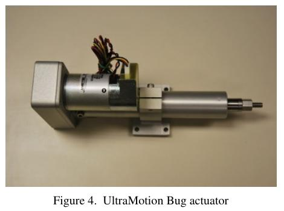
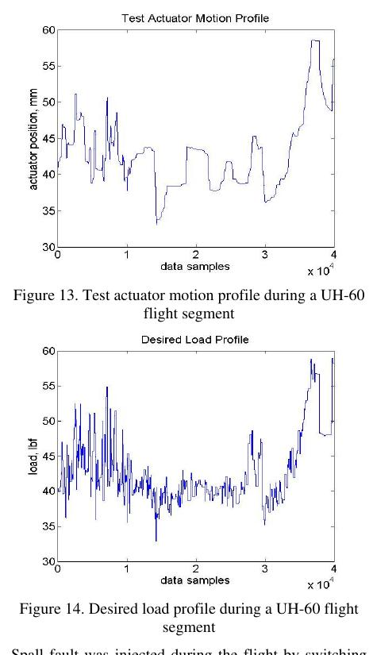

```{python}
#| echo: false
#| output: false
#| warning: false
import sys
sys.path.append("../assets")

import numpy as np
import matplotlib.pyplot as plt

from course_case import (
    PHYSICAL_FEATURES,
    course_holdout_masks,
    generate_course_case,
)
from figstyle import set_style, INK, ACCENT, ACCENT2, GREEN, AMBER, MUTED
from sklearn.calibration import calibration_curve
from sklearn.dummy import DummyClassifier
from sklearn.linear_model import LogisticRegression
from sklearn.metrics import (
    average_precision_score,
    brier_score_loss,
    confusion_matrix,
    precision_recall_curve,
    roc_auc_score,
)
from sklearn.model_selection import StratifiedGroupKFold
from sklearn.pipeline import Pipeline
from sklearn.preprocessing import StandardScaler

set_style()
case = generate_course_case()
train_mask, validation_mask, test_mask = course_holdout_masks(case)
physical_idx = np.arange(len(PHYSICAL_FEATURES))

pipeline = Pipeline(
    [
        ("scale", StandardScaler()),
        (
            "model",
            LogisticRegression(
                class_weight="balanced",
                max_iter=2000,
                random_state=42,
            ),
        ),
    ]
)
pipeline.fit(case.X[train_mask][:, physical_idx], case.y[train_mask])
validation_probability = pipeline.predict_proba(
    case.X[validation_mask][:, physical_idx]
)[:, 1]
precision, recall, thresholds = precision_recall_curve(
    case.y[validation_mask], validation_probability
)
eligible = recall[:-1] >= 0.85
threshold_index = np.flatnonzero(eligible)[
    np.argmax(precision[:-1][eligible])
]
chosen_threshold = float(thresholds[threshold_index])
```

## Вход: красный pipeline

На старте команда уже существует, но падает:

```text
$ make baseline
FAILED tests/test_split.py::test_test_units_are_unseen
FAILED tests/test_baseline.py::test_feature_order
ERROR artifacts/metrics.json not found
```

Через 90 минут та же команда должна завершиться **зелёным релизом baseline-v1**.

::: {.notes}
**Тайминг:** 0:00–0:02. Никакого повторения определений L1. Сразу показать наблюдаемый результат
пары: красная команда должна стать зелёной.
:::

## Выход: пять файлов, которым можно доверять

```text
artifacts/
  split_manifest.json
  cv_metrics.json
  decision_policy.json
  model.joblib
  test_report.json
```

И одна команда:

```bash
make baseline
```

Скриншот ноутбука не считается артефактом.

::: {.notes}
**Тайминг:** 0:02–0:04. Студенты создают ветку и каталог artifacts. Файлы будут появляться
после каждого checkpoint, а не все в конце.
:::

## Теория уже в L1

Сегодня не доказываем заново, почему нужны:

- group/time split;
- Average Precision;
- выбор порога на validation;
- sealed test;
- sklearn `Pipeline`.

Если принцип забыт — открыть [L1](../lectures/L01-supervised-validation.qmd).
На S3 каждый принцип получает **функцию, тест и файл**.

::: {.notes}
**Тайминг:** 0:04–0:05. Это явная граница функций L1 и S3.
:::

## Работаем парами, меняемся после checkpoint

:::: {.columns}
::: {.column width="50%"}
### Driver

- пишет код;
- проговаривает решение;
- запускает тест;
- не «чинит» тест молча.
:::
::: {.column width="50%"}
### Reviewer

- сверяет контракт;
- ищет утечку;
- читает diff;
- фиксирует вопрос в PR.
:::
::::

После каждого зелёного checkpoint роли меняются.

::: {.notes}
**Тайминг:** 0:05–0:07. В одиночной работе студент играет обе роли и оставляет короткий self-review.
:::

## Строка приходит с реального устройства

:::: {.columns}
::: {.column width="58%"}
{fig-alt="Электромеханический линейный привод UltraMotion Bug со стенда NASA FLEA." height="420"}
:::
::: {.column width="42%"}
Сегодня кодируем цепочку:

```text
привод
 → сигналы
 → окно
 → агрегаты
 → probability
 → решение
 → evidence
```

Данные учебные, контракт — инженерный.
:::
::::

::: {.notes}
**Тайминг:** 0:07–0:08. Фотография возвращает физический смысл к числам, но не превращает
синтетические строки в реальные flight data.

[Sources]
- https://c3.ndc.nasa.gov/dashlink/static/media/publication/2010_PHM_EMA.pdf
[/Sources]
:::

## Маршрут пары

```text
00:08  boot + audit
00:20  checkpoint A · data
00:38  checkpoint B · split
00:58  checkpoint C · baseline
01:15  checkpoint D · decision
01:27  checkpoint E · sealed test
01:30  release
```

Если отстали — сохраняем корректность и сокращаем bonus, а не убираем тесты.

::: {.notes}
Тайминг видим аудитории: это лабораторный маршрут, а не внутренний план презентации.
:::

# Этап A · Поднять данные и контракт {.divider background-color="#23373B"}

::: {.notes}
**Тайминг:** 0:08. Результат этапа — `test_data_contract.py` зелёный.
:::

## Создаём рабочую ветку

```bash
git switch main
git pull --ff-only
git switch -c s3/honest-baseline
uv sync --frozen
make data-check
pytest -q
```

`make data-check` из S2 обязан быть зелёным до обучения.

::: {.notes}
**Тайминг:** 0:08–0:10. Если окружение не поднимается, reviewer открывает issue с полным выводом,
driver не переходит в случайный Jupyter kernel.
:::

## Добавляем четыре модуля

```text
src/
  data.py       # загрузка + feature contract
  split.py      # маски + manifest
  baseline.py   # CV + fit + reports
  decision.py   # threshold + aggregation
tests/
  test_data.py
  test_split.py
  test_baseline.py
```

Каждый модуль имеет один публичный вход.

::: {.notes}
**Тайминг:** 0:10–0:11. Создать файлы. Не помещать всё в `train.py`.
:::

## Первая функция ничего не обучает

```python
from course_case import generate_course_case

def load_case(seed: int = 1126):
    case = generate_course_case(seed=seed)
    validate_case(case)
    return case
```

`load_case()` либо возвращает проверенный объект, либо падает с понятной причиной.

::: {.notes}
**Тайминг:** 0:11–0:13. В студенческом репозитории генератор копируется в `src/` или подключается
как подготовленный материал преподавателя.
:::

## Фиксируем форму до первой модели

```python
def validate_case(case) -> None:
    assert case.X.shape == (4032, 7)
    assert case.y.shape == (4032,)
    assert len(case.feature_names) == case.X.shape[1]
    assert np.isfinite(case.X).all()
    assert set(np.unique(case.y)) == {0, 1}
```

Форма становится частью версии `actuator-case-v1`.

::: {.notes}
**Тайминг:** 0:13–0:15. Попросить намеренно изменить ожидаемую форму и увидеть красный тест.
:::

## Provenance проверяется вместе с $X$

```python
def validate_provenance(case) -> None:
    n = len(case.y)
    assert len(case.flight_id) == n
    assert len(case.actuator_id) == n
    assert len(case.window_start_s) == n
    assert np.unique(case.flight_id).size == 168
    assert np.unique(case.actuator_id).size == 24
```

Порядок всех массивов должен совпадать.

::: {.notes}
**Тайминг:** 0:15–0:16. Типовая поломка — отсортировать X, но не переставить groups.
:::

## Разрешающий список признаков

```python
PHYSICAL_FEATURES = (
    "tracking_rmse_deg",
    "current_rms_a",
    "temperature_c",
    "vibration_rms_g",
    "load_rms_kn",
    "supply_voltage_v",
)
```

Модель получает только перечисленное. `flight_signature` намеренно остаётся за границей.

::: {.notes}
**Тайминг:** 0:16–0:17. Не писать «все столбцы кроме target».
:::

## Индексы выводим из контракта

```python
def feature_indices(case) -> np.ndarray:
    index = {name: i for i, name in enumerate(case.feature_names)}
    missing = set(PHYSICAL_FEATURES) - set(index)
    if missing:
        raise ValueError(f"missing features: {sorted(missing)}")
    return np.array([index[name] for name in PHYSICAL_FEATURES])
```

Порядок признаков становится детерминированным.

::: {.notes}
**Тайминг:** 0:17–0:18. Поменять местами два имени в генераторе и проверить, что код не ломает
семантику молча.
:::

## Быстрый CLI-audit

```python
def audit_summary(case) -> dict:
    return {
        "windows": len(case.y),
        "flights": np.unique(case.flight_id).size,
        "actuators": np.unique(case.actuator_id).size,
        "positive_rate": float(case.y.mean()),
        "finite": bool(np.isfinite(case.X).all()),
    }
```

```text
windows=4032 flights=168 actuators=24 positive_rate=0.226 finite=true
```

::: {.notes}
**Тайминг:** 0:18–0:19. Summary печатается в CI и сохраняется в metrics.
:::

## Один полёт — один объект ревью

```{python}
#| echo: false
selected = case.flight_id == "EMA-05-F04"
t = case.window_start_s[selected]

fig, axes = plt.subplots(2, 1, figsize=(10.6, 4.8), sharex=True)
axes[0].plot(t, case.X[selected, 0], color=ACCENT, lw=2.7)
axes[0].set_ylabel("tracking RMSE")
axes[1].plot(t, case.X[selected, 2], color=AMBER, lw=2.7)
axes[1].set_ylabel("temperature")
axes[1].set_xlabel("window start, s")
fig.suptitle("Audit plot · EMA-05-F04")
plt.show()
```

::: {.notes}
**Тайминг:** 0:19–0:20. График не заменяет asserts; он нужен reviewer для физической sanity-check.
:::

## Checkpoint A · контракт данных зелёный

```bash
pytest -q tests/test_data.py
python -m src.data --audit
```

Reviewer проверяет:

- разрешающий список признаков;
- совпадение длины provenance;
- явную маркировку синтетики;
- отсутствие model imports в `data.py`.

::: {.notes}
**Тайминг:** 0:20. Поменяться ролями.
:::

# Этап B · Сделать split исполняемым {.divider background-color="#23373B"}

::: {.notes}
**Тайминг:** 0:20. Теорию split не повторяем; пишем тесты из обещания L1.
:::

## Сначала тест, который пока красный

```python
def test_every_row_has_exactly_one_role(case):
    train, validation, test = build_masks(case)
    membership = (
        train.astype(int)
        + validation.astype(int)
        + test.astype(int)
    )
    assert np.all(membership == 1)
```

Запустить и увидеть `NameError: build_masks`.

::: {.notes}
**Тайминг:** 0:20–0:22. Красный тест — ожидаемое состояние, не дефект процесса.
:::

## Второй тест защищает test-объекты

```python
def test_test_units_are_unseen(case):
    train, validation, test = build_masks(case)
    known = set(case.actuator_id[train | validation])
    unseen = set(case.actuator_id[test])
    assert known.isdisjoint(unseen)
    assert len(unseen) == 6
```

Тест выражает финальное утверждение о новых приводах.

::: {.notes}
**Тайминг:** 0:22–0:24. Reviewer должен уметь прочитать тест без документации.
:::

## Реализуем маски буквальным кодом

```python
def build_masks(case):
    unit = np.array([
        int(value.split("-")[1])
        for value in case.actuator_id
    ])
    known = unit < 18
    train = known & (case.flight_order <= 4)
    validation = known & (case.flight_order >= 5)
    test = ~known
    return train, validation, test
```

::: {.notes}
**Тайминг:** 0:24–0:26. Код должен совпасть с manifest, а не с магическим `test_size`.
:::

## Третий тест фиксирует стрелу времени

```python
def test_validation_is_later(case):
    train, validation, _ = build_masks(case)
    for unit in np.unique(case.actuator_id[train]):
        same = case.actuator_id == unit
        train_last = case.flight_order[train & same].max()
        val_first = case.flight_order[validation & same].min()
        assert train_last < val_first
```

::: {.notes}
**Тайминг:** 0:26–0:28. Намеренно поменять `>= 5` на `>= 4`: тест должен упасть.
:::

## Проверяем реальные размеры

```{python}
#| echo: true
print("train:", int(train_mask.sum()))
print("validation:", int(validation_mask.sum()))
print("test:", int(test_mask.sum()))
print("test actuators:", np.unique(case.actuator_id[test_mask]).tolist())
```

Ожидаем `2160 / 864 / 1008` окон.

::: {.notes}
**Тайминг:** 0:28–0:29. Числа не копируются руками в код, но используются как snapshot contract.
:::

## Manifest строится из фактических масок

```python
def manifest(case, train, validation, test):
    return {
        "version": 1,
        "data_version": "actuator-case-v1",
        "cv_group": "flight_id",
        "train_units": sorted(set(case.actuator_id[train])),
        "validation_units": sorted(set(case.actuator_id[validation])),
        "test_units": sorted(set(case.actuator_id[test])),
        "seed": 1126,
    }
```

::: {.notes}
**Тайминг:** 0:29–0:31. Нельзя написать manifest отдельно от кода и надеяться, что они совпадают.
:::

## Стабильная сериализация даёт hash

```python
import hashlib
import json

payload = json.dumps(
    split_manifest,
    ensure_ascii=False,
    sort_keys=True,
    separators=(",", ":"),
).encode()
split_hash = hashlib.sha256(payload).hexdigest()
```

Hash попадёт во все следующие отчёты.

::: {.notes}
**Тайминг:** 0:31–0:33. `sort_keys=True` нужен для стабильности независимо от порядка dict.
:::

## Сохраняем атомарно

```python
from pathlib import Path

def write_json(path: Path, payload: dict) -> None:
    temporary = path.with_suffix(path.suffix + ".tmp")
    temporary.write_text(
        json.dumps(payload, indent=2, ensure_ascii=False)
    )
    temporary.replace(path)
```

Частично записанный manifest не должен выглядеть валидным.

::: {.notes}
**Тайминг:** 0:33–0:34. Для курса достаточно локальной атомарной замены.
:::

## Карта split — диагностический output

```{python}
#| echo: false
role = np.full(len(case.y), -1)
role[train_mask] = 0
role[validation_mask] = 1
role[test_mask] = 2
matrix = role.reshape(24, 7, 24)[:, :, 0]

fig, ax = plt.subplots(figsize=(10.5, 4.8))
ax.imshow(
    matrix,
    aspect="auto",
    interpolation="nearest",
    cmap=plt.matplotlib.colors.ListedColormap([ACCENT, AMBER, MUTED]),
)
ax.set(xlabel="flight order", ylabel="actuator index")
ax.set_title("Split audit · train / validation / unseen-unit test")
plt.show()
```

::: {.notes}
**Тайминг:** 0:34–0:35. Виден вертикальный temporal holdout и горизонтальный unseen-unit test.
:::

## Интерактивная инъекция утечки {.live-code}

```{pyodide}
#| caption: "Сломайте границу validation и запустите audit"
#| max-lines: 12
import numpy as np
unit = np.repeat(np.arange(6), 5)
flight = np.tile(np.arange(5), 6)
known = unit < 4
train = known & (flight <= 2)
validation = known & (flight >= 3)
test = ~known
# Попробуйте: validation = unit >= 3
membership = train.astype(int) + validation.astype(int) + test.astype(int)
print("непокрытых строк:", int(np.sum(membership == 0)))
print("строк в двух ролях:", int(np.sum(membership > 1)))
print("test units:", sorted(set(unit[test])))
```

::: {.notes}
**Тайминг:** 0:35–0:37. Задача — заставить audit упасть, затем вернуть корректную границу.
:::

## Checkpoint B · split запечатан

```bash
pytest -q tests/test_split.py
python -m src.split \
  --output artifacts/split_manifest.json
sha256sum artifacts/split_manifest.json
```

Reviewer подтверждает: test IDs не использовались ни в одном feature или threshold решении.

::: {.notes}
**Тайминг:** 0:37–0:38. Поменяться ролями. Добавить manifest в staging area.
:::

# Этап C · Собрать baseline как программу {.divider background-color="#23373B"}

::: {.notes}
**Тайминг:** 0:38. Теперь estimator разрешён.
:::

## Фабрика Pipeline — один публичный вход

```python
def make_baseline(seed: int) -> Pipeline:
    return Pipeline([
        ("scale", StandardScaler()),
        ("model", LogisticRegression(
            class_weight="balanced",
            max_iter=2000,
            random_state=seed,
        )),
    ])
```

Ни один caller не собирает scaler и model отдельно.

::: {.notes}
**Тайминг:** 0:38–0:40. Reviewer ищет `StandardScaler().fit_transform(X)` вне Pipeline.

[Sources]
- https://scikit-learn.org/stable/modules/compose.html#pipeline
[/Sources]
:::

## Dummy запускается тем же runner

```python
def make_dummy() -> Pipeline:
    return Pipeline([
        ("scale", StandardScaler()),
        ("model", DummyClassifier(strategy="prior")),
    ])
```

Runner получает factory, данные и split; формат отчёта одинаков.

::: {.notes}
**Тайминг:** 0:40–0:41. Scaling для Dummy избыточен, но единый интерфейс упрощает сравнение.

[Sources]
- https://scikit-learn.org/stable/modules/generated/sklearn.dummy.DummyClassifier.html
[/Sources]
:::

## CV возвращает строки, а не только среднее

```python
def grouped_cv(model, X, y, groups):
    cv = StratifiedGroupKFold(
        n_splits=5,
        shuffle=True,
        random_state=42,
    )
    for fold, (fit, score) in enumerate(cv.split(X, y, groups)):
        yield fold, fit, score
```

Каждый fold станет отдельной записью JSON.

::: {.notes}
**Тайминг:** 0:41–0:43. Splitter выбирается один раз и передаётся всем baselines.

[Sources]
- https://scikit-learn.org/stable/modules/cross_validation.html#stratifiedgroupkfold
[/Sources]
:::

## Assert живёт внутри runner

```python
for fold, fit_idx, score_idx in grouped_cv(...):
    overlap = (
        set(groups[fit_idx])
        & set(groups[score_idx])
    )
    if overlap:
        raise RuntimeError(
            f"fold {fold}: leaked groups {sorted(overlap)}"
        )
```

Не полагаемся только на корректность вызова splitter.

::: {.notes}
**Тайминг:** 0:43–0:44. Defense in depth делает ошибку видимой рядом с fit.
:::

## Один fold — одна запись результата

```python
model.fit(X[fit_idx], y[fit_idx])
probability = model.predict_proba(X[score_idx])[:, 1]

row = {
    "fold": fold,
    "n_fit": len(fit_idx),
    "n_score": len(score_idx),
    "positive_rate": float(y[score_idx].mean()),
    "ap": average_precision_score(y[score_idx], probability),
    "roc_auc": roc_auc_score(y[score_idx], probability),
}
```

::: {.notes}
**Тайминг:** 0:44–0:46. Не округлять внутри расчёта; округление только для печати.
:::

## Runner обрабатывает undefined metric

```python
def safe_roc_auc(y, probability):
    if np.unique(y).size < 2:
        return None
    return float(roc_auc_score(y, probability))
```

`None` с причиной честнее, чем выдуманный `0.0`.

::: {.notes}
**Тайминг:** 0:46–0:47. При малом числе событий grouped fold может содержать один класс.
:::

## Выполняем CV на train

```{python}
#| echo: false
X_train = case.X[train_mask][:, physical_idx]
y_train = case.y[train_mask]
groups_train = case.flight_id[train_mask]
cv = StratifiedGroupKFold(n_splits=5, shuffle=True, random_state=42)
fold_rows = []

for fold, (fit_idx, score_idx) in enumerate(cv.split(X_train, y_train, groups_train)):
    model = Pipeline([
        ("scale", StandardScaler()),
        ("model", LogisticRegression(
            class_weight="balanced", max_iter=2000, random_state=42
        )),
    ])
    model.fit(X_train[fit_idx], y_train[fit_idx])
    probability = model.predict_proba(X_train[score_idx])[:, 1]
    fold_rows.append((
        fold,
        y_train[score_idx].mean(),
        average_precision_score(y_train[score_idx], probability),
        roc_auc_score(y_train[score_idx], probability),
    ))

print("fold  prevalence    AP     ROC-AUC")
for fold, prevalence, ap, auc in fold_rows:
    print(f"{fold:>2d}      {prevalence:6.3f}   {ap:.3f}    {auc:.3f}")
```

::: {.notes}
**Тайминг:** 0:47–0:49. Студенты сравнивают числа со своим runner; небольших расхождений
при совпавших seed быть не должно.
:::

## График строится из JSON, не из памяти

```{python}
#| echo: false
fold_number = [row[0] for row in fold_rows]
fold_ap = [row[2] for row in fold_rows]

fig, ax = plt.subplots(figsize=(9.4, 4.4))
bars = ax.bar(fold_number, fold_ap, color=ACCENT, width=.62)
ax.axhline(case.y[train_mask].mean(), color=AMBER, ls="--", label="train prevalence")
ax.bar_label(bars, fmt="%.2f", padding=4)
ax.set(xlabel="fold", ylabel="Average Precision", ylim=(0, 1))
ax.set_title("Grouped CV output · logistic baseline")
ax.legend()
plt.show()
```

::: {.notes}
**Тайминг:** 0:49–0:50. В студенческом коде report script читает `cv_metrics.json`.
:::

## Dummy и Logistic в одной таблице

```text
model      mean_AP   std_AP   worst_AP
dummy        0.178    0.061      0.091
logistic     0.346    0.118      0.207
```

Таблица содержит также split hash и commit.

::: {.notes}
**Тайминг:** 0:50–0:52. Значения на слайде — иллюстрация формата; фактические числа берутся
из артефакта конкретного запуска.
:::

## Тест запрещает nuisance feature

```python
def test_feature_contract_excludes_nuisance(case):
    selected = tuple(
        case.feature_names[i]
        for i in feature_indices(case)
    )
    assert selected == PHYSICAL_FEATURES
    assert "flight_signature" not in selected
```

Так leakage-защита переживает рефакторинг.

::: {.notes}
**Тайминг:** 0:52–0:53. Попросить добавить `flight_signature` и увидеть конкретное падение.
:::

## Тест проверяет вероятность

```python
def test_probability_contract(case):
    model = make_baseline(seed=42)
    model.fit(case.X[:100, :6], case.y[:100])
    probability = model.predict_proba(case.X[100:120, :6])
    assert probability.shape == (20, 2)
    assert np.isfinite(probability).all()
    assert np.all((0 <= probability) & (probability <= 1))
```

::: {.notes}
**Тайминг:** 0:53–0:55. Не сравнивать здесь качество — это interface test.
:::

## Fit final использует только train

```python
model = make_baseline(seed=42)
model.fit(
    case.X[train][:, feature_idx],
    case.y[train],
)
validation_probability = model.predict_proba(
    case.X[validation][:, feature_idx]
)[:, 1]
```

Test-маска ещё не передаётся в функцию.

::: {.notes}
**Тайминг:** 0:55–0:56. Хорошая сигнатура функции физически не принимает test на этом этапе.
:::

## Checkpoint C · CV-отчёт воспроизводим

```bash
python -m src.baseline cv \
  --manifest artifacts/split_manifest.json \
  --output artifacts/cv_metrics.json
pytest -q tests/test_baseline.py
git diff -- artifacts/cv_metrics.json
```

Reviewer подтверждает одинаковый split hash для Dummy и Logistic.

::: {.notes}
**Тайминг:** 0:56–0:58. Поменяться ролями.
:::

# Этап D · Заморозить решение {.divider background-color="#23373B"}

::: {.notes}
**Тайминг:** 0:58. Работаем только с validation.
:::

## PR-кривая — output команды

```{python}
#| echo: false
fig, ax = plt.subplots(figsize=(9.3, 4.5))
ax.plot(recall, precision, color=ACCENT, lw=3)
ax.axvline(.85, color=GREEN, ls=":", label="min recall")
ax.scatter(
    recall[threshold_index],
    precision[threshold_index],
    s=100,
    color=AMBER,
    label=f"threshold={chosen_threshold:.2f}",
    zorder=4,
)
ax.set(xlabel="Recall", ylabel="Precision", xlim=(0, 1), ylim=(0, 1))
ax.set_title("Validation decision report")
ax.legend()
plt.show()
```

::: {.notes}
**Тайминг:** 0:58–1:00. Не объяснять PR заново; сверить, что график построен из validation.
:::

## Функция выбора порога чистая

```python
def choose_threshold(y, probability, min_recall):
    precision, recall, thresholds = (
        precision_recall_curve(y, probability)
    )
    eligible = recall[:-1] >= min_recall
    if not np.any(eligible):
        raise ValueError("recall constraint is infeasible")
    candidates = np.flatnonzero(eligible)
    best = candidates[np.argmax(precision[:-1][eligible])]
    return float(thresholds[best])
```

::: {.notes}
**Тайминг:** 1:00–1:02. Чистая функция легко тестируется без модели.

[Sources]
- https://scikit-learn.org/stable/modules/generated/sklearn.metrics.precision_recall_curve.html
[/Sources]
:::

## Тестируем крайние случаи

```python
def test_threshold_meets_recall():
    y = np.array([0, 0, 1, 0, 1, 0, 1])
    p = np.array([.1, .2, .3, .4, .5, .6, .9])
    threshold = choose_threshold(y, p, min_recall=.80)
    prediction = p >= threshold
    recall = prediction[y == 1].mean()
    assert recall >= .80
```

Добавить тест пустого eligible и одинаковых probability.

::: {.notes}
**Тайминг:** 1:02–1:04. Проверяем требование, а не конкретный threshold из реализации.
:::

## Интерактивный тест decision policy {.live-code}

```{pyodide}
#| caption: "Измените min_recall и проверьте результат"
#| max-lines: 13
import numpy as np
from sklearn.metrics import confusion_matrix, precision_recall_curve
y = np.array([0,0,0,1,0,0,1,0,1,0,0,1,0,0,0,1])
p = np.array([.04,.08,.15,.18,.21,.24,.31,.35,.48,.52,.56,.61,.66,.74,.81,.91])
min_recall = 0.80
precision, recall, thresholds = precision_recall_curve(y, p)
eligible = recall[:-1] >= min_recall
candidate = np.flatnonzero(eligible)
i = candidate[np.argmax(precision[:-1][eligible])]
threshold = thresholds[i]
tn, fp, fn, tp = confusion_matrix(y, p >= threshold).ravel()
print(f"threshold={threshold:.2f}, recall={tp/(tp+fn):.2f}")
print(f"TP={tp}, FP={fp}, FN={fn}, TN={tn}")
```

::: {.notes}
**Тайминг:** 1:04–1:06. Задача — найти минимально возможное число FP при recall 1.0.
:::

## Решение агрегируется по полёту

```python
def aggregate_flight(probability, flight_id):
    result = {}
    for flight in np.unique(flight_id):
        mask = flight_id == flight
        result[flight] = float(probability[mask].max())
    return result
```

Версия `v1`: максимум вероятности окна.

::: {.notes}
**Тайминг:** 1:06–1:08. Не обсуждать альтернативы долго; max фиксируется как первая policy.
:::

## Проверяем инвариант агрегации

```python
def test_aggregation_is_permutation_invariant():
    p = np.array([.1, .8, .2, .4])
    flight = np.array(["A", "A", "B", "B"])
    order = np.array([2, 0, 3, 1])
    assert aggregate_flight(p, flight) == (
        aggregate_flight(p[order], flight[order])
    )
```

Порядок строк не должен менять решение по полёту.

::: {.notes}
**Тайминг:** 1:08–1:09. Это пример теста свойства, а не snapshot.
:::

## Decision report хранит counts

```python
prediction = validation_probability >= threshold
tn, fp, fn, tp = confusion_matrix(
    y_validation, prediction
).ravel()

decision = {
    "threshold": threshold,
    "min_recall": 0.85,
    "tp": int(tp), "fp": int(fp),
    "fn": int(fn), "tn": int(tn),
}
```

::: {.notes}
**Тайминг:** 1:09–1:11. Counts интерпретируемы и позволяют пересчитать precision/recall.
:::

## Калибровка остаётся диагностикой

```{python}
#| echo: false
fraction, mean_probability = calibration_curve(
    case.y[validation_mask],
    validation_probability,
    n_bins=6,
    strategy="quantile",
)
brier = brier_score_loss(
    case.y[validation_mask],
    validation_probability,
)

fig, ax = plt.subplots(figsize=(7.4, 4.6))
ax.plot([0, 1], [0, 1], "--", color=MUTED, label="ideal")
ax.plot(mean_probability, fraction, "o-", color=ACCENT, lw=3, ms=8)
ax.set(xlabel="predicted", ylabel="observed", xlim=(0, 1), ylim=(0, 1))
ax.set_title(f"Validation calibration · Brier={brier:.3f}")
ax.legend()
plt.show()
```

::: {.notes}
**Тайминг:** 1:11–1:12. На S3 не добавляем calibrator: диагностируем и записываем ограничение.

[Sources]
- https://scikit-learn.org/stable/modules/calibration.html
[/Sources]
:::

## Freeze-файл запрещает тихую настройку

```json
{
  "policy_version": "decision-v1",
  "model_version": "logistic-v1",
  "split_hash": "sha256:...",
  "min_recall": 0.85,
  "threshold": 0.42,
  "flight_aggregation": "max",
  "calibration_status": "diagnostic_only"
}
```

Значения генерируются командой, а не копируются со слайда.

::: {.notes}
**Тайминг:** 1:12–1:14. После commit decision policy считается замороженной.
:::

## Model bundle содержит контракт

```python
from joblib import dump

bundle = {
    "pipeline": model,
    "feature_names": PHYSICAL_FEATURES,
    "decision_policy": decision_policy,
    "split_hash": split_hash,
}
dump(bundle, "artifacts/model.joblib")
```

Scaler, estimator и порядок признаков сохраняются вместе.

::: {.notes}
**Тайминг:** 1:14–1:15. Загружать joblib только из доверенного источника.

[Sources]
- https://scikit-learn.org/stable/model_persistence.html
[/Sources]
:::

## Checkpoint D · модель и policy заморожены

```bash
python -m src.baseline fit \
  --output artifacts/model.joblib
python -m src.decision \
  --output artifacts/decision_policy.json
git add artifacts/model.joblib artifacts/decision_policy.json
git commit -m "Freeze S3 baseline decision"
```

::: {.notes}
**Тайминг:** 1:15. Commit SHA записывается перед открытием test.
:::

# Этап E · Один раз открыть test {.divider background-color="#23373B"}

::: {.notes}
**Тайминг:** 1:15. Теперь test разрешён только read-only evaluator.
:::

## Evaluator не имеет метода `fit`

```python
def evaluate(model_bundle, case, test_mask):
    feature_idx = feature_indices(case)
    probability = model_bundle["pipeline"].predict_proba(
        case.X[test_mask][:, feature_idx]
    )[:, 1]
    return build_test_report(
        case.y[test_mask],
        probability,
        model_bundle["decision_policy"],
    )
```

Сигнатура не принимает train.

::: {.notes}
**Тайминг:** 1:15–1:17. Reviewer ищет `fit` и `choose_threshold` в evaluator — их быть не должно.
:::

## Test gate проверяет freeze

```python
def require_freeze(bundle, current_commit):
    policy = bundle["decision_policy"]
    if policy["frozen_commit"] != current_commit:
        raise RuntimeError("model is not frozen at current commit")
    if policy["test_status"] != "sealed":
        raise RuntimeError("test has already been evaluated")
```

Учебный gate не защита от злоумышленника, а защита процесса.

::: {.notes}
**Тайминг:** 1:17–1:19. Для повторного курса нужен новый versioned test или новая постановка.
:::

## Один запуск создаёт отчёт

```bash
python -m src.baseline test \
  --model artifacts/model.joblib \
  --manifest artifacts/split_manifest.json \
  --output artifacts/test_report.json
```

После успешного запуска:

```json
"test_status": "evaluated_once"
```

::: {.notes}
**Тайминг:** 1:19–1:20. Test report не перезаписывается без `--new-protocol-version`.
:::

## Фактический результат учебного кейса

```{python}
#| echo: false
dummy = DummyClassifier(strategy="prior")
dummy.fit(case.X[train_mask][:, physical_idx], case.y[train_mask])
dummy_probability = dummy.predict_proba(
    case.X[validation_mask][:, physical_idx]
)[:, 1]
test_probability = pipeline.predict_proba(
    case.X[test_mask][:, physical_idx]
)[:, 1]

print("model      split        prevalence    AP      ROC-AUC")
print(
    f"dummy      validation   {case.y[validation_mask].mean():.3f}"
    f"         {average_precision_score(case.y[validation_mask], dummy_probability):.3f}"
    "   0.500"
)
print(
    f"logistic   validation   {case.y[validation_mask].mean():.3f}"
    f"         {average_precision_score(case.y[validation_mask], validation_probability):.3f}"
    f"   {roc_auc_score(case.y[validation_mask], validation_probability):.3f}"
)
print(
    f"logistic   test         {case.y[test_mask].mean():.3f}"
    f"         {average_precision_score(case.y[test_mask], test_probability):.3f}"
    f"   {roc_auc_score(case.y[test_mask], test_probability):.3f}"
)
```

::: {.notes}
**Тайминг:** 1:20–1:22. Числа относятся только к синтетическому набору. Сравнить со student run.
:::

## Ошибки экспортируем как очередь ревью

```python
prediction = test_probability >= threshold
error_rows = np.flatnonzero(
    prediction != case.y[test_mask]
)

for row in error_rows:
    export_error_context(
        flight_id=test_flight[row],
        actuator_id=test_actuator[row],
        probability=test_probability[row],
        target=test_y[row],
    )
```

::: {.notes}
**Тайминг:** 1:22–1:23. Сегодня не меняем модель по этим ошибкам; сохраняем их для S4/S8.
:::

## Реальный полёт напоминает про нестационарность

:::: {.columns}
::: {.column width="50%"}
{fig-alt="Профили движения тестового привода и нагрузки стенда FLEA во время полёта UH-60." height="430"}
:::
::: {.column width="50%"}
В error context нужны:

- участок до и после окна;
- команда и фактическое положение;
- нагрузка и режим;
- качество сенсоров;
- принадлежность к ODD;
- версия pipeline.

Одна строка CSV недостаточна для инженерного разбора.
:::
::::

::: {.notes}
**Тайминг:** 1:23–1:25. Рисунок — реальный опубликованный flight segment FLEA; он показывает,
почему контекст вокруг окна нужен reviewer.

[Sources]
- https://c3.ndc.nasa.gov/dashlink/static/media/publication/2010_PHM_EMA.pdf
[/Sources]
:::

## Ограничения пишем до улучшений

```text
LIMITATIONS
- synthetic data; no claim about operational aircraft
- only three named regimes
- calibration is diagnostic, not corrected
- six unseen actuators in test
- max-window flight aggregation is provisional
- no latency or memory measurement yet
```

Отрицательный вывод — допустимый результат.

::: {.notes}
**Тайминг:** 1:25–1:26. Не исправлять ограничения маркетинговыми формулировками.
:::

## Checkpoint E · test report создан один раз

Reviewer проверяет:

- frozen commit совпадает;
- test IDs отсутствуют в CV-файле;
- threshold совпадает с decision policy;
- `test_status = evaluated_once`;
- limitations приложены;
- после test нет нового fit.

::: {.notes}
**Тайминг:** 1:26–1:27. Поменяться ролями последний раз.
:::

# Финал · Собрать release одной командой {.divider background-color="#23373B"}

::: {.notes}
**Тайминг:** 1:27. Три минуты на clean-room rehearsal.
:::

## Makefile выражает dependency graph

```make
.PHONY: baseline

baseline:
	uv run pytest -q
	uv run python -m src.data --audit
	uv run python -m src.split --output artifacts/split_manifest.json
	uv run python -m src.baseline cv --output artifacts/cv_metrics.json
	uv run python -m src.baseline fit --output artifacts/model.joblib
	uv run python -m src.decision --output artifacts/decision_policy.json
```

Test evaluation остаётся отдельной явной целью `make test-report`.

::: {.notes}
**Тайминг:** 1:27–1:28. Не запускать test при каждом CI push после первого evaluation.
:::

## CI проверяет smoke-path

```yaml
- run: uv sync --frozen
- run: uv run pytest -q
- run: make baseline
- run: test -s artifacts/split_manifest.json
- run: test -s artifacts/cv_metrics.json
- run: test -s artifacts/model.joblib
- run: uv run ruff check src tests
```

`test_report.json` проверяется как замороженный артефакт, а не пересчитывается.

::: {.notes}
**Тайминг:** 1:28–1:29.
:::

## Финальная команда

```text
$ make baseline
42 passed in 3.8s
data audit ............ OK
split manifest ........ 8c67d1...
grouped CV ............ AP 0.35 ± 0.12
model bundle .......... logistic-v1
decision policy ....... recall ≥ 0.85
release ............... READY
```

Теперь baseline можно использовать как контроль в L2–L3.

::: {.notes}
**Тайминг:** 1:29–1:30. Если команда красная, release не готов независимо от красивых метрик.
:::

## Definition of done

- [ ] clean `uv sync --frozen`;
- [ ] data/split/model tests зелёные;
- [ ] manifest и hash сохранены;
- [ ] Dummy и Logistic прошли одинаковые folds;
- [ ] threshold заморожен на validation;
- [ ] model bundle содержит feature order;
- [ ] test открыт один раз;
- [ ] limitations написаны;
- [ ] `make baseline` воспроизводит release.

::: {.notes}
Оставить на экране при приёмке.
:::

## Что уходит в PR

```text
Question
Data contract
Split claim + hash
Grouped CV table
Decision policy
One-shot test result
Limitations
Reproduce: make baseline
```

Reviewer обязан оставить хотя бы один вопрос к протоколу, не к форматированию.

::: {.notes}
Приёмка после занятия может проходить через draft PR.
:::

## Если не успели

| Состояние | Что сдавать |
|---|---|
| A+B готовы | manifest + тесты, без фиктивной метрики |
| C готов | CV report, test остаётся sealed |
| D готов | frozen model + policy |
| E готов | полный release |

Никогда не открывать test «хотя бы посмотреть», чтобы компенсировать нехватку времени.

::: {.notes}
Это снимает стимул жертвовать корректностью ради завершённости.
:::

## Bonus после зелёного release

1. сравнить `class_weight=None`;
2. добавить rule baseline;
3. оценить `max` против `90th percentile`;
4. проверить другой minimum recall;
5. построить error slices по режимам;
6. добавить JSON Schema для artifacts.

Каждый bonus — отдельная строка результата при неизменном test.

::: {.notes}
Bonus не выполнять до основного Definition of done.
:::

## Мост к S4

В S4 команда берёт из S3 не код Logistic Regression, а **каркас доказательства**:

```text
data contract
 + executable split
 + baseline runner
 + decision policy
 + artifact schema
 + clean command
```

Объект проекта может измениться; инженерная дисциплина остаётся.

::: {.notes}
Финальная связка с проектом. L1 дала правила, S3 дала reusable implementation pattern.
:::

## Выходной билет

Покажите соседней паре:

1. тест, который ловит утечку;
2. hash split manifest;
3. команду, которая создаёт CV report;
4. frozen threshold;
5. строку limitations.

И ответьте: **какая функция в вашем коде не имеет права видеть test?**

::: {.notes}
Ожидаемый ответ: всё до one-shot evaluator; особенно fit и choose_threshold.
:::

## Источники и реальные материалы {.smaller}

- NASA FLEA: реальная аппаратура, сенсоры и полётные профили.
- scikit-learn: `Pipeline`, grouped CV, PR curve, calibration, model persistence.
- Все численные строки семинара: открытый генератор `assets/course_case.py`.

Ни одна фотография не сгенерирована.

::: {.notes}
[Sources]
- https://c3.ndc.nasa.gov/dashlink/static/media/publication/2010_PHM_EMA.pdf
- https://scikit-learn.org/stable/modules/compose.html#pipeline
- https://scikit-learn.org/stable/modules/cross_validation.html
- https://scikit-learn.org/stable/modules/generated/sklearn.metrics.precision_recall_curve.html
- https://scikit-learn.org/stable/modules/calibration.html
- https://scikit-learn.org/stable/model_persistence.html
[/Sources]
:::
