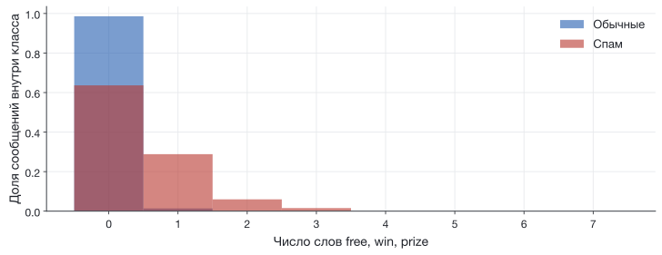
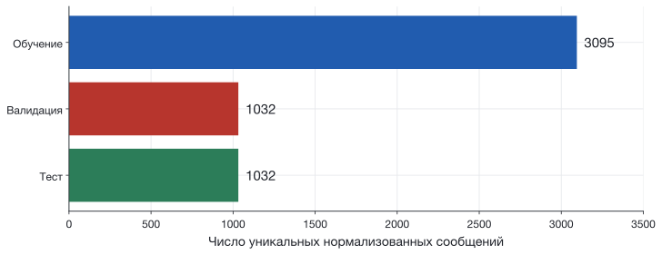
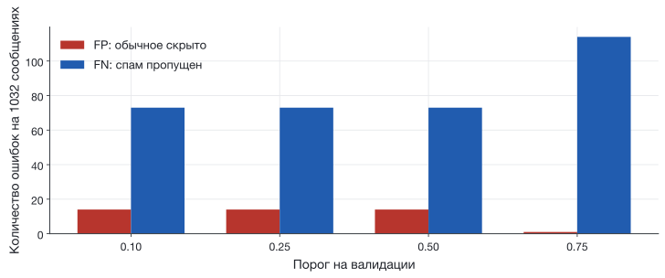

## Фильтр встречает другие сообщения

**Входные знания:** подсчёт слов, $x$, $y$, `probability` и обучение из S3.

**Что построим:** проверяемый эксперимент на реальном корпусе SMS.

Выбранный признак остаётся тем же: число слов `free`, `win`, `prize`.

[Начальный notebook](../starter/notebooks/S04-live-coding.ipynb) ·
[Полная версия с результатами](../starter/notebooks/solutions/S04-complete.ipynb)

## Реальные данные: SMS Spam Collection

**5574 строки** в скачанном файле UCI: метка и текст.

`ham` — обычное сообщение. `spam` — спам.

| Перед вычислением | Что проверяем |
|---|---|
| Метка | Только `ham` или `spam` |
| Текст | Есть непустое содержимое |
| Повторы | Одинаковый текст учитываем один раз |

Исторический англоязычный корпус. Порядок строк не задаёт время.

[Almeida, Hidalgo; UCI, DOI 10.24432/C5CC84. Копия и лицензия](../starter/data/README.md){.source}

## Блок 1 · Повторы и метки

```python
key = " ".join(message.lower().split())
if key in seen:
    continue
seen.add(key)
messages.append(message)
labels.append(int(label == "spam"))
```

`Free prize` и `FREE   PRIZE` получают один ключ.

Остаётся **5159** сообщений: **4517 обычных**, **642 спама**.

## Один столбец признаков

{height=365 fig-alt="Распределения числа слов по классам в обучающей части: многие спам-сообщения имеют нулевое значение признака"}

$X$ имеет форму $(5159,1)$: строки — сообщения, столбец — признак.
$y$ имеет форму $(5159,)$: одна метка для каждой строки.

[График только по обучающей части; sms-count-v1, seed=25, lessons/s04.py.]{.figcap}

## Блок 2 · Три части данных

{height=305 fig-alt="После удаления повторов 3095 сообщений отведено для обучения, 1032 для валидации и 1032 для теста"}

**Обучение:** найти $w,b$. **Валидация:** выбрать порог.
**Тест:** один раз оценить зафиксированное решение.

60% / 20% / 20%; `random_state=25`, `stratify=y`.

## Блок 3 · Та же модель через библиотеку

```python
model = LogisticRegression(C=float("inf"), max_iter=1000)
model.fit(X[train_ids], y[train_ids])
validation_probability = model.predict_proba(X[validation_ids])[:, 1]
```

Один вес и свободный член. Минимизируется знакомая логистическая потеря.
`C=∞` отключает дополнительный штраф на веса.

В этом запуске: $w\approx3.433$, $b\approx-2.386$.

[Числа для sms-count-v1, 3095 обучающих сообщений, scikit-learn из uv.lock.]{.figcap}

## Постоянный ответ уже даёт 87.5%

На валидации: 903 обычных сообщения и 129 спам-сообщений.

Если всегда отвечать «обычное»:

$$\mathrm{accuracy}=\frac{903}{1032}=87.5\%$$

Поймано **0 из 129** спам-сообщений.

[Опр.]{.definition} **Базовая модель** задаёт простую точку отсчёта для сравнения.

## Четыре исхода решения

| Настоящая метка | Оставили во входящих | Отправили в спам |
|---|:--:|:--:|
| Обычное | TN = 94 | FP = 1 |
| Спам | FN = 2 | TP = 3 |

[Опр.]{.definition} **Матрица ошибок** считает сочетания настоящего и предсказанного класса.

FP: спрятали обычное сообщение. FN: пропустили спам.

[Маленький отдельный пример на 100 сообщениях для ручного счёта.]{.figcap}

## Три доли из одной таблицы

[Опр.]{.definition} **Доля верных ответов**: $\mathrm{accuracy}=(TP+TN)/n$.

$$\frac{3+94}{100}=97\%$$

[Опр.]{.definition} **Точность обнаружения**: $\mathrm{precision}=TP/(TP+FP)$.

$$\frac3{3+1}=75\%\quad\text{среди отправленных в спам}$$

**Полнота обнаружения**: $\mathrm{recall}=TP/(TP+FN)$.

$$\frac3{3+2}=60\%\quad\text{среди всего настоящего спама}$$

## Блок 4 · Подсчёт исходов

```python
predicted = int(probability[i] >= threshold)
if actual[i] == 0 and predicted == 1:
    fp = fp + 1
elif actual[i] == 1 and predicted == 0:
    fn = fn + 1
```

В остальных ветках считаем TP и TN.

При пороге 0.5 на валидации: **TN 889, FP 14, FN 73, TP 56**.

## Порог меняет соотношение ошибок

{height=380 fig-alt="На валидации при порогах 0.1, 0.25, 0.5 получаются 14 FP и 73 FN, при 0.75 — 1 FP и 114 FN"}

Один и тот же $w,b$. Меняется только правило $p\geq\tau$.

[Валидация: 1032 сообщения; sms-count-v1, seed=25, lessons/s04.py.]{.figcap}

## Блок 5 · Явная цена ошибок

Условимся: спрятанное обычное сообщение стоит **5 единиц**,
пропущенный спам — **1 единицу**.

$$C(\tau)=5\,FP(\tau)+FN(\tau)$$

| Порог | FP | FN | Условная цена |
|:--:|:--:|:--:|:--:|
| 0.10 / 0.25 / 0.50 | 14 | 73 | 143 |
| 0.75 | 1 | 114 | 119 |
| Всегда «обычное» | 0 | 129 | 129 |

Фиксируем $\tau=0.75$ по валидации.

## Разбор двух настоящих ошибок

**Обычное сообщение со словом `win` дважды.**

Рассуждение об отношениях и споре с близким человеком.
$x=2$, $p\approx0.989$: ложная тревога.

**Реклама мелодии со словом `free` один раз.**

$x=1$, $p\approx0.740$: пропуск при пороге 0.75.

Полные исходные тексты показаны в notebook. Обе строки взяты из валидации.

## Блок 6 · Итоговая проверка

Модель, словарь и порог **0.75** уже зафиксированы.

```python
test_probability = model.predict_proba(X[test_ids])[:, 1]
tn, fp, fn, tp = count_errors(y[test_ids], test_probability, best_threshold)
```

| На 1032 тестовых сообщениях | Оставили во входящих | Отправили в спам |
|---|:--:|:--:|
| Обычное | 904 | 0 |
| Спам | 119 | 9 |

[sms-count-v1; итог одного фиксированного разбиения, команда: python lessons/s04.py.]{.figcap}

## Сработало на девяти сообщениях из 128

На тесте: **accuracy 88.5%**, **precision 100%**, **recall 7.0%**.

100% точности обнаружения здесь означает **9 верных срабатываний из 9**.

Условная цена: **119** у модели, **128** у постоянного ответа.

Один счётчик слов пропускает большую часть спама. Следующий эксперимент
может учитывать больше контекста. Ему потребуется отдельная проверка.

[Исторический английский корпус. Отправители и кампании неизвестны;
перенос на современные сообщения здесь не измерен.]{.figcap}

## Источники {.smaller}

- [UCI SMS Spam Collection](https://archive.ics.uci.edu/dataset/228/sms+spam+collection), Almeida, Hidalgo, 2011; CC BY 4.0.
- [Зафиксированные данные, контрольная сумма и протокол](../starter/data/README.md).
- [Полный исполняемый код](../starter/lessons/s04.py).
- [scikit-learn: LogisticRegression](https://scikit-learn.org/stable/modules/generated/sklearn.linear_model.LogisticRegression.html).
- Полнота и точность обнаружения считаются для положительного класса «спам».
