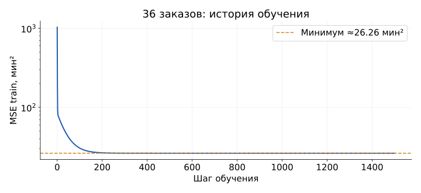

## Прогноз времени нового заказа {#s5-02}

**Условие нового заказа:** расстояние 2 км; до выхода из дома 35 минут. Эти значения заданы для решения.

Получим свой прогноз и проверим, можно ли на него опираться.

Для этого:

- прочитаем учебный CSV: D01-D36 для обучения, D37-D48 для проверки;
- напишем MSE, градиенты и обучение;
- сравним шаги обучения и проверим модель на $48-36=12$ новых заказах;
- получим прогноз и обсудим решение.

[Открыть notebook S5](../starter/notebooks/S05-live-coding.ipynb)

## Одна строка, один заказ {#s5-03}

**Строки D01-D03 учебного CSV:** км и минуты относятся к одному заказу. Дождь обозначаем: **0 = нет, 1 = есть**.

| Заказ | км | Очередь | Дождь | мин |
|---|---:|---:|---:|---:|
| D01 | 1 | 0 | 0 | 18 |
| D02 | 2 | 4 | 0 | 27 |
| D03 | 3 | 0 | 0 | 24 |

Заранее разделили **48 синтетических заказов**: D01-D36 дают **36 train**, D37-D48 дают **12 test**.

Дадим модели пока только расстояние: $\hat y=wx+b$.

**Что будет, если расстояниям достанутся чужие времена?**

## Сначала смотрим на точки {#s5-04}

{height=360 fig-alt="36 обучающих заказов из лекции"}

**C03:** точки из D01-D36, оси - расстояние в км и фактическое время в минутах.

Выберем вертикаль **2 км**, как в условии нового заказа.

**Почему на одном расстоянии встречается разное время?**

## Задание 1: прогноз без признаков {#s5-05}

```python
total_time = 0.0
for time_value in train_y:
    total_time = total_time + time_value
mean_train_time = ...
```

В **C04** получите среднее время. Начальная сумма **0** означает, что ни одно время ещё не добавлено.

Складываем колонку минут **D01-D36**: $18+27+24+\ldots=1113$ мин. Заказов $n=36$.

$$\overline y=\frac{1113}{36}\approx30.9167\text{ мин}$$

**Можно ли взять времена всех 48 заказов, включая 12 test?**

## Проверка вручную перед кодом {#s5-06}

**C05:** D01-D03 из CSV. Для первого шага **задаём** $w=0,b=20$; каждый прогноз $0x+20=20$ мин.

| $x$ | $y$ | $\hat y$ | $e=\hat y-y$ | $ex$ | $e^2$ |
|---:|---:|---:|---:|---:|---:|
| 1 | 18 | 20 | 2 | 2 | 4 |
| 2 | 27 | 20 | -7 | -14 | 49 |
| 3 | 24 | 20 | -4 | -12 | 16 |

$$\sum e=2-7-4=-9;\quad \sum ex=2-14-12=-24;\quad \sum e^2=4+49+16=69.$$

**Что означает знак минус у ошибки?**

## Одна функция для MSE {#s5-07}

[Опр.]{.definition} **MSE** - среднее квадратов ошибок прогноза.

```python
prediction = w * x_values[i] + b
error = prediction - y_values[i]
total_squared_error = total_squared_error + error ** 2
```

В **C06** повторяем для каждого заказа. Степень **2** означает квадрат ошибки; после цикла делим сумму на число заказов.

Проверка на **D01-D03**, при заданных $w=0,b=20$:

$$\mathrm{MSE}=\frac{(20-18)^2+(20-27)^2+(20-24)^2}{3}=\frac{4+49+16}{3}=23\text{ мин}^2.$$

**Что вернётся, если поставить return внутри for?**

## Задание 2: производная по весу {#s5-08}

$$g_w=\frac2n\sum_i e_ix_i,\qquad g_b=\frac2n\sum_i e_i$$

**2** возникает из производной квадрата; **$n$** - число переданных заказов.

```python
sum_error_x = ...
sum_error = sum_error + error
```

В **C07** восстановите накопление $ex$.

**D01-D03:** $x=(1,2,3)$, $y=(18,27,24)$; задаём $w=0,b=20$. Ошибки $e=(2,-7,-4)$.

$$g_w=\frac23(2\cdot1-7\cdot2-4\cdot3)=-16,\quad g_b=\frac23(2-7-4)=-6.$$

**Почему для веса умножаем ошибку на расстояние?**

## Проверяем первый шаг {#s5-09}

**C08:** D01-D03; старт задан $w=0,b=20$; шаг **выбираем** $\eta=0.1$.

Из ошибок $2,-7,-4$: $g_w=\frac23(2-14-12)=-16$, $g_b=\frac23(2-7-4)=-6$.

$$w_{new}=0-0.1(-16)=1.6,\qquad b_{new}=20-0.1(-6)=20.6.$$

| Проверка на $x=(1,2,3)$, $y=(18,27,24)$ | MSE, мин² |
|---|---|
| До: прогнозы 20, 20, 20 | $(2^2+(-7)^2+(-4)^2)/3=23$ |
| После: $1.6x+20.6$ даёт 22.2, 23.8, 25.4 | $(4.2^2+(-3.2)^2+1.4^2)/3\approx9.9467$ |

**Почему отрицательный градиент увеличил параметры?**

## Задание 3: обучение на 36 заказах {#s5-10}

:::: {.columns .meme-with-content}
::: {.column width="62%"}
[Опр.]{.definition} **Градиентный спуск** - повторение шагов против градиента функции потерь.

```python
for step in range(1500):
    dw, db = gradients(train_x, train_y, w, b)
    w = ...
    b = b - learning_rate * db
```

**C09:** D01-D36, **36 train**. Заполните обновление $w$.

**Выбраны заранее:** старт $w=b=0$, шаг $\eta=0.03$, **1500 повторов**, без выбора по test.

Результат: $w\approx4.50919$, $b\approx18.26588$.
Сумма $e^2$: **945.3052**; $\mathrm{MSE}=945.3052/36\approx26.26$.

**Почему gradients вызывается внутри цикла?**
:::
::: {.column .meme-image width="38%"}
{height=470 fig-alt="Расписание с пророчеством"}
:::
::::

## Почему потеря не дошла до нуля? {#s5-11}

{height=300 fig-alt="История MSE на 36 заказах, логарифмическая вертикальная ось"}

**C10:** D01-D36, старт $w=b=0$, выбранный шаг $0.03$, **1500 обновлений**.

История: $1$ значение до обучения $+1500$ после шагов $=1501$.

В каждой точке графика $\mathrm{MSE}=\sum_{D01-D36}(wx+b-y)^2/36$. В конце сумма квадратов **945.3052 мин²**: $945.3052/36\approx26.26$.

**Дадим ещё 1500 шагов. Ошибка станет нулевой?**

## Размер шага и результат обучения {#s5-12}

**C11:** D01-D36, каждый запуск заново с $w=b=0$. Для сравнения **выбираем 30 итераций** и три шага.

| Выбранный шаг $\eta$ | $\sum e^2$ после 30 шагов, мин² | MSE = сумма / 36, мин² |
|---:|---:|---:|
| 0.003 | 3436.6003 | 95.46 |
| 0.03 | 1899.6990 | 52.77 |
| 0.1 | 3 075 021 716.17 | 85 417 269.89 |

Для каждого заказа $e=wx+b-y$. Строки и старт одинаковы; меняется шаг.

Основной запуск: выбраны $\eta=0.03$ и 1500 итераций; $\mathrm{MSE}=945.3052/36\approx26.26$.

**Где стоит изменить шаг? Где может помочь больше итераций?**

## Прямая и среднее на одном рисунке {#s5-13}

{height=295 fig-alt="Прямая и среднее на тех же 36 заказах"}

**C12, D01-D36.** Среднее: сумма времён $1113$ мин / **36 заказов** $\approx30.92$ мин.

После 1500 шагов с выбранным $\eta=0.03$ от $w=b=0$ получены $w\approx4.50919$, $b\approx18.26588$, минимизирующие MSE на этих строках.

$$\hat y\approx4.50919x+18.26588;\quad x=2\ \Longrightarrow\ \hat y\approx27.28\text{ мин}.$$

**Один заказ ждёт в очереди, другой готов. Линия это знает?**

## Сравниваем на 12 новых заказах {#s5-14}

:::: {.columns .meme-with-content}
::: {.column width="58%"}
**C13:** фиксируем обученные на D01-D36 параметры; проверяем **D37-D48, 12 заказов**.

$e=\hat y-y$; $\mathrm{MAE}=\sum|e|/12$;
$\mathrm{RMSE}=\sqrt{\sum e^2/12}$.

| Модель | $\sum|e|$, мин | $\sum e^2$, мин² |
|---|---:|---:|
| Среднее $1113/36$ | 66.3333 | 676.4167 |
| Расстояние | 66.9365 | 548.9946 |

| Модель | MAE, мин | RMSE, мин |
|---|---:|---:|
| Среднее train | 5.53 | 7.51 |
| Расстояние | 5.58 | 6.76 |

**Какая модель лучше по MAE? А по RMSE?**
:::
::: {.column .meme-image width="42%"}
{height=430 fig-alt="Как выгляжу в интернете и в реальной жизни"}
:::
::::

## Успеем ли получить заказ? {#s5-15}

**C14, условие:** новый заказ $x=2$ км, до выхода **35 минут**.

На D01-D36 после 1500 шагов с $\eta=0.03$ от $w=b=0$ получили $w\approx4.50919,b\approx18.26588$.

$$\hat y\approx4.50919\cdot2+18.26588=27.28426\approx27.3\text{ мин}.$$

Проверка D37-D48, **12 заказов**: $e=\hat y-y$; $\sum|e|\approx66.9365$, $\sum e^2\approx548.9946$.

$$\mathrm{MAE}=66.9365/12\approx5.58;\quad\mathrm{RMSE}=\sqrt{548.9946/12}\approx6.76\text{ мин}.$$

1. Те же 2 км = 2000 м. Что произойдёт, если передать число 2000?
2. Обещаем, что заказ приедет до выхода через заданные 35 минут?
3. Как расскажем человеку о точности прогноза?

[Полный код](../starter/lessons/s05.py) · [Данные](../starter/data/DELIVERY-README.md)
