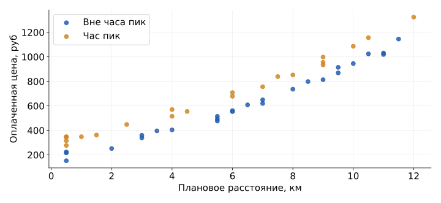
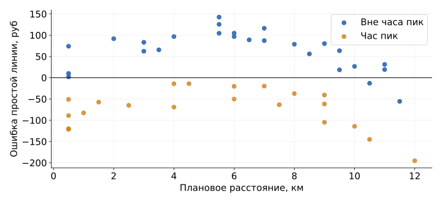
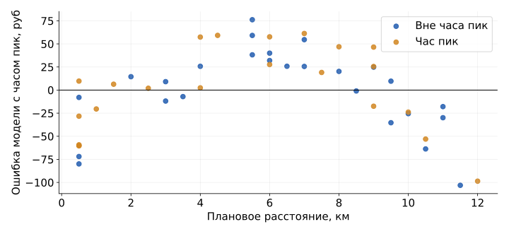
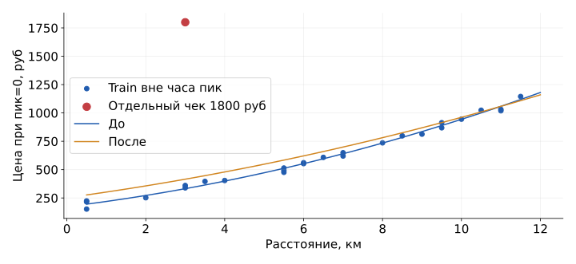

## Цена поездки перед заказом {#s6-02}

**Условие новой поездки:** 5 км в час пик, бюджет 700 рублей. Расстояние и бюджет заданы для решения.

Получим прогноз цены и узнаем, насколько он промахивается.

Сегодня:

- читаем отдельный учебный CSV: T01-T48 для обучения, T49-T64 для проверки;
- обучаем модели с разными признаками;
- сравниваем качество на $64-48=16$ отложенных поездках;
- прогнозируем цену и проверяем влияние дорогого чека.

[Открыть notebook S6](../starter/notebooks/S06-live-coding.ipynb)

## Проверка точности прогноза {#s6-03}

:::: {.columns .meme-with-content}
::: {.column .meme-image width="57%"}
{height=545 fig-alt="Астролог оценивает прогноз ИИ"}
:::
::: {.column width="43%"}
**Как проверить, чей прогноз точнее?**

Наша задача: цена поездки в рублях.
:::
::::

## Данные: 64 поездки {#s6-04}

**Учебный CSV: 64 синтетические поездки.** Значения расстояния, часа пик и цены созданы для занятия.

| Известно при заказе | Узнаем после поездки |
|---|---|
| Плановое расстояние, км | Оплаченная цена, руб |
| Час пик: 0 = нет, 1 = есть | |

**C02:** разбиение задано заранее: T01-T48 дают **48 train**, T49-T64 дают **16 test**; $48+16=64$.

Каждая строка описывает одну завершённую поездку.

**А если сразу дать модели сумму чека?**

[Условия и таблица](../starter/data/TAXI-README.md){.figcap}

## Расстояние и условия поездки {#s6-05}

{height=355 fig-alt="48 учебных поездок: цена по расстоянию, отдельные цвета для часа пик"}

**C03:** точки из T01-T48. Оси: км и фактические рубли; цвет берём из колонки **peak: 0 = вне пика, 1 = пик**.

**Что о поездке нельзя узнать по расстоянию?**

## Первые модели и план сравнения {#s6-06}

**C04:** используем только **T01-T48, 48 обучающих поездок**.

Постоянный прогноз: сумма их цен **30 826 руб** / **48 поездок**:

$$\overline y=30826/48\approx642.21\text{ руб}.$$

Для линии $\hat y=wx+b$ библиотечный **fit** подбирает $w,b$, минимизируя $\sum_{T01-T48}(wx+b-y)^2/48$.

Результат обучения, округлённый до сотых:

$$w\approx78.49,\quad b\approx186.80;\qquad\hat y\approx78.49x+186.80.$$

Заранее выберем ещё два набора: **расстояние и пик**; **расстояние, его квадрат и пик**.

**Почему все модели должны учиться на одних 48 строках?**

## Ошибки простой линии {#s6-07}

{height=280 fig-alt="Ошибки простой линии цены: цвет различает час пик"}

**C05, T01-T48:** линия $\hat y\approx78.49x+186.80$ получена минимизацией MSE на этих **48 строках**. На графике $e=\hat y-y$ в рублях; цвет: **0 = вне пика, 1 = пик**.

**Отдельный пример ошибки задан:** прогноз 600 руб, чек 650 руб.

$$e=600-650=-50\text{ руб}.$$

**Что означает ошибка -50 руб?**

## Задание 1: признак часа пик {#s6-08}

[Опр.]{.definition} **Множественная линейная регрессия** - линейная модель с несколькими признаками.

$$\hat y=w_1x+w_2p+b$$

В **C06** заполните второй элемент строки:

```python
peak_features.append([train_x[i], ...])
```

$x$: км; $p$ из CSV: **0 = вне пика, 1 = пик**. Все три параметра **fit** обучает по T01-T48, минимизируя $\sum(\hat y-y)^2/48$.

**Для сравнения зададим две поездки по 5 км:** признаки $[5,0]$ и $[5,1]$.

**Различит ли модель их цены?**

## После учёта часа пик {#s6-09}

{height=245 fig-alt="Ошибки модели с часом пик: по расстоянию остаётся изгиб"}

**C07:** fit минимизировал MSE на **T01-T48, 48 поездках** с признаками $[x,p]$. Получены коэффициенты:

$$\hat y\approx81.6214x+142.6749p+103.2414.$$

По вертикали $e=\hat y-y$ в рублях. Цвет: **$p=0$ вне пика, $p=1$ в пик**. Горизонтальный ноль означает точный прогноз.

**Почему остался изгиб? Обучать дольше или менять форму прогноза?**

## Задание 2: квадрат расстояния {#s6-10}

В **C08** восстановите второй признак:

```python
shape_features.append([distance, ..., train_peak[i]])
```

:::: {.columns .meme-with-content}
::: {.column width="62%"}
[Опр.]{.definition} **Преобразование признаков** - вычисление новых признаков из исходных.

**Условие:** 5 км в пик. $x^2=5\cdot5=25$, $p=1$: строка **[5, 25, 1]**.

Обучаем $\hat y=w_1x+w_2x^2+w_3p+b$ по **T01-T48**. Fit минимизирует $\sum(\hat y-y)^2/48$ и получает (округлено):

$$\hat y\approx42.580x+3.4468x^2+133.873p+173.108.$$

**Получилась кривая. Почему регрессия всё ещё линейная?**
:::
::: {.column .meme-image width="38%"}
{height=340 fig-alt="Кот be peak, be superior, be a FREAK"}
:::
::::

## Проверка на 16 новых поездках {#s6-11}

**C09:** параметры обучены по T01-T48 и зафиксированы. Проверяем **T49-T64, 16 поездок**. Вычитаем факт: $e=\hat y-y$.

$$\mathrm{MAE}=\frac{\sum|e|}{16},\qquad\mathrm{RMSE}=\sqrt{\frac{\sum e^2}{16}}.$$

| Модель | $\sum|e|$, руб | $\sum e^2$, руб² | MAE, руб | RMSE, руб |
|---|---:|---:|---:|---:|
| Среднее $30826/48$ | 3895.0000 | 1126748.2778 | 243.44 | 265.37 |
| Расстояние | 1110.0560 | 91088.1152 | 69.38 | 75.45 |
| Расстояние и пик | 445.0584 | 17747.5852 | 27.82 | 33.31 |
| Расстояние, квадрат и пик | 309.7353 | 8410.8501 | 19.36 | 22.93 |

Последняя строка: $309.7353/16\approx19.36$; $\sqrt{8410.8501/16}\approx22.93$.

**Какой вариант полезнее на этих поездках?**

[Одна синтетическая выборка; реальный сервис не измеряли.]{.figcap}

## Задание 3: прогноз новой поездки {#s6-12}

:::: {.columns .meme-with-content}
::: {.column width="61%"}
**C10, условие:** 5 км в пик, бюджет **700 руб**. Квадрат $5^2=25$, пик обозначен **1**.

```python
new_trip = [[5.0, 25.0, 1]]
new_prediction = ...
```

Fit: минимум MSE по **T01-T48, 48 поездкам**.

$$\begin{aligned}
\hat y&\approx42.580\cdot5+3.4468\cdot25\\
&\quad+133.873\cdot1+173.108\\
&=212.900+86.170+133.873+173.108\\
&=606.051\approx606\text{ руб}.
\end{aligned}$$

Запас: $700-606.05\approx93.95$ руб.

**Этого достаточно для уверенного решения?**
:::
::: {.column .meme-image width="39%"}
{height=390 fig-alt="Вторая почка как стартовый капитал"}
:::
::::

## Отдельный чек на 1800 рублей {#s6-13}

**C11:** отдельная синтетическая строка **задана в условии**: 3 км, вне пика ($p=0$), подтверждённая цена 1800 руб.

Для этой строки признаки **$[3,3^2,0]=[3,9,0]$**.

Копируем T01-T48 и добавляем одну поездку: **$48+1=49$ train-строк**. Новая модель снова минимизирует MSE, теперь на этой копии.

Исходные **$48+16=64$ строки** и test **T49-T64** сохранены.

**Что случилось с этой поездкой? Что проверим по чеку?**

## Что изменил чек на 1800 рублей? {#s6-14}

**C12:** до = модель по T01-T48; после = новое обучение на **$48+1=49$** строках, включая заданный чек **3 км, 1800 руб, вне пика**.

На одних строках: $e=\hat y-y$, $\mathrm{RMSE}=\sqrt{\sum e^2/n}$.

| Выборка | Модель | $\sum e^2$, руб² | RMSE, руб |
|---|---|---:|---:|
| 49 train, с чеком | До | 2179081.6033 | 210.88 |
| Те же 49 train | После | 2056278.4279 | 204.85 |
| 16 test, T49-T64 | До | 8410.8501 | 22.93 |
| Те же 16 test | После | 44686.9369 | 52.85 |

Пример: $\sqrt{2179081.6033/49}\approx210.88$ руб. Остальные строки считаем по той же формуле.

На **49 train** MAE: до $2386.1629/49\approx48.70$, после $3530.9769/49\approx72.06$ руб. Числители - суммы $|e|$.

**На train квадраты уменьшились. Почему на test стало хуже?**

## Что стало с остальными прогнозами? {#s6-15}

{height=250 fig-alt="Цены вне пика: модель до и после отдельного дорогого чека"}

**C13:** обе кривые для **$p=0$**, вне пика, поэтому член с пиком умножен на ноль. Точки - T01-T48; заданный чек: **3 км, 1800 руб**.

Коэффициенты получены минимизацией MSE на своих обучающих строках:

$$\text{До, 48 строк: }\hat y\approx42.580x+3.4468x^2+173.108;$$
$$\text{После, }48+1=49:\quad\hat y\approx47.2927x+2.3600x^2+252.3977.$$

**Добавили один чек. Почему другие прогнозы тоже изменились?**

## Можно ли ехать с 700 рублями? {#s6-16}

**Условие:** 5 км в пик ($p=1$), бюджет **700 руб**. Исходная модель обучена по **T01-T48**, минимизируя MSE.

$$\hat y\approx42.580\cdot5+3.4468\cdot5^2+133.873\cdot1+173.108\approx606.05\text{ руб}.$$

На **T49-T64, 16 test**: $e=\hat y-y$; $\sum|e|\approx309.7353$, $\sum e^2\approx8410.8501$.

$$\mathrm{MAE}=309.7353/16\approx19.36;\quad\mathrm{RMSE}=\sqrt{8410.8501/16}\approx22.93\text{ руб}.$$

В **C14** обсудите:

1. Чек на **1800 руб = 180000 коп.** записали числом 180000 в колонку рублей. Что исправить?
2. Заданный чек действительно на 1800 рублей. Удаляем поездку?
3. Что человек должен знать вместе с прогнозом цены?

[Полный код](../starter/lessons/s06.py) · [Данные](../starter/data/TAXI-README.md)
